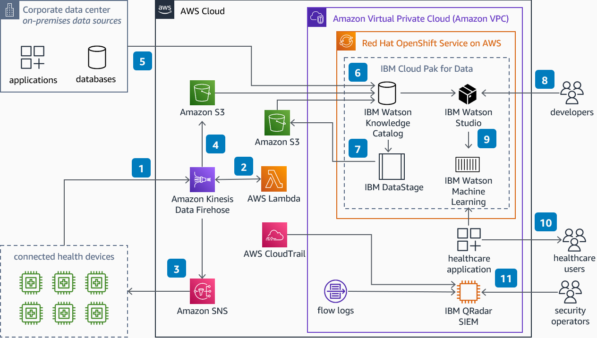

# Build a Healthcare Data Pipeline on AWS with IBM Cloud Pak for Data

Publication date: **April 19, 2023 ([Diagram history](#diagram-history "#diagram-history"))**

This architecture helps you build data pipelines and use machine learning (ML) models to predict patient treatment outcome, readmission rate, or disease progression.

## Build a Healthcare Data Pipeline on AWS with IBM Cloud Pak for Data Diagram

1. Connected medical devices stream patient health information to **Amazon Data Firehose**.
2. **AWS Lambda** applies data format transformations on the stream data.
3. If the transformation fails, **Amazon Simple Notification Service** (Amazon SNS) receives a
   notification and invokes a re-processing API to rectify the failure.
4. After successful format transformation, **Firehose** persists data
   on **Amazon Simple Storage Service** (Amazon S3).
5. [IBM Cloud Pak for Data](https://www.ibm.com/docs/en/cloud-paks/cp-data/4.6.x?topic=services-watson-studio "https://www.ibm.com/docs/en/cloud-paks/cp-data/4.6.x?topic=services-watson-studio")
   (CP4D) uses its connection services to access data in **Amazon S3** and on-premises.
6. You can use [IBM
   Watson Knowledge Catalog](https://www.ibm.com/docs/en/cloud-paks/cp-data/4.6.x?topic=services-watson-knowledge-catalog "https://www.ibm.com/docs/en/cloud-paks/cp-data/4.6.x?topic=services-watson-knowledge-catalog") to create a data governance framework, perform data enrichment, and train ML models.
   You can create data protection rules for data access and mask sensitive information.
7. With [IBM DataStage](https://www.ibm.com/docs/en/cloud-paks/cp-data/4.6.x?topic=services-datastage "https://www.ibm.com/docs/en/cloud-paks/cp-data/4.6.x?topic=services-datastage"),
   you can create, edit, load, and run data transformation jobs to generate enriched and tailored information.
8. Use [IBM Watson Studio](https://www.ibm.com/cloud/watson-studio "https://www.ibm.com/cloud/watson-studio") to analyze data, and build and train ML models.
9. Trained models are deployed to [IBM
   Watson Machine Learning](https://www.ibm.com/docs/en/cloud-paks/cp-data/4.6.x?topic=services-watson-machine-learning "https://www.ibm.com/docs/en/cloud-paks/cp-data/4.6.x?topic=services-watson-machine-learning") and are exposed as endpoints. These endpoints are integrated within a
   healthcare application to provide insights into patient condition.
10. Dashboards provide information for patient treatment, outcome prediction, readmission rate and disease progression.
11. [IBM Security QRadar XDR](https://www.ibm.com/qradar "https://www.ibm.com/qradar") on **Amazon Elastic Compute Cloud** (Amazon EC2)
    collects, processes and aggregates **Amazon VPC** flow logs, **AWS CloudTrail** logs
    and IBM CP4D logs. It uses these to manage security and provide near real-time monitoring and threat alerts.

## Download editable diagram

To customize this reference architecture diagram based on your business needs, [download the ZIP file](samples/build-healthcare-data-pipeline-on-aws-ibm-cp4d.md "samples/build-healthcare-data-pipeline-on-aws-ibm-cp4d.md") which contains an editable PowerPoint.

## Create a free AWS account

Sign up for an AWS account. New accounts include 12 months of [AWS Free Tier](https://aws.amazon.com/free/ "https://aws.amazon.com/free/") access, including the use of Amazon EC2, Amazon S3, and
Amazon DynamoDB.

## Further reading

For additional information, refer to

- [AWS Architecture
  Icons](https://aws.amazon.com/architecture/icons "https://aws.amazon.com/architecture/icons")
- [AWS Architecture Center](https://aws.amazon.com/architecture "https://aws.amazon.com/architecture")
- [AWS Well-Architected](https://aws.amazon.com/architecture/well-architected "https://aws.amazon.com/architecture/well-architected")
- [IBM Cloud Pak for Data](https://www.ibm.com/docs/en/cloud-paks/cp-data/4.6.x "https://www.ibm.com/docs/en/cloud-paks/cp-data/4.6.x")
- [IBM Watson Knowledge Catalog](https://www.ibm.com/docs/en/cloud-paks/cp-data/4.6.x?topic=services-watson-knowledge-catalog "https://www.ibm.com/docs/en/cloud-paks/cp-data/4.6.x?topic=services-watson-knowledge-catalog")
- [IBM DataStage](https://www.ibm.com/docs/en/cloud-paks/cp-data/4.6.x?topic=services-datastage "https://www.ibm.com/docs/en/cloud-paks/cp-data/4.6.x?topic=services-datastage")
- [IBM Watson Studio](https://www.ibm.com/cloud/watson-studio "https://www.ibm.com/cloud/watson-studio")
- [IBM Watson Machine Learning](https://www.ibm.com/docs/en/cloud-paks/cp-data/4.6.x?topic=services-watson-machine-learning "https://www.ibm.com/docs/en/cloud-paks/cp-data/4.6.x?topic=services-watson-machine-learning")
- [IBM Security QRadar XDR](https://www.ibm.com/qradar "https://www.ibm.com/qradar")

## Diagram history

To be notified about updates to this reference architecture diagram, subscribe to the RSS feed.

| Change              | Description                                     | Date           |
| ------------------- | ----------------------------------------------- | -------------- |
| Initial publication | Reference architecture diagram first published. | April 19, 2023 |

###### Note

To subscribe to RSS updates, you must have an RSS plugin enabled for the browser you are using.
