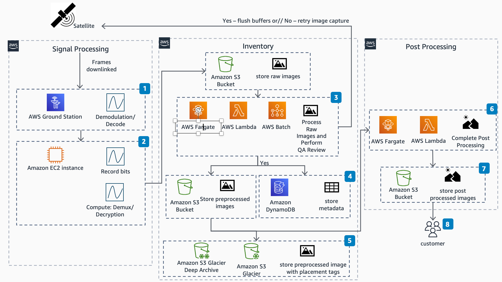
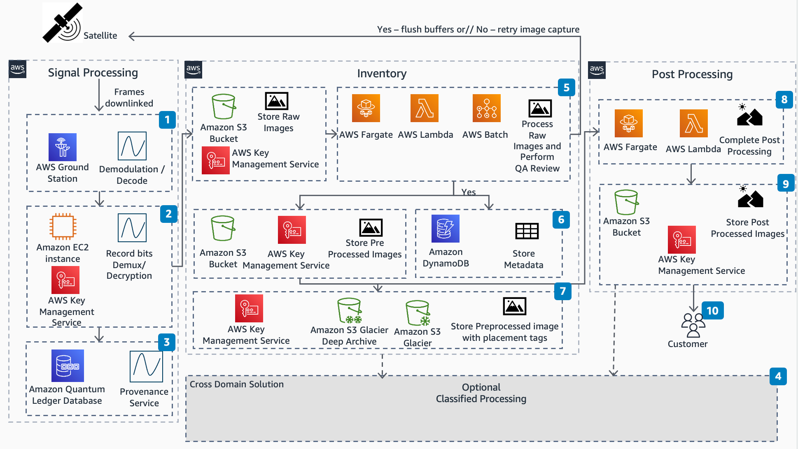

# Electro-Optical Imagery Reference Architecture

Publication date: **May 12, 2021 ([Diagram history](#diagram-history "#diagram-history"))**

This architecture enables you to process electro-optical imagery on AWS.

## Electro-Optical Imagery Reference Architecture

1. Demodulate and Decode: Extract baseband waveform from modulated carrier; remove forward error correction.
2. Convert into raw sensor data: Decommutate signal frames; decrypt data
   .
3. Process Raw Images: Process Raw Images and Perform QA Review
   - QA Review: Confirm Images are sufficient for processing
   - **AWS Batch**: Run multiple jobs in parallel
   - **AWS Fargate** and **AWS Lambda**:
     - Sensor Correction: Apply corrections for optical distortions
     - Orthorectify: Sensor perspective
     - Georeference: Apply image to spatial grid and assign known coordinate system
     - Generate Thumbnails: Create post-processed thumbnails for customer purchase

4. Store metadata: Store information on latitude/longitude collection, region collection, time and date of retrieval
   .
5. Storage: Store preprocessed images in a variety of **Amazon S3** services by balancing cost savings and time of retrieval.
6. Post Processing and Analysis: Complete imagery processing.
   - Feature Extraction: Identify features in images (such as ships)
   - Naming/Tagging of Features: Tag features by name/identification system
   - Time Series Creation: Tag images to sort

7. Storage and Dissemination: Final storage of images and analytics for end customer.
8. Customer Delivery: Deliver final images to end customers

## Electro-Optical Imagery Reference Architecture (Classified Processing)

1. Demodulate and Decode: Extract baseband waveform from modulated carrier; remove forward error correction.
2. Convert into raw sensor data: Decommutate signal frames; decrypt data
   .
3. Immutable transaction log: Cryptographically establish provenance and fidelity
   .
4. Optional Classified Processing: Throughout the image processing, move data to the appropriate regions for classified processing.
5. Process Raw Images: Process Raw Images and Perform QA Review
   - QA Review: Confirm Images are sufficient for processing
   - **AWS Batch**: Run multiple jobs in parallel
   - **AWS Fargate** and **AWS Lambda**:
     - Sensor Correction: Apply corrections for optical distortions
     - Orthorectify: Sensor perspective
     - Georeference: Apply image to spatial grid and assign known coordinate system
     - Generate Thumbnails: Create post-processed thumbnails for customer purchase

6. Store metadata: Store information on latitude/longitude collection, region collection, time and date of retrieval
   .
7. Storage: Store preprocessed images in a variety of **Amazon S3** services by balancing cost savings and time of retrieval.
8. Post Processing and Analysis: Complete imagery processing.
   - Feature Extraction: Identify features in images (such as ships)
   - Naming/Tagging of Features: Tag features by name/identification system
   - Time Series Creation: Tag images to sort

9. Storage and Dissemination: Final storage of images and analytics for end customer.
10. Customer Delivery: Deliver final images to end customers

## Download editable diagram

To customize this reference architecture diagram based on your business needs, [download the ZIP file](samples/electro-optical-imagery-architecture.md "samples/electro-optical-imagery-architecture.md") which contains an editable PowerPoint.

## Create a free AWS account

Sign up for an AWS account. New accounts include 12 months of [AWS Free Tier](https://aws.amazon.com/free/ "https://aws.amazon.com/free/") access, including the use of Amazon EC2, Amazon S3, and
Amazon DynamoDB.

## Further reading

For additional information, refer to

- [AWS Architecture
  Icons](https://aws.amazon.com/architecture/icons "https://aws.amazon.com/architecture/icons")
- [AWS Architecture Center](https://aws.amazon.com/architecture "https://aws.amazon.com/architecture")
- [AWS Well-Architected](https://aws.amazon.com/architecture/well-architected "https://aws.amazon.com/architecture/well-architected")

## Diagram history

To be notified about updates to this reference architecture diagram, subscribe to the RSS feed.

| Change              | Description                                     | Date         |
| ------------------- | ----------------------------------------------- | ------------ |
| Initial publication | Reference architecture diagram first published. | May 12, 2021 |

###### Note

To subscribe to RSS updates, you must have an RSS plugin enabled for the browser you are using.
