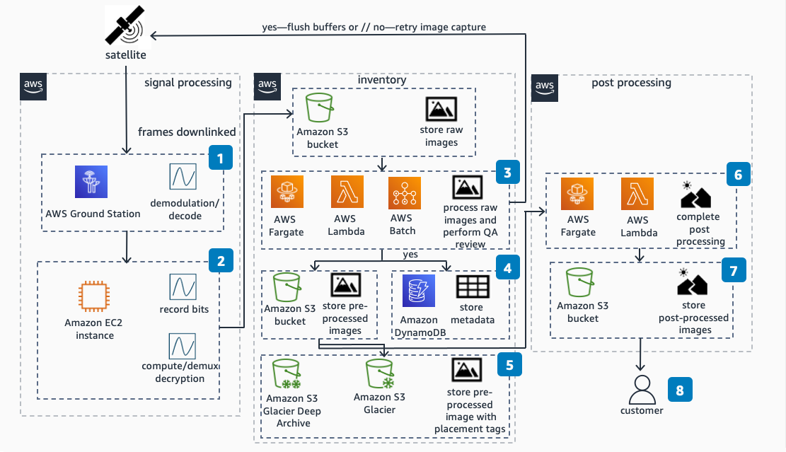
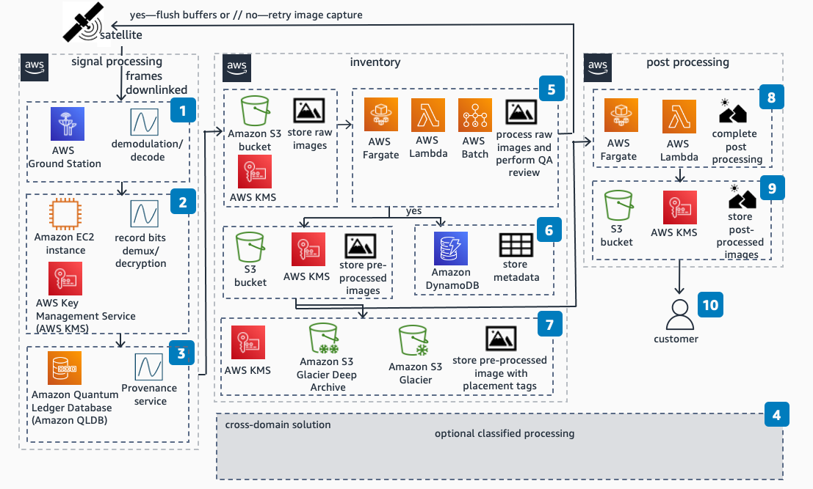

# Electro-Optical Imagery on AWS

Publication date: **May 13, 2021 ([Diagram history](#diagram-history "#diagram-history"))**

This diagram demonstrates how to extract, process, and store electro-optical satellite imagery by using AWS.

## Electro-Optical Imagery on AWS Diagram 1

1. Demodulate and decode: Extract baseband waveform from modulated carrier; remove
   forward error correction.
2. Convert into raw sensor data: Decommutate signal frames; decrypt data.
3. Process raw images and perform QA review.
   - QA review: Confirm Images are sufficient for processing.
   - **AWS Batch**: Run multiple jobs in parallel.
     - **AWS Fargate** and **AWS Lambda**:
     - Sensor correction: Apply corrections for optical distortions.
     - Orthorectify: Sensor perspective.
     - Georeference: Apply image to spatial grid and assign known coordinate
       system.
     - Generate thumbnails: Create post-processed thumbnails for customer
       purchase.

4. Store metadata: Store information on latitude/longitude collection, Region collection,
   time and date of retrieval.
5. Storage: Store preprocessed images in a variety of **Amazon Simple Storage Service** (Amazon S3) services by balancing cost savings and time of
   retrieval
6. Post processing and analysis: Complete imagery processing.
   - Feature extraction: Identify features in images (such as ships).
   - Naming/tagging of features: Tag features by name or identification system.
   - Time series creation: Tag images to sort by time.

7. Storage and dissemination: Final storage of images and analytics for end
   customer.
8. Customer delivery: Deliver final images to end customers.

## Electro-Optical Imagery on AWS Diagram 2: Classified Processing

1. Demodulate and decode: Extract baseband waveform from modulated carrier; remove
   forward error correction.
2. Convert into raw sensor data: Decommutate signal frames; decrypt data.
3. Immutable transaction log: Cryptographically establish provenance and fidelity.
4. Optional classified processing: Throughout the image processing, move data to the
   appropriate regions for classified processing.
5. Process raw images: Process raw images and perform QA review:
   - QA Review: Confirm Images are sufficient for processing
   - **AWS Batch**: Run multiple jobs in parallel.
   - **AWS Fargate** and **AWS Lambda**:
     - Sensor correction: Apply corrections for optical distortions.
     - Orthorectify: Sensor perspective.
     - Georeference: Apply image to spatial grid and assign known coordinate
       system.
     - Generate thumbnails: Create post-processed thumbnails for customer
       purchase.

6. Store metadata: Store information on latitude/longitude collection, Region collection,
   time, and date of retrieval.
7. Storage: Store preprocessed images in a variety of Amazon S3 services by balancing cost
   savings and time of retrieval.
8. Post processing and analysis: Complete imagery processing.
   - Feature extraction: Identify features in images (such as ships).
   - Naming/tagging of features: Tag features by name/identification system.
   - Time seriesc reation: Tag images to sort by time.

9. Storage and dissemination: Final storage of images and analytics for end
   customer.
10. Customer delivery: Deliver final images to end customers.

## Download editable diagram

To customize this reference architecture diagram based on your business needs, [download the ZIP file](samples/electro-optical-imagery.md "samples/electro-optical-imagery.md") which contains an editable PowerPoint.

## Create a free AWS account

Sign up for an AWS account. New accounts include 12 months of [AWS Free Tier](https://aws.amazon.com/free/ "https://aws.amazon.com/free/") access, including the use of Amazon EC2, Amazon S3, and
Amazon DynamoDB.

## Further reading

For additional information, refer to

- [AWS Architecture
  Icons](https://aws.amazon.com/architecture/icons "https://aws.amazon.com/architecture/icons")
- [AWS Architecture Center](https://aws.amazon.com/architecture "https://aws.amazon.com/architecture")
- [AWS Well-Architected](https://aws.amazon.com/architecture/well-architected "https://aws.amazon.com/architecture/well-architected")

## Diagram history

To be notified about updates to this reference architecture diagram, subscribe to the RSS feed.

| Change              | Description                                     | Date         |
| ------------------- | ----------------------------------------------- | ------------ |
| Initial publication | Reference architecture diagram first published. | May 13, 2021 |

###### Note

To subscribe to RSS updates, you must have an RSS plugin enabled for the browser you are using.
