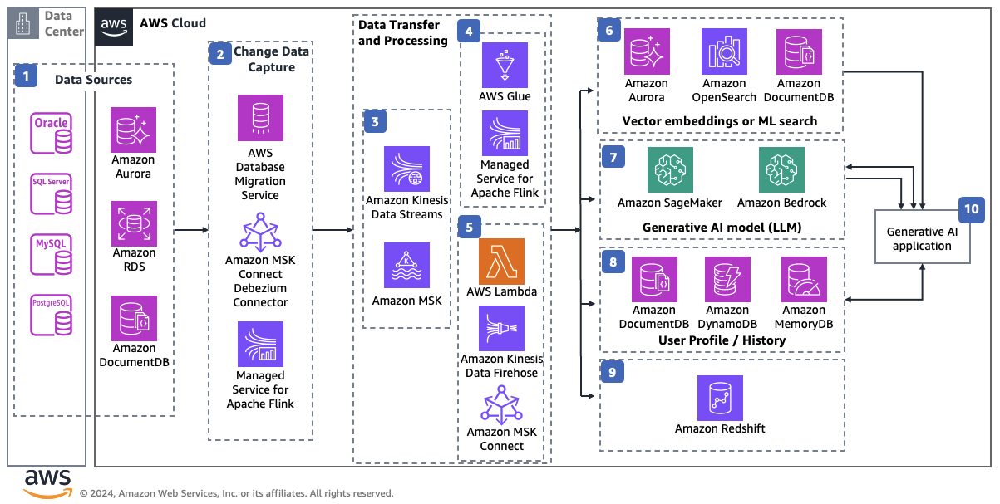

# Exploring Real-Time Streaming for Retrieval Augmented Generation in GenerativeAI

Publication date: **August 12, 2024 ([Diagram history](#diagram-history "#diagram-history"))**

This architecture demonstrates the integration of streaming data services on AWS with Retrieval Augmented Generation(RAG) in Generative AI applications.

## Exploring Real-Time Streaming for Retrieval Augmented Generation in GenerativeAI

1. Data sources for change data capture(CDC) includes on-premise or AWS databases such as
   Oracle, SQL Server, MySQL, PostgreSQL, **Amazon Aurora** ,
   and **Amazon RDS**, all funneling data into your Retrieval
   Augmented Generation(RAG) model.
2. **AWS Database Migration Service** and **Amazon MSK Connect with Debezium connector** help with one-time
   data migration of databases and continuous data replication. **AWS
   Database Migration Service** and **Amazon MSK Connect with
   Debezium connector** captures and stream changes from source databases and
   applies them in same order they are captured to the target.
3. Utilizing **AWS Database Migration Service** and
   **Amazon MSK Connect with Debezium connector** enables the
   streaming of data to **Amazon Kinesis Data Streams** or
   **Amazon Managed Streaming for Apache Kafka (Amazon MSK)**
   , facilitating the collection and processing of large streams.
4. By utilizing **AWS Glue** Spark Streaming and **Amazon Managed Service for Apache Flink** , you can construct
   specialized data processing pipelines to cater to your data consumption
   requirements.
5. **AWS Lambda** , **Amazon Kinesis
   Data Firehose** and **Amazon MSK Connect** , which
   serve as data sink services, enable the direct transfer of source data into destinations
   like **Data Lake** , **Amazon
   Redshift**, among others.
6. Leveraging **Amazon Aurora PostgreSQL with pgvector**,
   **Amazon Opensearch** and **Amazon
   DocumentDB** allows the generation of vector embeddings for streamlined data
   retrieval , vector representation management, scalability, and real-time inference
   capabilities.
7. **Amazon SageMaker** and **Amazon
   Bedrock** offers the means to discover pertinent information within a corpus,
   conduct similarity search on vectorized domain specific datasets, and use this data as
   input for generation models.
8. To preserve user profiles and conversation history, **Amazon
   DocumentDB**, **Amazon DynamoDB** and **Amazon MemoryDB** provide suitable options.
9. Leverage **Amazon Redshift** service to ensure data
   persistence, thereby augmenting the data inputs for the Generative AI RAG model.
10. For details on the workings of RAG applications, refer to [Retrieval-Augmented
    Generation(RAG)](https://aws.amazon.com/what-is/retrieval-augmented-generation/ "https://aws.amazon.com/what-is/retrieval-augmented-generation/")

## Download editable diagram

To customize this reference architecture diagram based on your business needs, [download the ZIP file](samples/exploring-real-time-streaming-for-retrieval-augmented-generation.md "samples/exploring-real-time-streaming-for-retrieval-augmented-generation.md") which contains an editable PowerPoint.

## Create a free AWS account

Sign up for an AWS account. New accounts include 12 months of [AWS Free Tier](https://aws.amazon.com/free/ "https://aws.amazon.com/free/") access, including the use of Amazon EC2, Amazon S3, and
Amazon DynamoDB.

## Further reading

For additional information, refer to

- [AWS Architecture
  Icons](https://aws.amazon.com/architecture/icons "https://aws.amazon.com/architecture/icons")
- [AWS Architecture Center](https://aws.amazon.com/architecture "https://aws.amazon.com/architecture")
- [AWS Well-Architected](https://aws.amazon.com/architecture/well-architected "https://aws.amazon.com/architecture/well-architected")

## Contributors

Contributors to this reference architecture diagram include:

- Jatinder Singh (jsinghtq@), Senior Technical Account Manager
- Manpreet Kour (mkour@), Senior Technical Account Manager
- Ali Alemi (alialem@), Senior WW SSA Streaming

## Diagram history

To be notified about updates to this reference architecture diagram, subscribe to the RSS feed.

| Change              | Description                                     | Date            |
| ------------------- | ----------------------------------------------- | --------------- |
| Initial publication | Reference architecture diagram first published. | August 22, 2024 |

###### Note

To subscribe to RSS updates, you must have an RSS plugin enabled for the browser you are using.
