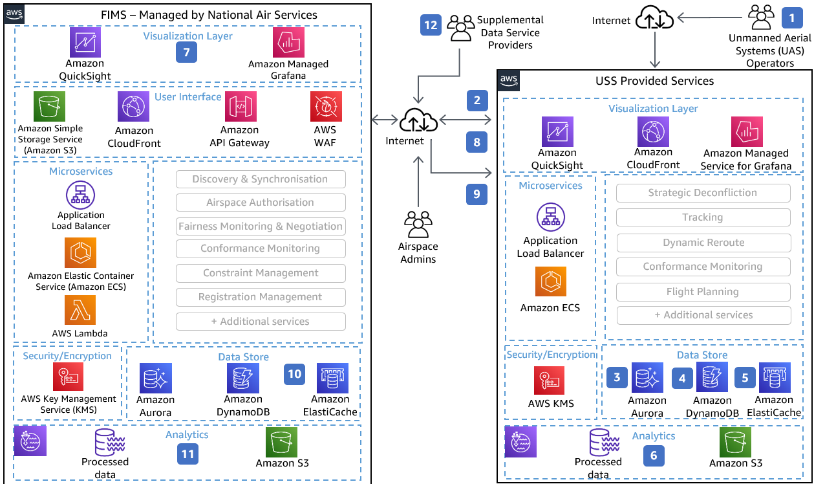

# Flight Information Management System

(FIMS)

Publication date: **February 2, 2022 ([Diagram history](#diagram-history "#diagram-history"))**

This architecture enables you to manage and operate services required for unmanned aerial
systems on AWS.

## Flight Information Management System (FIMS) Diagram

1. Operators access the FIMS services through a web-based portal for flight planning and
   additional services.
2. Flight plans are sent to appropriate microservices and **Amazon Elastic Container Service** (Amazon ECS) is leveraged for processing approvals.
3. Persistent relational data such as registration and flight plan are stored in
   **Amazon Aurora**.
4. Real-time data (such as telemetry, position, track, and velocity) is stored in
   **DynamoDB** .
5. Cached data is stored through **Amazon ElastiCache** for quick
   retrieval.
6. Processed data is encrypted and stored in data lake, and managed by **AWS Lake Formation**, in accordance with regulatory compliance.
7. Virtualization tools to view real-time positioning, flight paths, potential conflicts,
   etc. can be deployed using **Quick Suite** and **Amazon Managed Grafana**.
8. Flight plan approvals automatically provided to UAS operators by FIMS.
9. UAS operators request/receive manual approval from FIMS Admins for flight plans when
   conflicts arise.
10. UAS provider data stored in **Amazon Aurora** and real-time
    data stored in **DynamoDB** databases.
11. Data lake built on **Amazon S3** is used for secure data
    archival, analytics, and visualization.
12. Supplemental data from weather services is ingested into FIMS for smart
    decisioning.

## Download editable diagram

To customize this reference architecture diagram based on your business needs, [download the ZIP file](samples/flight-information-management-system.md "samples/flight-information-management-system.md") which contains an editable PowerPoint.

## Create a free AWS account

Sign up for an AWS account. New accounts include 12 months of [AWS Free Tier](https://aws.amazon.com/free/ "https://aws.amazon.com/free/") access, including the use of Amazon EC2, Amazon S3, and
Amazon DynamoDB.

## Further reading

For additional information, refer to

- [AWS Architecture
  Icons](https://aws.amazon.com/architecture/icons "https://aws.amazon.com/architecture/icons")
- [AWS Architecture Center](https://aws.amazon.com/architecture "https://aws.amazon.com/architecture")
- [AWS Well-Architected](https://aws.amazon.com/architecture/well-architected "https://aws.amazon.com/architecture/well-architected")

## Diagram history

To be notified about updates to this reference architecture diagram, subscribe to the RSS feed.

| Change              | Description                                     | Date             |
| ------------------- | ----------------------------------------------- | ---------------- |
| Initial publication | Reference architecture diagram first published. | February 2, 2022 |

###### Note

To subscribe to RSS updates, you must have an RSS plugin enabled for the browser you are using.
