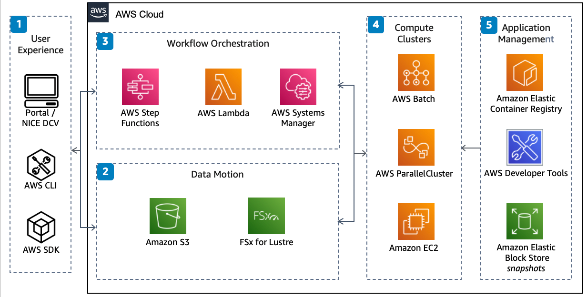

# High Performance Computing on AWS

Publication date: **September 1, 2021 ([Diagram history](#diagram-history "#diagram-history"))**

This architecture enables you to deploy and burst a suite of high performance computing (HPC) cases to the cloud directly from the desktop.

## High Performance Computing on AWS

1. Users deploy HPC cases with one of the AWS SDKs or the **AWS Command Line Interface** (AWS CLI). Users can interface directly with the cluster through
   NICE DCV.
2. Data is staged both to and from AWS with **Amazon Simple Storage Service**
   (Amazon S3). **Amazon S3** offers low-cost, reliable storage while
   interfacing directly to **Amazon FSx for Lustre** for a fully
   managed, high-performance storage.
3. Serverless services manage case workflow. **AWS Step Functions**
   provides workflow management and orchestrates other services, such as serverless compute
   with **AWS Lambda**. **AWS Systems Manager** can be used for operational management of compute clusters.
4. **AWS ParallelCluster**, **AWS Batch**, and custom-made clusters lie at the core of the HPC
   infrastructure, each with access to high-performance **Amazon Elastic Compute Cloud** (Amazon EC2) instances connected by a high performance network with an
   optional Elastic Fabric Adapter. Cost optimization with Amazon EC2 is achieved with
   payment-model choice and environment right sizing
5. Manage applications with a consistent, versioned, and repeatable framework. AWS Developer Tools accelerate software development. Installed software can be stored in containers or snapshots, depending on the compute cluster.

## Download editable diagram

To customize this reference architecture diagram based on your business needs, [download the ZIP file](samples/high-performance-computing.md "samples/high-performance-computing.md") which contains an editable PowerPoint.

## Create a free AWS account

Sign up for an AWS account. New accounts include 12 months of [AWS Free Tier](https://aws.amazon.com/free/ "https://aws.amazon.com/free/") access, including the use of Amazon EC2, Amazon S3, and
Amazon DynamoDB.

## Further reading

For additional information, refer to

- [AWS Architecture
  Icons](https://aws.amazon.com/architecture/icons "https://aws.amazon.com/architecture/icons")
- [AWS Architecture Center](https://aws.amazon.com/architecture "https://aws.amazon.com/architecture")
- [AWS Well-Architected](https://aws.amazon.com/architecture/well-architected "https://aws.amazon.com/architecture/well-architected")
- [High
  Performance Computing Lens — AWS Well-Architected Framework](../../../wellarchitected/latest/high-performance-computing-lens/welcome.md "../../../wellarchitected/latest/high-performance-computing-lens/welcome.md")

## Diagram history

To be notified about updates to this reference architecture diagram, subscribe to the RSS feed.

| Change              | Description                                     | Date              |
| ------------------- | ----------------------------------------------- | ----------------- | ----------------------------------------------------------------------------------------------------------- |
| Initial publication | Reference architecture diagram first published. | September 1, 2021 | ###### Note To subscribe to RSS updates, you must have an RSS plugin enabled for the browser you are using. |
