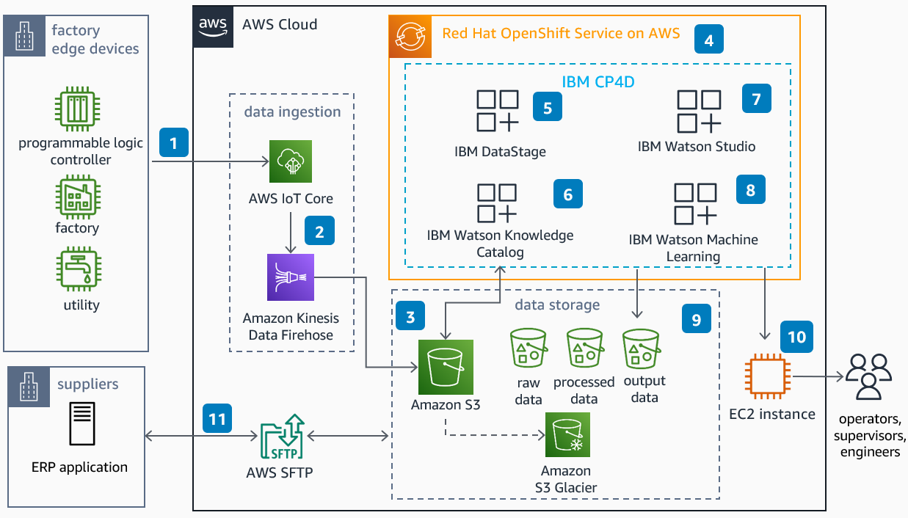

# Near Real-Time IoT Analytics with AWS and IBM CP4D

Publication date: **May 12, 2023 ([Diagram history](#diagram-history "#diagram-history"))**

This architecture demonstrates how to build near real-time IOT analytics with machine learning by using IBM Cloud Pak for DATA (CP4D) running on AWS.

## Near Real-Time IoT Analytics with AWS and IBM CP4D Diagram

1. Data from multiple sources across the manufacturing plant and
   edge devices is ingested from all the assets to **AWS IoT Core**.
2. **Amazon Data Firehose** streams IoT data and loads it into
   **Amazon Simple Storage Service** (Amazon S3), a fully managed, highly available
   and scalable data lake storage service.
3. Infrequently accessed data is moved to **Amazon Glacier** for
   cost-effective archival.
4. CP4D runs as a container workload running on OpenShift. **Red Hat OpenShift Service on AWS** (ROSA)
   is a fully managed OpenShift implementation on AWS.
5. With IBM DataStage, you can create, edit, load, and run data transformation
   jobs to generate enriched and tailored information.
6. You can use IBM Watson Knowledge Catalog to create a data governance framework,
   enrich data, and train machine learning (ML) models. You can create data
   protection rules for data access and mask sensitive information.
7. Use Watson Studio to analyze data, and build and train machine learning models.
8. Trained models are deployed to IBM Watson Machine Learning and are exposed as endpoints.
9. Model outputs are stored in **Amazon S3** output data buckets.
10. The Edge device custom developed applications on **Amazon Elastic Compute Cloud** (Amazon EC2)
    with dashboards used by factory operators and supervisors to monitor the model predictions.
11. Enterprise resource planning (ERP) applications get the data and put it into data stores
    using **AWS Transfer Family**.

## Download editable diagram

To customize this reference architecture diagram based on your business needs, [download the ZIP file](samples/iot-analytics-with-aws-ibm-cp4d.md "samples/iot-analytics-with-aws-ibm-cp4d.md") which contains an editable PowerPoint.

## Create a free AWS account

Sign up for an AWS account. New accounts include 12 months of [AWS Free Tier](https://aws.amazon.com/free/ "https://aws.amazon.com/free/") access, including the use of Amazon EC2, Amazon S3, and
Amazon DynamoDB.

## Further reading

For additional information, refer to

- [AWS Architecture
  Icons](https://aws.amazon.com/architecture/icons "https://aws.amazon.com/architecture/icons")
- [AWS Architecture Center](https://aws.amazon.com/architecture "https://aws.amazon.com/architecture")
- [AWS Well-Architected](https://aws.amazon.com/architecture/well-architected "https://aws.amazon.com/architecture/well-architected")
- [IBM Cloud Pak for DATA (IBM CP4D)](https://www.ibm.com/products/cloud-pak-for-data "https://www.ibm.com/products/cloud-pak-for-data")

## Contributors

Contributors to this reference architecture diagram include:

- Sankar Cherukuri, Partner Solution Architect

## Diagram history

To be notified about updates to this reference architecture diagram, subscribe to the RSS feed.

| Change              | Description                                     | Date         |
| ------------------- | ----------------------------------------------- | ------------ |
| Initial publication | Reference architecture diagram first published. | May 12, 2023 |

###### Note

To subscribe to RSS updates, you must have an RSS plugin enabled for the browser you are using.
