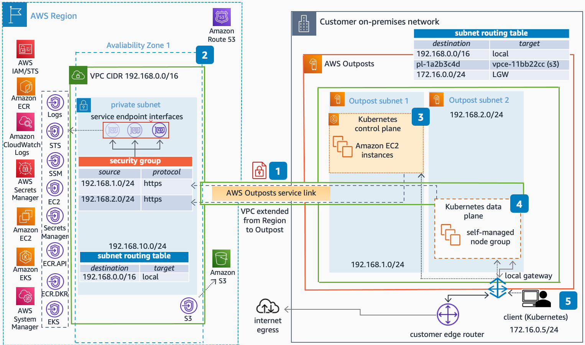

# Local Clusters for Amazon EKS on AWS Outposts

Publication date: **June 02, 2023 ([Diagram history](#diagram-history "#diagram-history"))**

This reference architecture diagram helps you deploy a local cluster for Amazon Elastic Kubernetes Service (Amazon EKS) on AWS Outposts.

## Local Clusters for Amazon EKS on AWS Outposts Diagram

1. Ensure that you have a reliable network connection between AWS Outposts and its parent Region. Use a highly available, low-latency connectivity, such as AWS Direct Connect.
2. Create the Amazon Elastic Kubernetes Service (Amazon EKS) [local cluster VPC and its required constructs](../../../eks/latest/userguide/eks-outposts-vpc-subnet-requirements.md "../../../eks/latest/userguide/eks-outposts-vpc-subnet-requirements.md").
3. Create a [local Amazon EKS cluster](https://aws.amazon.com/blogs/containers/fully-private-local-clusters-for-amazon-eks-on-aws-outposts-powered-by-vpc-endpoints/ "https://aws.amazon.com/blogs/containers/fully-private-local-clusters-for-amazon-eks-on-aws-outposts-powered-by-vpc-endpoints/"), specifying the Kubernetes control plane subnet on AWS Outposts.
4. Create [self-managed](../../../eks/latest/userguide/eks-outposts-self-managed-nodes.md "../../../eks/latest/userguide/eks-outposts-self-managed-nodes.md") Amazon EKS nodes on AWS Outposts, following the recommended [prerequisites](../../../eks/latest/userguide/eks-outposts-local-cluster-create.md "../../../eks/latest/userguide/eks-outposts-local-cluster-create.md").
5. Allow administrative access from the on-premises network to the Amazon EKS cluster endpoint using the local gateway (LGW). For more information, refer to [Local gateway basics](../../../outposts/latest/userguide/outposts-local-gateways.md "../../../outposts/latest/userguide/outposts-local-gateways.md").
6. Refer to the local cluster for Amazon EKS on AWS Outposts [considerations](../../../eks/latest/userguide/eks-outposts-network-disconnects.md "../../../eks/latest/userguide/eks-outposts-network-disconnects.md").

###### Note

Deploying a local cluster for Amazon EKS is currently only available through the [AWS Outposts Rack](https://aws.amazon.com/outposts/rack/ "https://aws.amazon.com/outposts/rack/") offering.

## Download editable diagram

To customize this reference architecture diagram based on your business needs, [download the ZIP file](samples/local-clusters-for-amazon-eks-on-aws-outposts.md "samples/local-clusters-for-amazon-eks-on-aws-outposts.md") which contains an editable PowerPoint.

## Create a free AWS account

Sign up for an AWS account. New accounts include 12 months of [AWS Free Tier](https://aws.amazon.com/free/ "https://aws.amazon.com/free/") access, including the use of Amazon EC2, Amazon S3, and
Amazon DynamoDB.

## Further reading

For additional information, refer to

- [AWS Architecture
  Icons](https://aws.amazon.com/architecture/icons "https://aws.amazon.com/architecture/icons")
- [AWS Architecture Center](https://aws.amazon.com/architecture "https://aws.amazon.com/architecture")
- [AWS Well-Architected](https://aws.amazon.com/architecture/well-architected "https://aws.amazon.com/architecture/well-architected")

## Diagram history

To be notified about updates to this reference architecture diagram, subscribe to the RSS feed.

| Change              | Description                                     | Date         |
| ------------------- | ----------------------------------------------- | ------------ |
| Initial publication | Reference architecture diagram first published. | June 2, 2023 |

###### Note

To subscribe to RSS updates, you must have an RSS plugin enabled for the browser you are using.
