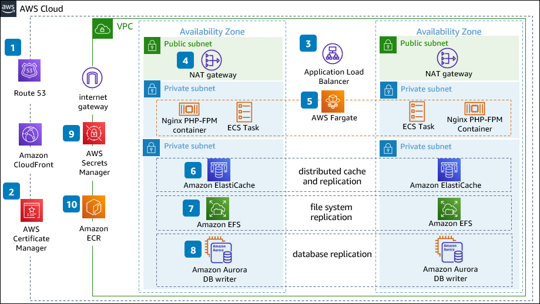

# Moodle for High Availability on AWS

Publication date: **December 22, 2021 ([Diagram history](#diagram-history "#diagram-history"))**

Moodle is an open source learning management system (LMS) that supports distributed online learning.
When implemented on AWS, Moodle can scale flexibly to optimize cost and maximize availability.
We recommend separation of the application and database layers to enable autoscaling for elasticity.
Instructors and students can focus on teaching and learning, and organizations can reduce administrative
overhead by building a highly available Moodle architecture on AWS.

## Moodle for High Availability on AWS Diagram

1. **Amazon Route 53** provides highly available routing
   policies and directs students to the closest **Amazon CloudFront** locations to access
   static content, reducing latency.
2. Use **AWS Certificate Manager** to manage your SSL certificates for secure communication
   with public and private resources.
3. The public **Application Load Balancer** scales automatically with your student traffic
   and keeps in-flight student data secure with HTTPS and SSL termination.
4. The **NAT gateway** provides a pathway to external entities and platforms should that be
   required.
5. Run the Moodle platform application layer on **Amazon Elastic Container Service**
   (Amazon ECS), leveraging **AWS Fargate**, the serverless compute engine for containers.
   **Fargate** removes the need to provision and manage servers, lets you specify and pay for
   resources per application, and improves security through application isolation by design.
6. **Amazon ElastiCache** allows you to set up, run, and scale popular open-source compatible
   in-memory data stores in the cloud. Use multi-AZ **ElastiCache** in your Moodle architecture
   to provide automated disaster recovery.
7. **Amazon Elastic File System** (Amazon EFS) provides a serverless, set-and-forget, elastic
   file system that lets you share file data without provisioning or managing storage.
8. **Amazon Aurora** provides a MySQL or PostgreSQL compatible solution for Moodle relational
   database workloads.
9. **AWS Secrets Manager** helps you protect secrets needed to access your applications, services,
   and IT resources.
10. **Amazon Elastic Container Registry** (ECR) is a fully managed container registry that
    makes it easy to store, manage, share, and deploy your container images and artifacts
    anywhere.

## Download editable diagram

To customize this reference architecture diagram based on your business needs, [download the ZIP file](samples/moodle-for-high-availability-on-aws.md "samples/moodle-for-high-availability-on-aws.md") which contains an editable PowerPoint.

## Create a free AWS account

Sign up for an AWS account. New accounts include 12 months of [AWS Free Tier](https://aws.amazon.com/free/ "https://aws.amazon.com/free/") access, including the use of Amazon EC2, Amazon S3, and
Amazon DynamoDB.

## Further reading

For additional information, refer to

- [AWS Architecture
  Icons](https://aws.amazon.com/architecture/icons "https://aws.amazon.com/architecture/icons")
- [AWS Architecture Center](https://aws.amazon.com/architecture "https://aws.amazon.com/architecture")
- [AWS Well-Architected](https://aws.amazon.com/architecture/well-architected "https://aws.amazon.com/architecture/well-architected")

## Diagram history

To be notified about updates to this reference architecture diagram, subscribe to the RSS feed.

| Change              | Description                                     | Date              |
| ------------------- | ----------------------------------------------- | ----------------- |
| Initial publication | Reference architecture diagram first published. | December 22, 2021 |

###### Note

To subscribe to RSS updates, you must have an RSS plugin enabled for the browser you are using.
