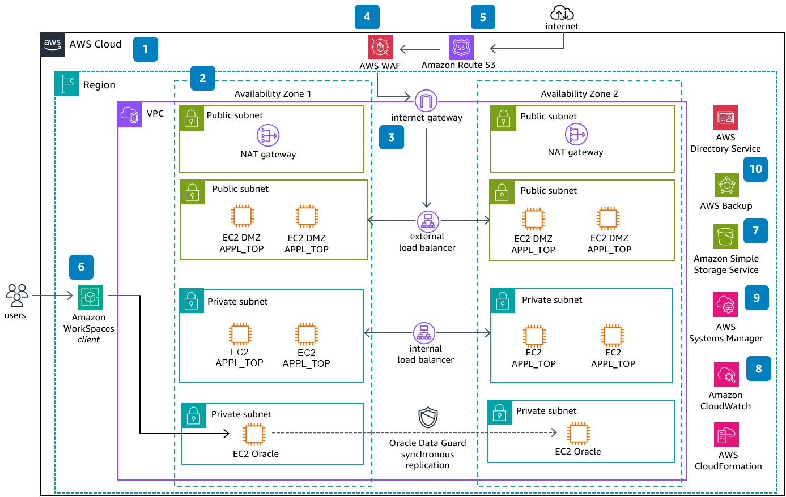

# Oracle E-Business Suite on AWS

Publication date: **August 3, 2023 ([Diagram history](#diagram-history "#diagram-history"))**

This reference architecture can be used to deploy Oracle E-Business Suite on AWS by showing how to configure high availability for the database and application tier.

## Oracle E-Business Suite on AWS Diagram

1. The architecture starts with a single Region and single Virtual
   Private Cloud (VPC) on-par with the on-premises data center.
2. Multiple Availability Zones (AZs) provide resilience and high
   availability for the production workload.
3. **Application Load Balancer** distributes network traffic to improve
   the scalability and availability of your applications across multiple AZs.
4. **AWS WAF** is the web application firewall
   that protects the Oracle E-Business Suite applications against common web exploits.
5. **Amazon Route 53** provides domain name service (DNS) configuration.
6. **Amazon WorkSpaces** provides a desktop experience in the cloud.
   Use **AWS Directory Service** to enable user authentication.
7. **Amazon Simple Storage Service** (Amazon S3) is used for storing backups, files, and objects.
8. **Amazon CloudWatch** is used for application logging, monitoring, and alarms.
9. **AWS Systems Manager** provides bastion-less access to instances in
   private subnet, along with management and monitoring capabilities.
10. **AWS Backup** is a fully managed service that
    enables you to centralize and automate data protection across on-premise and
    AWS services.

## Download editable diagram

To customize this reference architecture diagram based on your business needs, [download the ZIP file](samples/oracle-e-business-suite-on-aws.md "samples/oracle-e-business-suite-on-aws.md") which contains an editable PowerPoint.

## Create a free AWS account

Sign up for an AWS account. New accounts include 12 months of [AWS Free Tier](https://aws.amazon.com/free/ "https://aws.amazon.com/free/") access, including the use of Amazon EC2, Amazon S3, and
Amazon DynamoDB.

## Further reading

For additional information, refer to

- [AWS Architecture
  Icons](https://aws.amazon.com/architecture/icons "https://aws.amazon.com/architecture/icons")
- [AWS Architecture Center](https://aws.amazon.com/architecture "https://aws.amazon.com/architecture")
- [AWS Well-Architected](https://aws.amazon.com/architecture/well-architected "https://aws.amazon.com/architecture/well-architected")

## Contributors

Contributors to this reference architecture diagram include:

- Joyjeet Banerjee, Senior Partner Solutions Architect, Amazon Web Services

## Diagram history

To be notified about updates to this reference architecture diagram, subscribe to the RSS feed.

| Change              | Description                                     | Date           |
| ------------------- | ----------------------------------------------- | -------------- | ----------------------------------------------------------------------------------------------------------- |
| Initial publication | Reference architecture diagram first published. | August 3, 2023 | ###### Note To subscribe to RSS updates, you must have an RSS plugin enabled for the browser you are using. |
