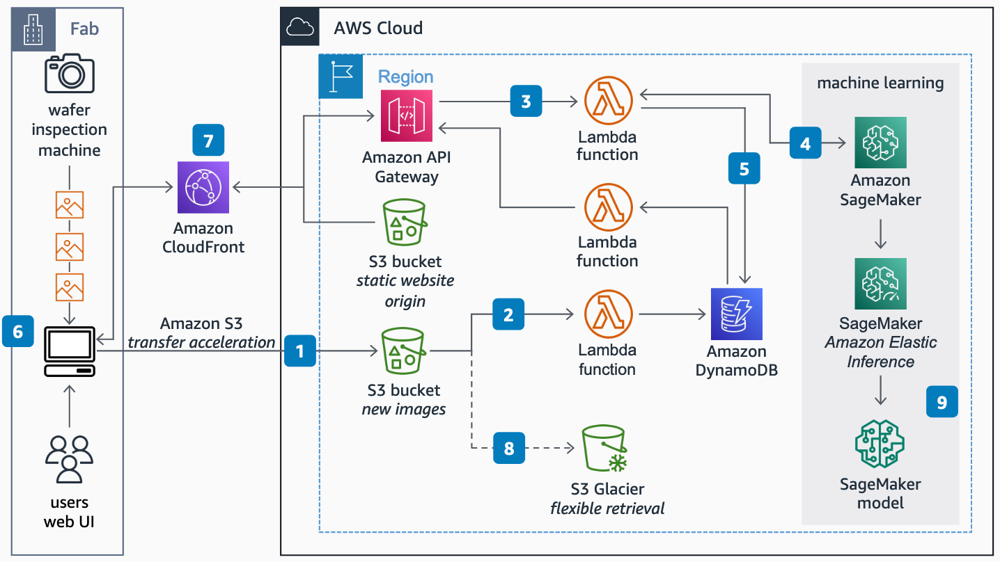

# Wafer Inspection with Machine Learning

Publication date: **September 16, 2022 ([Diagram history](#diagram-history "#diagram-history"))**

This architecture shows you how computer vision wafer inspection accelerates defect detection and reduces human error in detecting (ring/scratch and so on), improving fab productivity.

## Wafer Inspection with Machine Learning

Diagram

1. Users upload images from wafer inspection to an **Amazon Simple Storage Service** (Amazon S3) bucket through a web user interface (UI) using transfer
   acceleration.
2. **Amazon S3** calls an **AWS Lambda** function, logging the new image location in an **DynamoDB** table.
3. The web interface calls an **Amazon API Gateway**
   instance with the images metadata, which is stored in **Amazon DynamoDB** by a second **Lambda** function.
4. The **Lambda** function calls **Amazon SageMaker AI** for inference. Amazon Elastic Inference lowers the cost of
   inference by only attaching a graphics processing unit (GPU) when data needs to be
   processed.
5. The **Lambda** function adds the Inference results to the
   **Amazon DynamoDB** table.
6. Users are notified in the UI of detected defects. The UI fetches the image and
   metadata of the defected wafer from **Amazon API Gateway**. Wafers without defects move faster to the next
   step.
7. To accelerate user access to the image and inference results **Amazon CloudFront** caches both static content and API calls.
8. **Amazon S3** lifecycle policies move older images to cold
   storage for cost optimization.
9. Images analyzed by engineers are added to the next model-training datasets to improve inference accuracy.

## Download editable diagram

To customize this reference architecture diagram based on your business needs, [download the ZIP file](samples/wafer-inspection-with-machine-learning-architecture.md "samples/wafer-inspection-with-machine-learning-architecture.md") which contains an editable PowerPoint.

## Create a free AWS account

Sign up for an AWS account. New accounts include 12 months of [AWS Free Tier](https://aws.amazon.com/free/ "https://aws.amazon.com/free/") access, including the use of Amazon EC2, Amazon S3, and
Amazon DynamoDB.

## Further reading

For additional information, refer to

- [AWS Architecture
  Icons](https://aws.amazon.com/architecture/icons "https://aws.amazon.com/architecture/icons")
- [AWS Architecture Center](https://aws.amazon.com/architecture "https://aws.amazon.com/architecture")
- [AWS Well-Architected](https://aws.amazon.com/architecture/well-architected "https://aws.amazon.com/architecture/well-architected")

## Diagram history

To be notified about updates to this reference architecture diagram, subscribe to the RSS feed.

| Change              | Description                                     | Date               |
| ------------------- | ----------------------------------------------- | ------------------ |
| Initial publication | Reference architecture diagram first published. | September 16, 2022 |

###### Note

To subscribe to RSS updates, you must have an RSS plugin enabled for the browser you are using.
