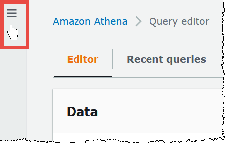

# Enable CloudWatch query metrics in Athena

When you create a workgroup in the console, the setting for publishing query metrics
to CloudWatch is selected by default.

###### To enable or disable query metrics in the Athena console for a workgroup

1. Open the Athena console at
   [https://console.aws.amazon.com/athena/](https://console.aws.amazon.com/athena/home "https://console.aws.amazon.com/athena/home").
2. If the console navigation pane is not visible, choose the expansion menu
   on the left.

 3. In the navigation pane, choose **Workgroups**. 4. Choose the link of the workgroup that you want to modify. 5. On the details page for the workgroup, choose
**Edit**. 6. In the **Settings** section, select or clear
**Publish query metrics to AWS CloudWatch**.
If you use API operations, the command line interface, or the client application with
the JDBC driver to create workgroups, to enable publishing of query metrics, set
`PublishCloudWatchMetricsEnabled` to `true` in [WorkGroupConfiguration](../APIReference/API_WorkGroupConfiguration.md "../APIReference/API_WorkGroupConfiguration.md").
The following example shows only the metrics configuration and omits other
configuration:

```
"WorkGroupConfiguration": {
      "PublishCloudWatchMetricsEnabled": "true"
     ....
     }
```
