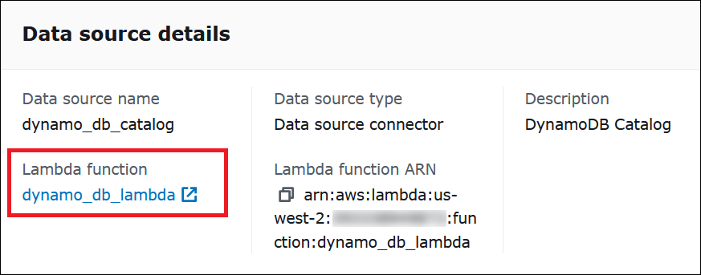
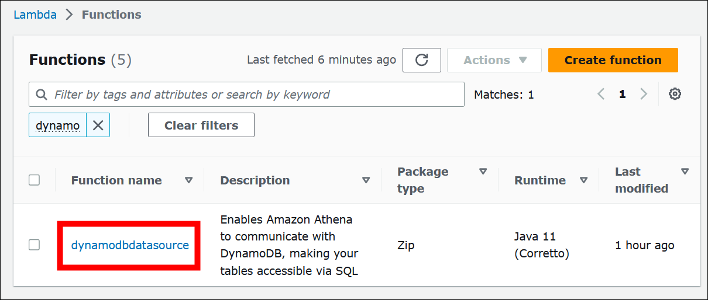
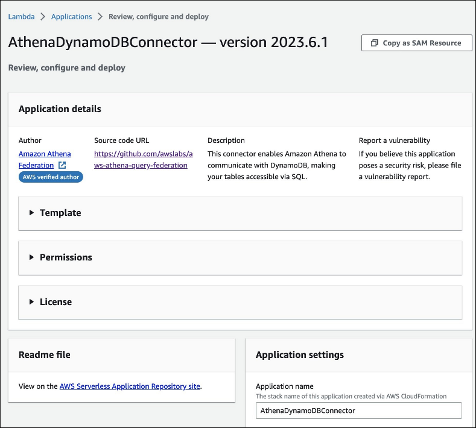
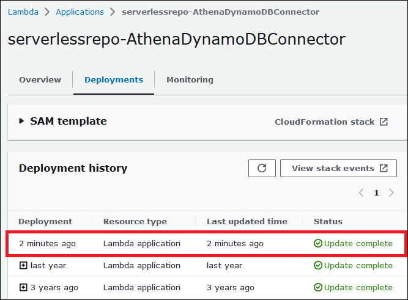

# Legacy connections

## Find the latest Athena Query Federation version

The latest version number of Athena data source connectors corresponds to the latest
Athena Query Federation version. In certain cases, the GitHub releases can be slightly
newer than what is available on the AWS Serverless Application Repository (SAR).

###### To find the latest Athena Query Federation version number

1. Visit the GitHub URL [https://github.com/awslabs/aws-athena-query-federation/releases/latest](https://github.com/awslabs/aws-athena-query-federation/releases/latest "https://github.com/awslabs/aws-athena-query-federation/releases/latest").
2. Note the release number in the main page heading in the following
   format:

**Release v**
`year`.`week_of_year`.`iteration_of_week`
**of Athena Query Federation**

For example, the release number for **Release v2023.8.3 of Athena Query
Federation** is 2023.8.3.

## Find and note resource names

In preparation for the upgrade, you must find and note the following
information:

1. The Lambda function name for the connector.
2. The Lambda function environment variables.
3. The Lambda application name, which manages the Lambda function for the
   connector.

###### To find resource names from the Athena console

1. Open the Athena console at
   [https://console.aws.amazon.com/athena/](https://console.aws.amazon.com/athena/home "https://console.aws.amazon.com/athena/home").
2. If the console navigation pane is not visible, choose the expansion menu
   on the left.

 3. In the navigation pane, choose **Data sources and catalogs**. 4. In the **Data source name** column, choose the link to the
data source for your connector. 5. In the **Data source details** section, under **Lambda
function**, choose the link to your Lambda function.

 6. On the **Functions** page, in the **Function
name** column, note the function name for your connector.

 7. Choose the function name link. 8. Under the **Function overview** section, choose the
**Configuration** tab. 9. In the pane on the left, choose **Environment
variables**. 10. In the **Environment variables** section, make a note of the
keys and their corresponding values. 11. Scroll to the top of the page. 12. In the message **This function belongs to an application. Click here
to manage it**, choose the **Click here**
link. 13. On the
**serverlessrepo-`your_application_name`**
page, make a note of your application name without
**serverlessrepo**. For example, if the application name is
**serverlessrepo-DynamoDbTestApp**, then your application
name is **DynamoDbTestApp**. 14. Stay on the Lambda console page for your application, and then continue with
the steps in **Finding the version of the connector that you are
using**.

## Find the version of the connector that you are using

Follow these steps to find the version of the connector that you are using.

###### To find the version of the connector that you are using

1. On the Lambda console page for your Lambda application, choose the
   **Deployments** tab.
2. On the **Deployments** tab, expand **SAM
   template**.
3. Search for **CodeUri**.
4. In the **Key** field under **CodeUri**, find
   the following string:

```
applications-`connector_name`-versions-`year`.`week_of_year`.`iteration_of_week`/`hash_number`
```

The following example shows a string for the CloudWatch connector:

```
applications-AthenaCloudwatchConnector-versions-2021.42.1/15151159...
```

5. Record the value for
   `year`.`week_of_year`.`iteration_of_week`
   (for example, **2021.42.1**). This is the version for your
   connector.

## Deploy the new version of your connector

Follow these steps to deploy a new version of your connector.

###### To deploy a new version of your connector

1. Open the Athena console at
   [https://console.aws.amazon.com/athena/](https://console.aws.amazon.com/athena/home "https://console.aws.amazon.com/athena/home").
2. If the console navigation pane is not visible, choose the expansion menu
   on the left.

 3. In the navigation pane, choose **Data sources and catalogs**. 4. On the **Data sources and catalogs** page, choose **Create data
source**. 5. Choose the data source that you want to upgrade, and then choose
**Next**. 6. In the **Connection details** section, choose
**Create Lambda function**. This opens the Lambda console
where you will be able to deploy your updated application.

 7. Because you are not actually creating a new data source, you can close the
Athena console tab. 8. On the Lambda console page for the connector, perform the following
steps:

    1. Ensure that you have removed the **serverlessrepo-**
     prefix from your application name, and then copy the application name to
     the **Application name** field.
    2. Copy your Lambda function name to the
     **AthenaCatalogName** field. Some connectors call
     this field **LambdaFunctionName**.
    3. Copy the environment variables that you recorded into their
     corresponding fields.

9. Select the option **I acknowledge that this app creates custom IAM
   roles and resource policies**, and then choose
   **Deploy**.
10. To verify that your application has been updated, choose the
    **Deployments** tab.

The **Deployment history** section shows that your update is
complete.

 11. To confirm the new version number, you can expand **SAM
template** as before, find **CodeUri**, and check
the connector version number in the **Key** field.

You can now use your updated connector to create Athena federated queries.
