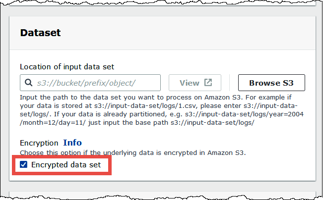
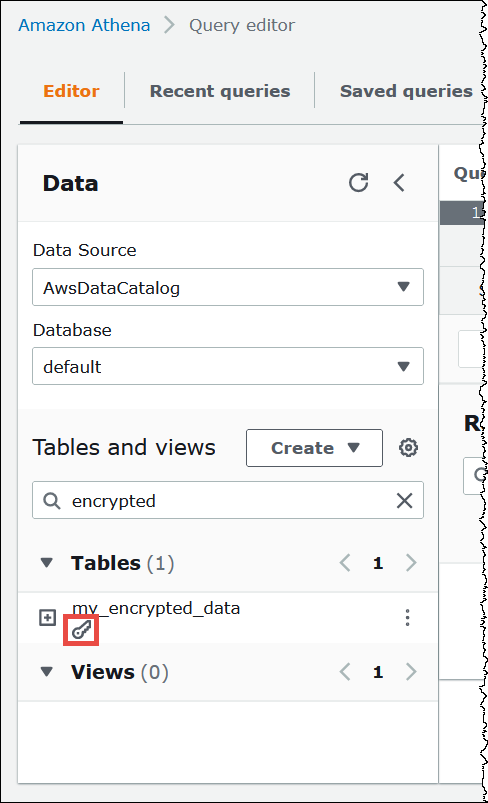

# Create tables

based on encrypted datasets in Amazon S3

When you create a table, indicate to Athena that a dataset is encrypted in Amazon S3.
This isn't required when using SSE-KMS. For both SSE-S3 and AWS KMS encryption, Athena
determines how to decrypt the dataset and create the table, so mustn't provide key
information.

Users that run queries, including the user who creates the table, must have the
permissions described earlier in this topic.

###### Important

If you use Amazon EMR along with EMRFS to upload encrypted Parquet files, you must
disable multipart uploads by setting
`fs.s3n.multipart.uploads.enabled` to `false`. If you
don't do this, Athena is unable to determine the Parquet file length and a
**HIVE_CANNOT_OPEN_SPLIT** error occurs. For
more information, see [Configure
multipart upload for Amazon S3](../../../emr/latest/ManagementGuide/emr-plan-upload-s3.md#Config_Multipart "../../../emr/latest/ManagementGuide/emr-plan-upload-s3.md#Config_Multipart") in the
_Amazon EMR Management Guide_.

To indicate that the dataset is encrypted in Amazon S3, perform one of the following
steps. This step isn't required if SSE-KMS is used.

- In a [CREATE TABLE](create-table.md "create-table.md") statement, use a
  `TBLPROPERTIES` clause that specifies
  `'has_encrypted_data'='true'`, as in the following
  example.

```
CREATE EXTERNAL TABLE 'my_encrypted_data' (
   `n_nationkey` int,
   `n_name` string,
   `n_regionkey` int,
   `n_comment` string)
ROW FORMAT SERDE
   'org.apache.hadoop.hive.ql.io.parquet.serde.ParquetHiveSerDe'
STORED AS INPUTFORMAT
   'org.apache.hadoop.hive.ql.io.parquet.MapredParquetInputFormat'
LOCATION
   's3://amzn-s3-demo-bucket/`folder_with_my_encrypted_data`/'
**TBLPROPERTIES (
 'has\_encrypted\_data'='true')**
```

- Use the [JDBC driver](connect-with-jdbc.md "connect-with-jdbc.md") and set the
  `TBLPROPERTIES` value as shown in the previous example when
  you use `statement.executeQuery()` to run the [CREATE TABLE](create-table.md "create-table.md") statement.
- When you use the Athena console to [create a table using a
  form](data-sources-glue-manual-table.md "data-sources-glue-manual-table.md") and specify the table location, select the
  **Encrypted data set** option.


In the Athena console list of tables, encrypted tables display a key-shaped
icon.


