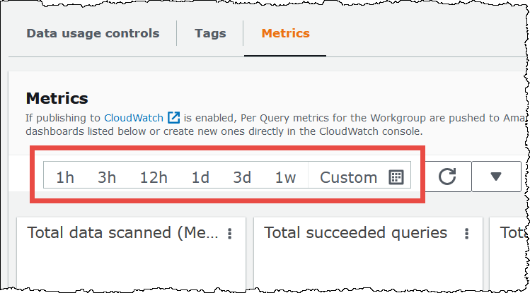
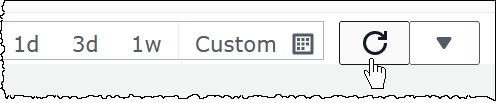
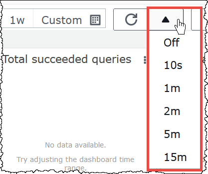

# Monitor Athena query metrics with CloudWatch

Athena publishes query-related metrics to Amazon CloudWatch, when the [publish query metrics to CloudWatch](athena-cloudwatch-metrics-enable.md "athena-cloudwatch-metrics-enable.md")
option is selected. You can create custom dashboards, set alarms and triggers on metrics in
CloudWatch, or use pre-populated dashboards directly from the Athena console.

When you enable query metrics for queries in workgroups, the metrics are displayed within
the **Metrics** tab in the **Workgroups** panel, for each
workgroup in the Athena console.

Athena publishes the following metrics to the CloudWatch console:

- `DPUAllocated` – The total number of DPUs (data processing units)
  provisioned in a capacity reservation to run queries.
- `DPUConsumed` – The number of DPUs actively consumed by queries
  in a `RUNNING` state at a given time in a reservation. Metric emitted
  only when workgroup is associated with a capacity reservation and includes all
  workgroups associated with a reservation.
- `DPUCount` – The maximum number of DPUs consumed by your query,
  published exactly once as the query completes.
- `EngineExecutionTime` – The number of milliseconds that the query
  took to run.
- `ProcessedBytes` – The number of bytes that Athena scanned per DML
  query.
- `QueryPlanningTime` – The number of milliseconds that Athena took
  to plan the query processing flow.
- `QueryQueueTime` – The number of milliseconds that the query was
  in the query queue waiting for resources.
- `ServicePreProcessingTime` – The number of milliseconds that
  Athena took to preprocess the query before submitting the query to the query
  engine.
- `ServiceProcessingTime` – The number of milliseconds that Athena
  took to process the query results after the query engine finished running the
  query.
- `TotalExecutionTime` – The number of milliseconds that Athena took
  to run a DDL or DML query.
  For more complete descriptions, see the [List of CloudWatch metrics and dimensions for Athena](#athena-cloudwatch-metrics-table "#athena-cloudwatch-metrics-table") later in this document.

These metrics have the following dimensions:

- `CapacityReservation` – The name of the capacity reservation used
  to execute the query, if applicable.
- `QueryState` – `SUCCEEDED`, `FAILED`, or
  `CANCELED`
- `QueryType` – `DML`, `DDL`, or
  `UTILITY`
- `WorkGroup` – name of the workgroup
  Athena publishes the following metric to the CloudWatch console under the
  `AmazonAthenaForApacheSpark` namespace:

- `DPUCount` – number of DPUs consumed during the session to
  execute the calculations.
  This metric has the following dimensions:

- `SessionId` – The ID of the session in which the calculations
  are submitted.
- `WorkGroup` – Name of the workgroup.
  For more information, see the [List of CloudWatch metrics and dimensions for Athena](#athena-cloudwatch-metrics-table "#athena-cloudwatch-metrics-table") later in this topic. For information
  about Athena usage metrics, see [Monitor Athena usage metrics with CloudWatch](monitoring-athena-usage-metrics.md "monitoring-athena-usage-metrics.md").

You can view query metrics in the Athena console or in the CloudWatch console.

###### To view query metrics for a workgroup in the Athena console

1. Open the Athena console at
   [https://console.aws.amazon.com/athena/](https://console.aws.amazon.com/athena/home "https://console.aws.amazon.com/athena/home").
2. If the console navigation pane is not visible, choose the expansion menu
   on the left.

 3. In the navigation pane, choose **Workgroups**. 4. Choose the workgroup that you want from the list, and then choose the
**Metrics** tab.

The metrics dashboard displays.

###### Note

If you just recently enabled metrics for the workgroup and/or there
has been no recent query activity, the graphs on the dashboard may be
empty. Query activity is retrieved from CloudWatch depending on the interval
that you specify in the next step. 5. In the **Metrics** section, choose the metrics interval
that Athena should use to fetch the query metrics from CloudWatch, or specify a
custom interval.

 6. To refresh the displayed metrics, choose the refresh icon.

 7. Click the arrow next to the refresh icon to choose how frequently you want
the metrics display to be updated.



###### To view metrics in the Amazon CloudWatch console

1. Open the CloudWatch console at
   [https://console.aws.amazon.com/cloudwatch/](https://console.aws.amazon.com/cloudwatch/ "https://console.aws.amazon.com/cloudwatch/").
2. In the navigation pane, choose **Metrics**, **All
   metrics**.
3. Select the **AWS/Athena** namespace.

###### To view metrics with the AWS CLI

- Do one of the following:

      + To list the metrics for Athena, open a command prompt, and use the
       following command:


      ```
      aws cloudwatch list-metrics --namespace "AWS/Athena"
      ```
      + To list all available metrics, use the following command:


      ```
      aws cloudwatch list-metrics"
      ```

  If you've enabled CloudWatch metrics in Athena, it sends the following metrics to CloudWatch per
  workgroup. The following metrics use the `AWS/Athena` namespace.

| Metric name              | Description                                                                                                                                                                                                                                                                                                                                                                                                                                                                                                                                                               |
| ------------------------ | ------------------------------------------------------------------------------------------------------------------------------------------------------------------------------------------------------------------------------------------------------------------------------------------------------------------------------------------------------------------------------------------------------------------------------------------------------------------------------------------------------------------------------------------------------------------------- |
| DPUAllocated             | The total number of DPUs (data processing units) provisioned in a<br>capacity reservation to run queries.                                                                                                                                                                                                                                                                                                                                                                                                                                                                 |
| DPUConsumed              | The number of DPUs actively consumed by queries in a<br>`RUNNING` state at a given time in a reservation. This<br>metric is emitted only when workgroup is associated with a capacity<br>reservation and includes all workgroups associated with a reservation.<br>If you move a workgroup from one reservation to another, the metric<br>includes data from the time when the workgroup belonged to the first<br>reservation. For more information about capacity reservations, see [Manage query processing capacity](capacity-management.md "capacity-management.md"). |
| DPUCount                 | The maximum number of DPUs consumed by your query, published exactly<br>once as the query completes. This metric is emitted only for workgroups<br>that are attached to a capacity reservation.                                                                                                                                                                                                                                                                                                                                                                           |
| EngineExecutionTime      | The number of milliseconds that the query took to run.                                                                                                                                                                                                                                                                                                                                                                                                                                                                                                                    |
| ProcessedBytes           | The number of bytes that Athena scanned per DML query. For queries<br>that were canceled (either by the users, or automatically, if they<br>reached the limit), this includes the amount of data scanned before<br>the cancellation time. This metric is not reported for DDL<br>queries.                                                                                                                                                                                                                                                                                 |
| QueryPlanningTime        | The number of milliseconds that Athena took to plan the query<br>processing flow. This includes the time spent retrieving table<br>partitions from the data source. Note that because the query engine<br>performs the query planning, query planning time is a subset of<br>EngineExecutionTime.                                                                                                                                                                                                                                                                         |
| QueryQueueTime           | The number of milliseconds that the query was in the query queue<br>waiting for resources. Note that if transient errors occur, the query<br>can be automatically added back to the queue.                                                                                                                                                                                                                                                                                                                                                                                |
| ServicePreProcessingTime | The number of milliseconds that Athena took to preprocess the query<br>before submitting the query to the query engine.                                                                                                                                                                                                                                                                                                                                                                                                                                                   |
| ServiceProcessingTime    | The number of milliseconds that Athena took to process the query<br>results after the query engine finished running the query.                                                                                                                                                                                                                                                                                                                                                                                                                                            |
| TotalExecutionTime       | The number of milliseconds that Athena took to run a DDL or DML query.<br>TotalExecutionTime includes QueryQueueTime, QueryPlanningTime,<br>EngineExecutionTime, and ServiceProcessingTime.                                                                                                                                                                                                                                                                                                                                                                               |

These metrics for Athena have the following dimensions.

| Dimension           | Description                                                                                                                                                                                                                                                                                                                                                                                                          |
| ------------------- | -------------------------------------------------------------------------------------------------------------------------------------------------------------------------------------------------------------------------------------------------------------------------------------------------------------------------------------------------------------------------------------------------------------------- |
| CapacityReservation | The name of the capacity reservation that was used to execute the<br>query, if applicable. When a capacity reservation is not used, this<br>dimension returns no data.                                                                                                                                                                                                                                               |
| QueryState          | The query state.<br>Valid statistics: SUCCEEDED, FAILED, or CANCELED.                                                                                                                                                                                                                                                                                                                                                |
| QueryType           | The query type.<br>Valid statistics: `DDL`, `DML`, or<br>`UTILITY`. The type of query statement that was run.<br>`DDL` indicates DDL (Data Definition Language) query<br>statements. `DML` indicates DML (Data Manipulation<br>Language) query statements, such as `CREATE TABLE AS<br>SELECT`. `UTILITY` indicates query statements<br>other than DDL and DML, such as `SHOW CREATE TABLE`, or<br>`DESCRIBE TABLE`. |
| WorkGroup           | The name of the workgroup.                                                                                                                                                                                                                                                                                                                                                                                           |
