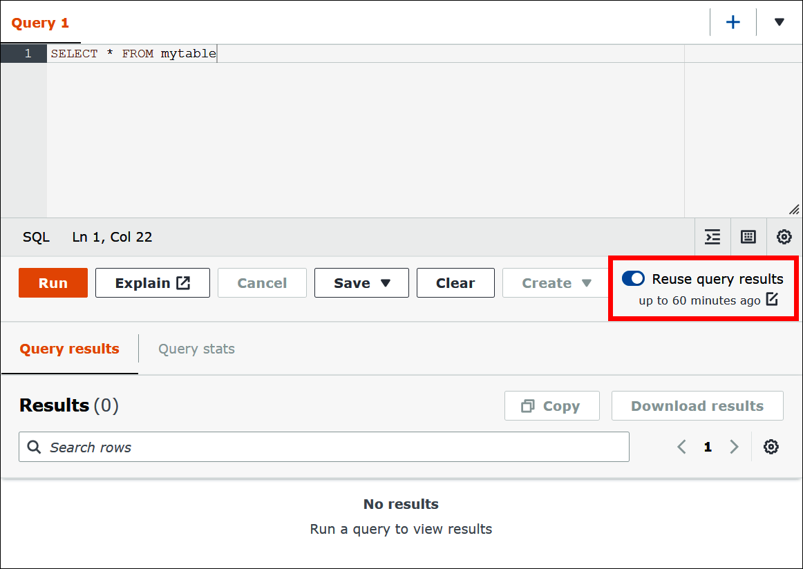
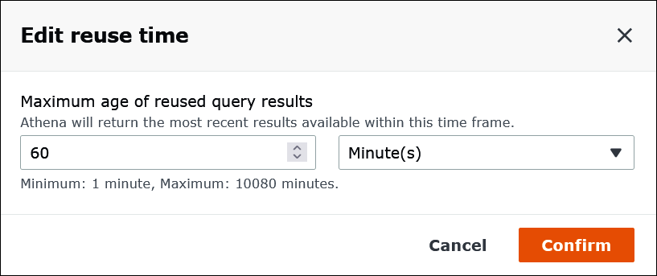
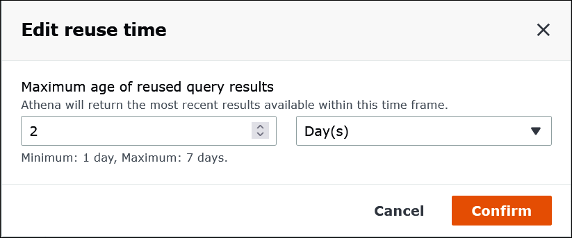
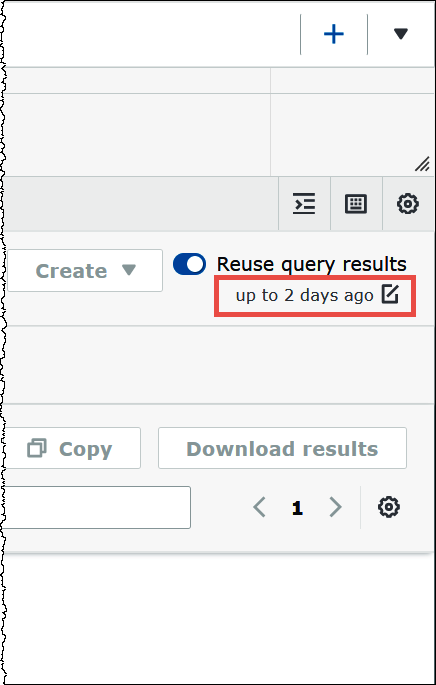

# Reuse query results in Athena

When you re-run a query in Athena, you can optionally choose to reuse the last stored query
result. This option can increase performance and reduce costs in terms of the number of
bytes scanned. Reusing query results is useful if, for example, you know that the results
will not change within a given time frame. You can specify a maximum age for reusing query
results. Athena uses the stored result as long as it is not older than the age that you
specify. For more information, see [Reduce cost and improve query performance with Amazon Athena](https://aws.amazon.com/blogs/big-data/reduce-cost-and-improve-query-performance-with-amazon-athena-query-result-reuse/ "https://aws.amazon.com/blogs/big-data/reduce-cost-and-improve-query-performance-with-amazon-athena-query-result-reuse/") in the _AWS
Big Data Blog_.

###### Note

The query result reuse feature requires Athena engine version 3. For information about changing engine
versions, see [Change Athena engine versions](engine-versions-changing.md "engine-versions-changing.md").

## Key features

- Reusing query results is a per-query, opt-in feature. You can enable query
  result reuse on a per query basis.
- The maximum age for reusing query results can be specified in minutes, hours,
  or days. The maximum age specifiable is the equivalent of 7 days regardless of
  the time unit used. The default is 60 minutes.
- When you enable result reuse for a query, Athena looks for a previous execution
  of the query within the same workgroup. If Athena finds corresponding stored
  query results, it does not rerun the query, but points to the previous result
  location or fetches data from it.

- For any query that enables the results reuse option, Athena reuses the last
  query result saved to the workgroup folder only when all the following
  conditions are true:
  - The query string is an exact match.
  - The database and the catalog name match.
  - The previous result is not older than the maximum age specified, or
    not older than 60 minutes if a maximum age has not been
    specified.
  - Athena only reuses an execution that has the exact same [result
    configuration](../APIReference/API_ResultConfiguration.md "../APIReference/API_ResultConfiguration.md") as the current execution.
  - You have access to all the tables referenced in the query.
  - You have access to the S3 file location where the previous result is
    stored.

If any of these conditions are not met, Athena runs the query without using the cached
results.

## Considerations

and limitations

When using the query result reuse feature, keep in mind the following points:

- Athena reuses query results only within the same workgroup.
- The reuse query results feature respects workgroup configurations. If you
  override the result configuration for a query, the feature is disabled.
- Only queries that produce query result sets on Amazon S3 can reuse query results.
  This means that, for example, CTAS, `INSERT INTO`,
  `MERGE`, `UNLOAD`, and DDL queries are not
  supported.
- Apache Hive, Apache Hudi, Apache Iceberg, and Linux Foundation Delta Lake
  tables registered with AWS Glue are supported. External Hive metastores are not
  supported.
- Queries that reference federated catalogs or an external Hive metastore are
  not supported.
- Query result reuse is not supported for Lake Formation governed tables.
- Query result reuse is not supported when the Amazon S3 location of the table source
  is registered as a data location in Lake Formation.
- Tables with row and column permissions are not supported.
- Tables that have fine grained access control (for example, column or row
  filtering) are not supported.
- Any query that references an unsupported table is not eligible for query
  result reuse.
- Athena requires that you have Amazon S3 read permissions for the previously
  generated output file to be reused.
- The reuse query results feature assumes that content of previous result has
  not been modified. Athena does not check the integrity of a previous result
  before using it.
- If the query results from the previous execution have been deleted or moved to
  different location in Amazon S3, the subsequent execution of the same query will not
  reuse the query results.
- Potentially stale results can be returned. Athena does not check for changes in
  source data until the maximum reuse age that you specify has been
  reached.
- If multiple results are available for reuse, Athena uses the latest
  result.
- Queries that use non-deterministic operators or functions like
  `rand()` or `shuffle()` do not use cached results. For
  example, `LIMIT` without `ORDER BY` is non-deterministic
  and not cached, but `LIMIT` with `ORDER BY` is
  deterministic and is cached.
- Query result reuse is supported in the Athena console, in the Athena API, and in
  the JDBC driver. Currently, ODBC driver support for query result reuse is
  available only for Windows.
- To use the query result reuse feature with JDBC, the minimum required driver
  version is 2.0.34.1000. For ODBC, the minimum required driver version is
  1.1.19.1002. For driver download information, see [Connect to Amazon Athena with ODBC and JDBC
  drivers](athena-bi-tools-jdbc-odbc.md "athena-bi-tools-jdbc-odbc.md").
- Query result reuse is not supported for queries that use more than one data
  catalog.
- Query result reuse is not supported for queries that include more than 20
  tables.

## How to reuse query results in the

Athena console

To use the feature, enable the **Reuse query results** option in the
Athena query editor.

###### To configure the reuse query results feature

1. In the Athena query editor, under the **Reuse query results**
   option, choose the edit icon next to **up to 60 minutes
   ago**.
2. In the **Edit reuse time** dialog box, from the box on the
   right, choose a time unit (minutes, hours, or days).
3. In the box on the left, enter or choose the number of time units that you want
   to specify. The maximum time you can enter is the equivalent of seven days
   regardless of the time unit chosen.

The following example specifies a maximum reuse time of two days.

 4. Choose **Confirm**.

A banner confirms your configuration change, and the **Reuse query
results** option displays your new setting.

