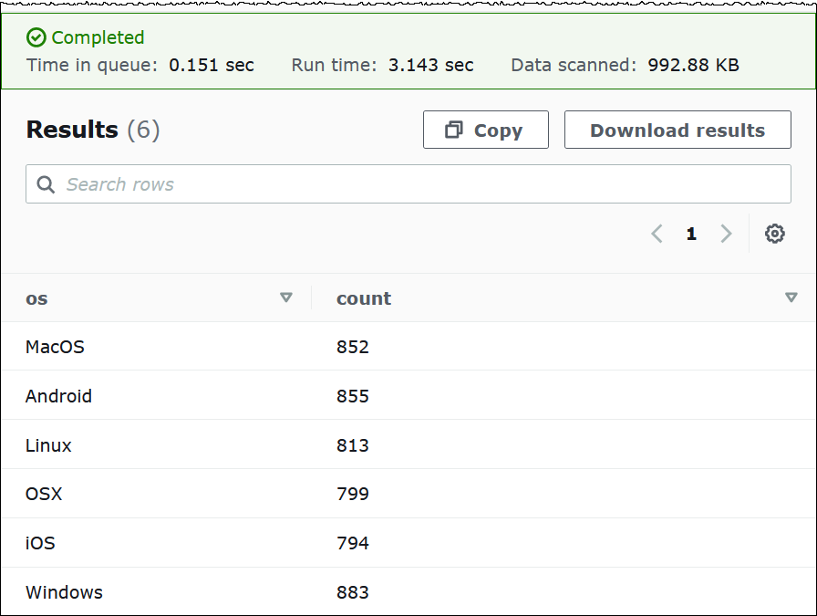
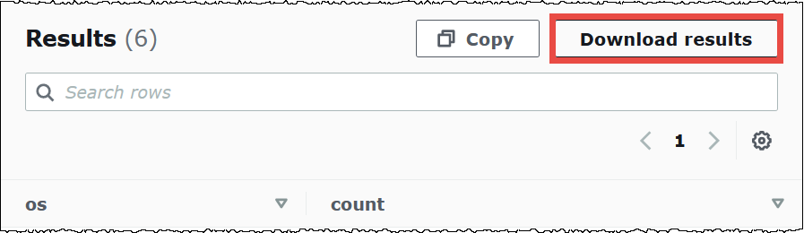
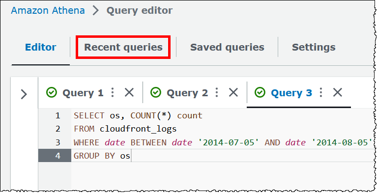
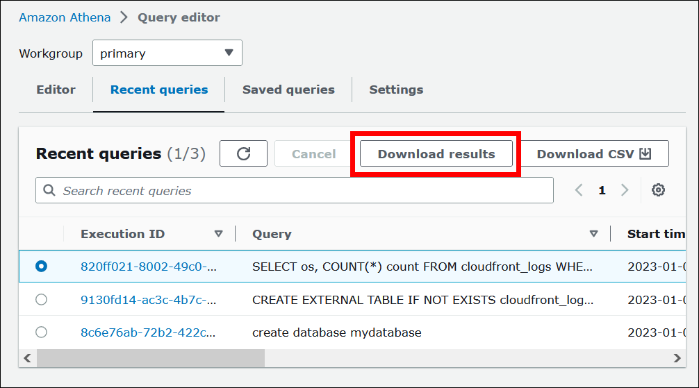
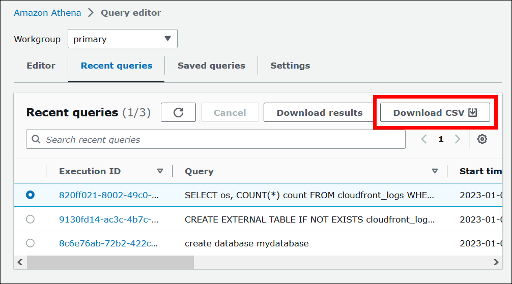

# Step 3: Query data

Now that you have the `cloudfront_logs` table created in Athena based on the
data in Amazon S3, you can run SQL queries on the table and see the results in Athena. For
more information about using SQL in Athena, see [SQL reference for Athena](ddl-sql-reference.md "ddl-sql-reference.md").

###### To run a query

1. Choose the plus (**+**) sign to open a new query tab and
   enter the following SQL statement in the query pane.

```
SELECT os, COUNT(*) count
FROM cloudfront_logs
WHERE date BETWEEN date '2014-07-05' AND date '2014-08-05'
GROUP BY os
```

2. Choose **Run**.

The results look like the following:

 3. To save the results of the query to a `.csv` file, choose
**Download results**.

 4. To view or run previous queries, choose the **Recent
queries** tab.

 5. To download the results of a previous query from the **Recent
queries** tab, select the query, and then choose **Download
results**. Queries are retained for 45 days.

 6. To download one or more recent SQL query strings to a CSV file, choose
**Download CSV**.



For more information, see [Work with query results and recent queries](querying.md "querying.md").
