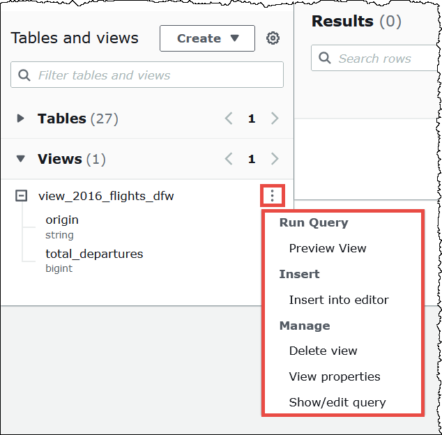

# Manage Athena views

In the Athena console, you can:

- Locate all views in the left pane, where tables are listed.
- Filter views.
- Preview a view, show its properties, edit it, or delete it.

###### To show the actions for a

view

A view shows in the console only if you have already created it.

1. In the Athena console, choose **Views**, and then choose a
   view to expand it and show the columns in the view.
2. Choose the three vertical dots next to the view to show a list of actions for
   the view.

 3. Choose actions to preview the view, insert the view name into the query
editor, delete the view, see the view's properties, or display and edit the view
in the query editor.

## Supported DDL actions for Athena views

Athena supports the following management actions for views.

| Statement                                                                                 | Description                                                                                                                                                                                                                                                                       |
| ----------------------------------------------------------------------------------------- | --------------------------------------------------------------------------------------------------------------------------------------------------------------------------------------------------------------------------------------------------------------------------------- |
| [CREATE VIEW and CREATE PROTECTED MULTI DIALECT VIEW](create-view.md "create-view.md") | Creates a new view from a specified `SELECT` query. For more information, see [Create views](views-console.md#creating-views "views-console.md#creating-views"). The optional `OR REPLACE` clause lets you update the existing view by replacing it.                     |
| [DESCRIBE VIEW](describe-view.md "describe-view.md")                                      | Shows the list of columns for the named view. This allows you to examine the attributes of a complex view.                                                                                                                                                                     |
| [DROP VIEW](drop-view.md "drop-view.md")                                                  | Deletes an existing view. The optional `IF EXISTS` clause suppresses the error if the view does not exist.                                                                                                                                                                     |
| [SHOW CREATE VIEW](show-create-view.md "show-create-view.md")                             | Shows the SQL statement that creates the specified view.                                                                                                                                                                                                                       |
| [SHOW VIEWS](show-views.md "show-views.md")                                               | Lists the views in the specified database, or in the current database if you omit the database name. Use the optional `LIKE` clause with a regular expression to restrict the list of view names. You can also see the list of views in the left pane in the console. |
| [SHOW COLUMNS](show-columns.md "show-columns.md")                                         | Lists the columns in the schema for a view.                                                                                                                                                                                                                                       |
