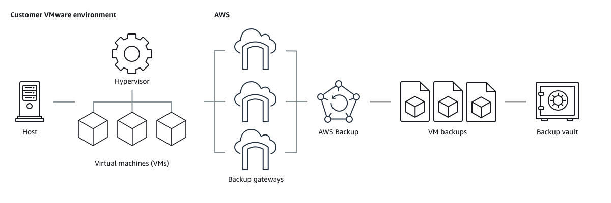

# How AWS Backup works with supported AWS

services

Some AWS Backup-supported AWS services offer their own, stand-alone backup features. Those
features are available to you independent of whether you use AWS Backup. However, the backups other
AWS services create are not available for central governance through AWS Backup.

To configure AWS Backup to centrally manage data protection for all your supported services,
you must opt in to managing that service with AWS Backup, create an on-demand backup or schedule
backups using a backup plan, and store your backups in backup vaults.

See [Assigning resources](assigning-resources.md "assigning-resources.md") for information on
choosing which services (resource types) you want to back up.

###### Topics

- [Working with Amazon S3 data](#working-with-s3 "#working-with-s3")
- [Working with VMware virtual machines](#working-with-vms "#working-with-vms")
- [Working with Amazon DynamoDB](#working-with-ddb "#working-with-ddb")
- [Working with Amazon FSx file systems](#working-with-fsx "#working-with-fsx")
- [Working with Amazon EC2](#working-with-ec2 "#working-with-ec2")
- [Working with Amazon EFS](#working-with-efs "#working-with-efs")
- [Working with Amazon EBS](#working-with-ebs "#working-with-ebs")
- [Working with Amazon RDS and Aurora](#working-with-rds "#working-with-rds")
- [Working with Aurora DSQL](#working-with-aurora-dsql "#working-with-aurora-dsql")
- [Working with AWS BackInt](#working-with-backint "#working-with-backint")
- [Working with AWS Storage Gateway](#working-with-storage-gateway "#working-with-storage-gateway")
- [Working with Amazon DocumentDB](#working-with-docdb "#working-with-docdb")
- [Working with Amazon Neptune](#working-with-nep "#working-with-nep")
- [Working with Amazon Redshift and Amazon Redshift Serverless](#working-with-redshift "#working-with-redshift")
- [Working with Amazon Timestream](#working-with-timestream "#working-with-timestream")
- [Working with AWS Organizations](#working-with-orgs "#working-with-orgs")
- [Working with CloudFormation](#working-with-cloudformation "#working-with-cloudformation")
- [Working with AWS BackInt, AWS Systems Manager for SAP, and SAP HANA](#working-with-saphana-and-backint-and-ssm "#working-with-saphana-and-backint-and-ssm")
- [Working with Amazon EKS](#working-with-eks "#working-with-eks")
- [Working with Amazon GuardDuty](#working-with-guardduty "#working-with-guardduty")
- [How AWS services back up their own resources](#services-backup "#services-backup")

## Working with Amazon S3 data

AWS Backup offers fully-managed backup and restore for Amazon S3 backups.
To learn more, see [Amazon S3 backups](s3-backups.md "s3-backups.md").

- How to back up resources: [Getting started with AWS Backup](getting-started.md "getting-started.md")
- How to restore Amazon S3 data using AWS Backup: [Restore S3 data using AWS Backup](restoring-s3.md "restoring-s3.md")

For detailed information about S3 data, see the [Amazon S3
documentation](../../../s3.md "../../../s3.md").

## Working with VMware virtual machines

AWS Backup supports centralized and automated data protection for on-premises VMware virtual
machines (VMs) along with VMs in the VMware Cloud™ (VMC) on AWS. You can back up from your
on premises and VMC virtual machines to AWS Backup. Then, you can restore from AWS Backup to either on
premises or VMC.

Backup gateway is downloadable AWS Backup software that you deploy to your VMware infrastructure
to connect your VMware VMs to AWS Backup. The gateway connects to your VM management server to discover your
VMs, encrypt data, and efficiently transfer data to AWS Backup. The following diagram illustrates
how Backup gateway connects to your VMs:

- How to back up resources: [Virtual machine backups](vm-backups.md "vm-backups.md")
- How to restore VM resources: [Restore a virtual machine using AWS Backup](restoring-vm.md "restoring-vm.md")

## Working with Amazon DynamoDB

AWS Backup supports backing up and restoring Amazon DynamoDB tables. DynamoDB is a fully-managed NoSQL
database service that provides fast and predictable performance with seamless
scalability.

Since its launch, AWS Backup has always supported DynamoDB. Starting November 2021, AWS Backup also
introduced advanced features for DynamoDB backups. Those advanced features include copying your
backups across AWS Regions and accounts, tiering backups to cold storage, and using tags
for permissions and cost management.

New AWS Backup customers onboarding after November 2021 will have advanced DynamoDB backup
features enabled by default.

We recommend all existing AWS Backup customers enable advanced features for DynamoDB. There is
no difference in warm backup storage pricing after you enable advanced features, and you can
save money by tiering backups to cold storage and optimize your costs by using cost
allocation tags.

For a full list of advanced features and how to enable them, see [Advanced DynamoDB backup](advanced-ddb-backup.md "advanced-ddb-backup.md").

- How to back up resources: [Getting started with AWS Backup](getting-started.md "getting-started.md")
- How to restore DynamoDB resources: [Restore a Amazon DynamoDB table](restoring-dynamodb.md "restoring-dynamodb.md")

For detailed information about DynamoDB, see [What is Amazon DynamoDB?](../../../amazondynamodb/latest/developerguide/Introduction.md "../../../amazondynamodb/latest/developerguide/Introduction.md") in
the _Amazon DynamoDB Developer Guide_.

## Working with Amazon FSx file systems

AWS Backup supports backing up and restoring Amazon FSx file systems. Amazon FSx provides fully
managed third-party file systems with the native compatibility and feature sets for
workloads. AWS Backup uses the built-in backup functionality of Amazon FSx. So backups taken from the
AWS Backup console have the same level of file system consistency and performance, and the same
restore options as backups that are taken through the Amazon FSx console.

If you use AWS Backup to manage these backups, you gain additional functionality, such as
unlimited retention options, and the ability to create scheduled backups as frequently as
every hour. In addition, AWS Backup retains your backups even after the source file system is
deleted. This protects against accidental or malicious deletion.

Use AWS Backup to protect Amazon FSx file systems if you want to configure backup policies and
monitor backup tasks from a central backup console that also extends support for other AWS
services.

- How to back up resources: [Getting started with AWS Backup](getting-started.md "getting-started.md")
- How to restore Amazon FSx resources: [Restore an FSx file system](restoring-fsx.md "restoring-fsx.md")

For detailed information about Amazon FSx file systems, see the [Amazon FSx documentation](../../../fsx.md "../../../fsx.md").

## Working with Amazon EC2

AWS Backup supports Amazon EC2 instances.

- How to back up resources: [Getting started with AWS Backup](getting-started.md "getting-started.md")
- How to restore Amazon EC2 resources: [Restore an Amazon EC2 instance](restoring-ec2.md "restoring-ec2.md")

You can schedule or perform on-demand backup jobs that include entire EC2 instances,
including its Amazon EBS volumes. Therefore, you can restore an entire Amazon EC2 instance from a
single recovery point, including the root volume, data volumes, and some instance
configuration settings, such as the instance type and key pair.

You can also back up and restore your VSS-enabled Microsoft Windows applications. You
can schedule application-consistent backups, define lifecycle policies, and perform
consistent restores as part of an on-demand backup or a scheduled backup plan. For more
information, see [Create Windows VSS backups](windows-backups.md "windows-backups.md").

AWS Backup does not reboot your EC2 instances at any time.

**Images and snapshots**

When backing up an Amazon EC2 instance, AWS Backup takes a snapshot of the root Amazon EBS storage
volume, the launch configurations, and all associated EBS volumes. AWS Backup stores certain
configuration parameters of the EC2 instance, including instance type, security groups,
Amazon VPC, monitoring configuration, and tags. The backup data is stored as an Amazon EBS
volume-backed Amazon Machine Image (AMI).

If the instance was launched from an AMI from AWS Marketplace, the instance has a product code.
An AMI created from the instance also has a product code. With Amazon EC2, you can't copy an
AMI with a product code to another account. Therefore, AWS Backup also has this restriction.

If you delete an Amazon Machine Image (AMI) or Amazon EBS snapshot that is managed by AWS Backup
using AWS Backup and you have the Amazon EC2 recycle bin configured, the image or snapshot might
incur charges per the Amazon EC2 recycle bin policy. Snapshots and images in the Amazon EC2 recycle bin
are no longer managed by AWS Backup and will not be managed by AWS Backup policies if you restore
them from the recycle bin.

AWS Backup managed Amazon EBS snapshots and snapshots associated with a AWS Backup managed Amazon EC2 AMI
which have Amazon EBS Snapshot Lock applied may not be deleted as part of the recovery point
lifecycle if the snapshot lock duration exceeds the backup lifecycle. Instead, these
recovery points will have the status of `EXPIRED`. These recovery points can be
[deleted
manually](deleting-backups.md#deleting-backups-manually "deleting-backups.md#deleting-backups-manually") if you choose to first remove the Amazon EBS snapshot lock.

AWS Backup can encrypt EBS snapshots associated with an Amazon EC2 backup. This is similar to how
it encrypts EBS snapshots. AWS Backup uses the same encryption applied on the underlying EBS
volumes when creating a snapshot of the Amazon EC2 AMI, and the configuration parameters of the
original instance are persisted in the restore metadata.

A snapshot derives its encryption from the volume, and the same
encryption is applied to the corresponding snapshots. EBS snapshots of a copied AMI are
always encrypted. If you specify a KMS key during the copy, the specified key is applied.
If you don't specify a KMS key, a default KMS key is applied.

For more information, see [Amazon EC2 instances](../../../AWSEC2/latest/UserGuide/Instances.md "../../../AWSEC2/latest/UserGuide/Instances.md") in the
_Amazon EC2 User Guide_ and [Amazon EBS encryption](../../../ebs/latest/userguide/ebs-encryption.md "../../../ebs/latest/userguide/ebs-encryption.md") in the
_Amazon EBS User Guide_.

## Working with Amazon EFS

AWS Backup supports Amazon Elastic File System (Amazon EFS).

- How to back up resources: [Getting started with AWS Backup](getting-started.md "getting-started.md")
- How to restore Amazon EFS resources: [Restore an Amazon EFS file system](restoring-efs.md "restoring-efs.md")

The Amazon EFS automatic backup vault `aws/efs/automatic-backup-vault` is reserved
for those automatic backups only.

This vault should not be used to create cross-account copies or as a destination for
backups created by other non-automated backup plans. If you use it as a destination for
other backup plans, you will receive an "insufficient privileges" error.

For detailed information about Amazon EFS file systems, see [What is Amazon Elastic File System?](../../../efs/latest/ug/whatisefs.md "../../../efs/latest/ug/whatisefs.md") in the _Amazon Elastic File System User Guide_.

## Working with Amazon EBS

AWS Backup supports Amazon Elastic Block Store (Amazon EBS) volumes.

AWS Backup managed Amazon EBS snapshots and snapshots associated with a AWS Backup managed Amazon EC2 AMI
which have Amazon EBS Snapshot Lock applied may not be deleted as part of the recovery point
lifecycle if the snapshot lock duration exceeds the backup lifecycle. Instead, these
recovery points will have the status of `EXPIRED`. These recovery points can be
[deleted
manually](deleting-backups.md#deleting-backups-manually "deleting-backups.md#deleting-backups-manually") if you choose to first remove the Amazon EBS snapshot lock.

- How to back up resources: [Getting started with AWS Backup](getting-started.md "getting-started.md")
- How to restore Amazon EBS volumes: [Restore an Amazon EBS volume](restoring-ebs.md "restoring-ebs.md")

You can also learn more using the following tutorial: [Amazon EBS Backup and Restore Using AWS Backup](https://aws.amazon.com/getting-started/hands-on/amazon-ebs-backup-and-restore-using-aws-backup/ "https://aws.amazon.com/getting-started/hands-on/amazon-ebs-backup-and-restore-using-aws-backup/").

For more information, see [Amazon EBS volumes](../../../ebs/latest/userguide/ebs-volumes.md "../../../ebs/latest/userguide/ebs-volumes.md") in the
_Amazon EBS User Guide_.

## Working with Amazon RDS and Aurora

AWS Backup supports Amazon RDS database engines and Aurora clusters.

- How to back up resources: [Getting started with AWS Backup](getting-started.md "getting-started.md")
- [Amazon Relational Database Service backups](rds-backup.md "rds-backup.md")
- How to restore Amazon RDS resources: [Restore an RDS database](restoring-rds.md "restoring-rds.md")
- How to restore Aurora clusters: [Restoring an Amazon Aurora cluster](restoring-aur.md "restoring-aur.md")

You can also learn by trying the following how-to guide: [Amazon RDS Backup and Restore Using AWS Backup](https://aws.amazon.com/getting-started/hands-on/amazon-rds-backup-restore-using-aws-backup/ "https://aws.amazon.com/getting-started/hands-on/amazon-rds-backup-restore-using-aws-backup/").

For more information about Amazon RDS, see [What is Amazon Relational Database Service?](../../../AmazonRDS/latest/UserGuide/Welcome.md "../../../AmazonRDS/latest/UserGuide/Welcome.md") in the _Amazon RDS User Guide_.

For detailed information about Aurora, see [What is Amazon Aurora?](../../../AmazonRDS/latest/AuroraUserGuide/CHAP_AuroraOverview.md "../../../AmazonRDS/latest/AuroraUserGuide/CHAP_AuroraOverview.md")
in the _Amazon Aurora User Guide_.

If you initiate a backup job from the Amazon RDS console, this can conflict with an Aurora
clusters backup job, causing the error **`Backup job expired before
 completion`**. If this occurs, configure a longer backup window in
AWS Backup.

AWS does not charge for Aurora snapshots stored inside a backup vault as long as
Aurora has automated backups enabled and the retention period for Aurora automated backups
is more than the retention period of Aurora snapshots. Any snapshots within the backup
vault will be charged if the snapshots’ database is deleted (deletions may occur
accidentally or during blue/green deployment).

Large snapshots and frequent backups from a deleted database could result in
significant storage charges. Visit the [AWS Backup calculator](https://calculator.aws/#/addService/Backup "https://calculator.aws/#/addService/Backup") to estimate potential AWS Backup
charges.

## Working with Aurora DSQL

AWS Backup supports Aurora DSQL clusters for centralized backup and restore operations. Aurora
DSQL is a serverless, distributed SQL database that provides ACID transactions with strong
consistency and snapshot isolation across multiple AWS Regions.

Aurora DSQL supports both single-Region and multi-Region cluster configurations.
Multi-Region clusters include linked cluster Regions that handle read and write operations,
and witness Regions that participate in consensus without serving client traffic.

- How to back up resources: [Getting started with AWS Backup](getting-started.md "getting-started.md")
- How to restore Aurora DSQL clusters: [Amazon Aurora DSQL restore](restore-auroradsql.md "restore-auroradsql.md")

For detailed information about Aurora DSQL, see [What is Aurora DSQL?](../../../aurora-dsql/latest/userguide/what-is-aurora-dsql.md "../../../aurora-dsql/latest/userguide/what-is-aurora-dsql.md") in
the _Aurora DSQL User Guide_.

When backing up multi-Region Aurora DSQL clusters, AWS Backup coordinates backup operations
across all linked cluster Regions while leveraging witness Regions for transaction
consistency. This ensures that your backup captures a consistent state across the entire
distributed database system.

## Working with AWS BackInt

AWS Backup works with AWS Backint to support SAP HANA database backup and restore on Amazon EC2 instances.

- Instructions to backup and restore SAP HANA resources:
  [SAP HANA Amazon EC2 Instances backup and restore](backup-saphana.md "backup-saphana.md")
- Set up AWS Backint Agent:
  [AWS Backint Agent for SAP HANA](../../../sap/latest/sap-hana/aws-backint-agent-sap-hana.md "../../../sap/latest/sap-hana/aws-backint-agent-sap-hana.md")

## Working with AWS Storage Gateway

AWS Backup supports Storage Gateway Volume Gateway. You can also restore Amazon EBS snapshots as Storage Gateway
volumes.

- How to back up resources: [Getting started with AWS Backup](getting-started.md "getting-started.md")
- How to restore Storage Gateway resources: [Restore a Storage Gateway volume](restoring-storage-gateway.md "restoring-storage-gateway.md").

## Working with Amazon DocumentDB

AWS Backup supports Amazon DocumentDB clusters.

- How to back up resources: [Getting started with AWS Backup](getting-started.md "getting-started.md")
- How to restore Amazon DocumentDB resources: [Restoring a DocumentDB cluster](restoring-docdb.md "restoring-docdb.md").

## Working with Amazon Neptune

AWS Backup supports Amazon Neptune clusters.

- How to back up resources: [Getting started with AWS Backup](getting-started.md "getting-started.md")
- How to restore Amazon Neptune clusters: [Restore a Neptune cluster](restoring-nep.md "restoring-nep.md").

## Working with Amazon Redshift and Amazon Redshift Serverless

AWS Backup supports Amazon Redshift provisioned clusters and Redshift Serverless namespaces.

- How to [backup Amazon Redshift](redshift-backups.md "redshift-backups.md")
  provisioned clusters.
- How to [backup Redshift Serverless](redshift-backups.md "redshift-backups.md")
  data warehouses.
- How to [restore Amazon Redshift](redshift-restores.md "redshift-restores.md").
- How to [restore Redshift Serverless](redshift-serverless-restores.md "redshift-serverless-restores.md").

## Working with Amazon Timestream

AWS Backup supports Amazon Timestream tables.

- How to
  [backup Timestream](timestream-backup.md "timestream-backup.md") tables.
- How to
  [restore Timestream](timestream-restore.md "timestream-restore.md") tables.

## Working with AWS Organizations

AWS Backup works with AWS Organizations to simplify cross-account monitoring and management

- [Create a management account in Organizations](manage-cross-account.md#create-organization "manage-cross-account.md#create-organization").
- Turn on
  [cross-account management](manage-cross-account.md#enable-cross-account "manage-cross-account.md#enable-cross-account").
- Designate
  [delegated administrator accounts and delegate policies](manage-cross-account.md#backup-delegatedadmin "manage-cross-account.md#backup-delegatedadmin").

## Working with CloudFormation

AWS Backup support CloudFormation templates and application stacks

- [CloudFormation stack backups](applicationstackbackups.md "applicationstackbackups.md")

## Working with AWS BackInt, AWS Systems Manager for SAP, and SAP HANA

AWS Backup works with AWS BackInt and with SSM for SAP to support SAP HANA backup and restore functions.

- [SAP HANA databases on Amazon EC2 instances backup](backup-saphana.md "backup-saphana.md")
- [Get started with AWS Systems Manager for SAP](../../../ssm-sap/latest/userguide/get-started.md "../../../ssm-sap/latest/userguide/get-started.md")
- [AWS Backint Agent for SAP HANA](../../../sap/latest/sap-hana/aws-backint-agent-sap-hana.md "../../../sap/latest/sap-hana/aws-backint-agent-sap-hana.md")

## Working with Amazon EKS

AWS Backup supports backups of Amazon EKS clusters, including Kubernetes cluster state and persistent storage attached to the EKS cluster via a persistent volume claim (EBS volumes, EFS file systems, and S3 buckets).

An Amazon EKS backup will create a composite recovery point, where a child recovery point will be for each resource backed up.

- How to back up resources: [Getting started with AWS Backup](getting-started.md "getting-started.md")
- How to backup Amazon EKS clusters: [Amazon EKS backups](eks-backups.md "eks-backups.md")
- How to restore Amazon EKS clusters: [Restore an Amazon EKS cluster](restoring-eks.md "restoring-eks.md")

For detailed information about Amazon EKS, see [What is Amazon EKS?](../../../eks/latest/userguide/what-is-eks.md "../../../eks/latest/userguide/what-is-eks.md") in the _Amazon EKS User Guide_.

## Working with Amazon GuardDuty

AWS Backup integrates with Amazon GuardDuty to provide automated malware scanning of your recovery points. This integration helps you detect potential malware in your EC2, EBS, and S3 backups.

- **Automated scanning** - Configure backup plans to automatically scan recovery points as they are created
- **On-demand scanning** - Manually initiate scans of specific recovery points using the StartScanJob API
- **Incremental scanning** - Scan only changed data since the last scan to reduce costs
- **Scan results** - View scan status and results in the AWS Backup console and APIs

To enable malware scanning, you must configure IAM roles that allow GuardDuty to read your recovery points and AWS Backup to initiate scans. For more information, see [Managed policies for AWS Backup](security-iam-awsmanpol.md "security-iam-awsmanpol.md").

## How AWS services back up their own resources

You might refer to the technical documentation for a specific AWS service's backup and
restore process, particularly when, during a restore, you need to configure a new instance
of that AWS service. The following is a list of documentation:

- [Amazon EC2 Related
  Services](../../../AWSEC2/latest/UserGuide/concepts.md#related-services "../../../AWSEC2/latest/UserGuide/concepts.md#related-services")
- [Using AWS Backup with Amazon EFS](../../../efs/latest/ug/awsbackup.md "../../../efs/latest/ug/awsbackup.md")
- [Backup and restore for DynamoDB](../../../amazondynamodb/latest/developerguide/Backup-and-Restore.md "../../../amazondynamodb/latest/developerguide/Backup-and-Restore.md")
- [Amazon EBS Snapshots](../../../ebs/latest/userguide/ebs-snapshots.md "../../../ebs/latest/userguide/ebs-snapshots.md")
- [Backing Up and
  Restoring Amazon RDS DB Instances](../../../AmazonRDS/latest/UserGuide/CHAP_CommonTasks.md "../../../AmazonRDS/latest/UserGuide/CHAP_CommonTasks.md")
  - [Overview of Backing Up
    and Restoring an Aurora DB Cluster](../../../AmazonRDS/latest/AuroraUserGuide/Aurora.Managing.md "../../../AmazonRDS/latest/AuroraUserGuide/Aurora.Managing.md")

- [Using AWS Backup with
  FSx for Windows File Server](../../../fsx/latest/WindowsGuide/using-backups.md "../../../fsx/latest/WindowsGuide/using-backups.md")
- [Using AWS Backup with
  FSx for Lustre](../../../fsx/latest/LustreGuide/using-backups-fsx.md "../../../fsx/latest/LustreGuide/using-backups-fsx.md")
- [Backing up your volumes](../../../storagegateway/latest/vgw/backing-up-volumes.md "../../../storagegateway/latest/vgw/backing-up-volumes.md")
- [Backing Up and Restoring in
  Amazon DocumentDB](../../../documentdb/latest/developerguide/backup_restore.md "../../../documentdb/latest/developerguide/backup_restore.md")
- [Backing Up and Restoring an Amazon Neptune Cluster](../../../neptune/latest/userguide/backup-restore.md "../../../neptune/latest/userguide/backup-restore.md")
