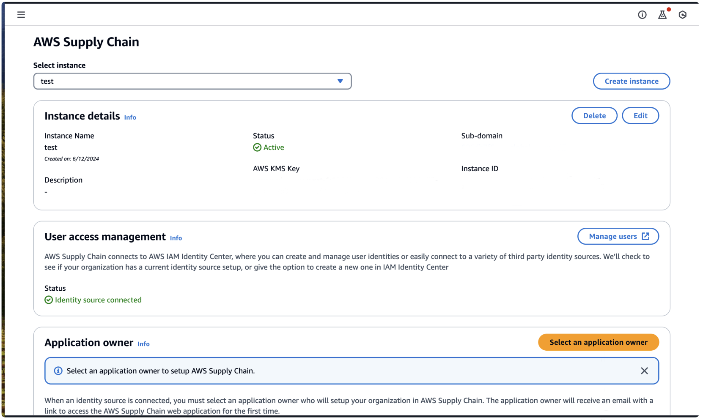
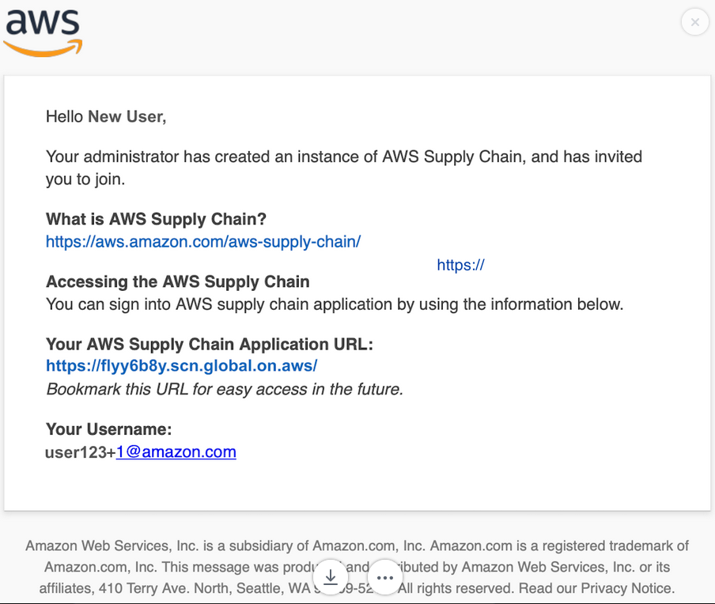

# Step 3: Choose an AWS Supply Chain application owner

As an AWS console administrator, you choose an AWS Supply Chain
application owner to manage the AWS Supply Chain web application access. The
AWS Supply Chain application owner can add or remove user permission roles to the
AWS Supply Chain web application.

After the instance is created and an identity source is connected, follow these steps
to choose an AWS Supply Chain application owner.

1. Open the AWS Supply Chain console dashboard.
2. Go to **Select application owner** and select a user to be an AWS Supply Chain application owner. Search results only show users matching the search criteria.

 3. (Optional) Choose **Go to IAM Identity Center** to add more users. For more information on adding users, see [Manage your identity source](../../../singlesignon/latest/userguide/manage-your-identity-source.md "../../../singlesignon/latest/userguide/manage-your-identity-source.md") in _AWS IAM Identity Center
User Guide_ and for more information on user permission roles, see [User permission roles](adding-users-groups.md "adding-users-groups.md").

###### Note

You can only add one user at a time from the AWS Supply Chain Console. You cannot add a group as an application owner in AWS Supply Chain. 4. Choose **Send Invite**. An email is sent to the web application administrator. Once the web application administrator receives the invite email, they will be able to select the application URL and log into the AWS Supply Chain.

On the AWS Supply Chain console dashboard, you will see the user listed under **Application owner**.

Choose **Manage in AWS Supply Chain** to add and remove users in the AWS Supply Chain web application
