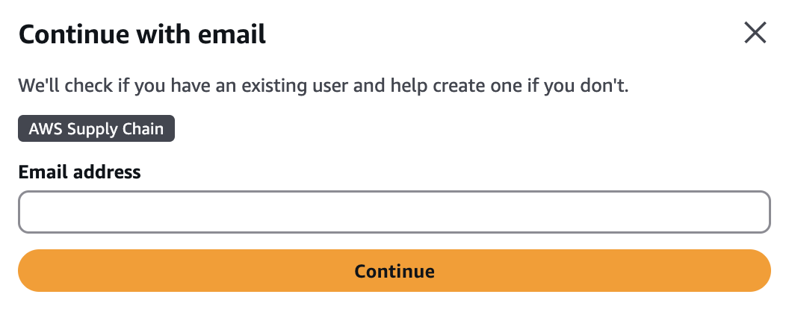

# Step 1: Assign an IAM Identity Center User profile

To create an instance and use the AWS Supply Chain service, you need to either connect an existing IAM Identity Center user profile or create a new one.

1. Open the [AWS Supply Chain console](https://console.aws.amazon.com/scn/home " https://console.aws.amazon.com/scn/home"). You can also search for "AWS Supply Chain" from the main AWS Management Console.
2. If necessary, change the **AWS Region** by selecting **Select a Region** located at the top of the console. Choose your Region from the drop-down list.
3. Select **Create AWS Supply Chain instance**. A notification will appear.

 4. Enter your email address and select **Continue**. IdC will verify if the
email matches an existing user. 5. Do one of the following:

    * **If IdC matches the email address to a user** – Select **Connect your identity source and onboard your team**.

    ###### Note

    This can be used if your organization has an established IdC instance that you would like to use for AWS Supply Chain.
    * **If IdC does not find a match to an existing user** – A **Create a New User** notification appears. Proceed to the next step.

6.  In the notification, enter the following then select **Continue**:

        * Email address
        * First name
        * Last name

    IdC creates the user automatically and adds them as the AWS Supply Chain administrator.

7.  Do one of the following:
    - **To create an instance using standard configuration** – Select **Create**. See [Use standard configuration](create-instance-standard.md "create-instance-standard.md").
    - **To create an instance using a custom configuration** – Select **Edit in advanced setup**. See [Use advanced configuration](create-instance-advanced.md "create-instance-advanced.md").
