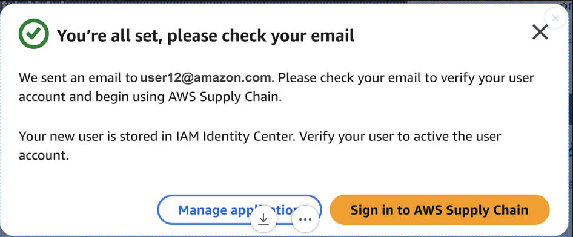
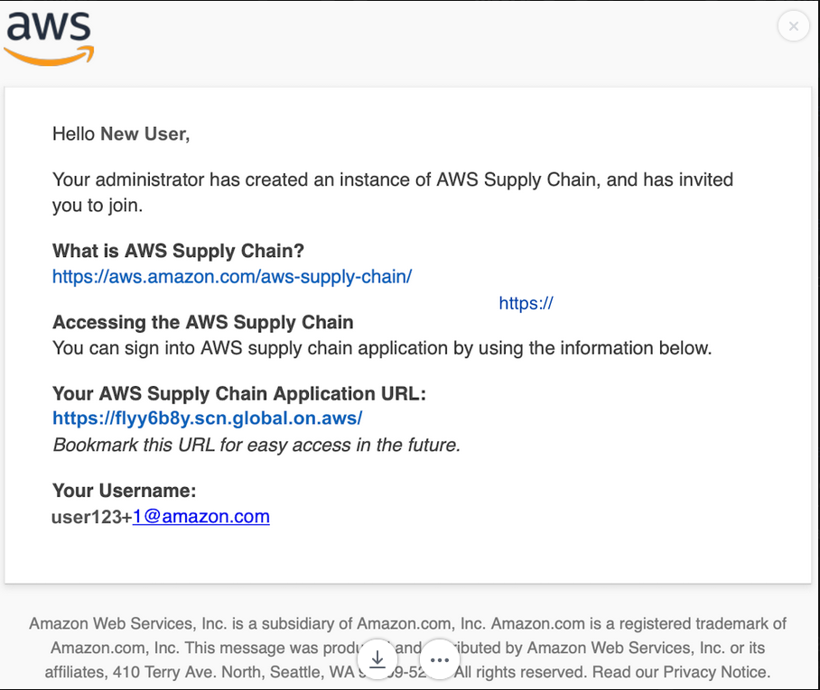

# Use standard configuration

Standard configuration creates your AWS Supply Chain instance using default security and
encryption settings. Instances operate in AWS geographic regions. For more
information about regions, see [Regions and
endpoints](../../../general/latest/gr/rande.md "../../../general/latest/gr/rande.md") in the _IAM User Guide_ and [Regional endpoints](../../../general/latest/gr/rande.md#regional-endpoints "../../../general/latest/gr/rande.md#regional-endpoints") in the _AWS General Reference_.

To create an AWS Supply Chain instance using a standard configuration of preset parameters,
follow these steps.

1. Select **Create**.

A confirmation will appear.

 2. Check your email for the following:

    * An email from the IdC team.
    * An email from Identity Management team.

    

3. Once you receive the invite email, log on to AWS Supply Chain. See [Log on to AWS Supply Chain web
   application](viewing-homepage.md "viewing-homepage.md") .
