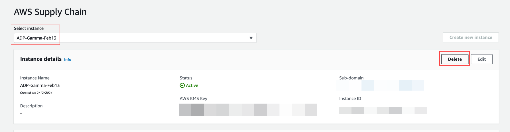

# Deleting an instance

To delete an instance, follow these steps.

###### Note

When you delete an instance, information from the Amazon S3 bucket is not automatically
deleted.

1. Open the AWS Supply Chain console at [https://console.aws.amazon.com/scn/home](https://console.aws.amazon.com/scn/home "https://console.aws.amazon.com/scn/home").
2. On the AWS Supply Chain console dashboard, from the dropdown, select the
   instance that you want to delete.

 3. Choose **Delete**. 4. On the **Delete AWS Supply Chain Instance** page, under
**Confirmation**, type `delete` to
confirm that you want to delete the instance. 5. Choose **Delete**. The instance deletion starts and once the instance is deleted, you will see a confirmation message.

###### Note

After the instance is deleted, information related to Amazon Q in AWS Supply Chain is automatically deleted.
