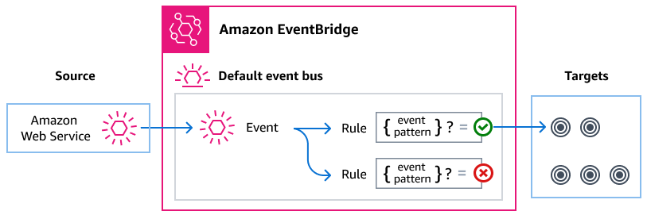

# Managing AWS Supply Chain events using Amazon EventBridge

Using EventBridge, you can automate other services to respond to the execution
status changes of a Step Functions Standard Workflow.

Amazon EventBridge is a serverless service that uses events to connect application
components together, making it easier for you to build scalable event-driven applications.
Event-driven architecture is a style of building loosely-coupled software systems that work
together by emitting and responding to events. Events represent a change in a resource or
environment.

Here's how it works:

As with many AWS services, AWS Supply Chain generates and sends events to the
EventBridge default event bus. (The default event bus is automatically provisioned
in every AWS account.) An event bus is a router that receives events and
delivers them to zero or more destinations, or _targets_. Rules you
specify for the event bus evaluate events as they arrive. Each rule checks whether an event
matches the rule's _event pattern_. If the event does match, the event
bus sends the event to the specified target(s).

###### Topics

- [AWS Supply Chain events](#supported-events "#supported-events")
- [Delivering AWS Supply Chain events using EventBridge rules](#eventbridge-using-events-rules "#eventbridge-using-events-rules")
- [AWS Supply Chain events detail reference](events-detail-reference.md "events-detail-reference.md")

## AWS Supply Chain events

AWS Supply Chain sends the following events to the default EventBridge event bus
automatically. Events that match a rule's event pattern are delivered to the specified
targets on a [basis](../../../eventbridge/latest/userguide/eb-service-event.md#eb-service-event-delivery-level "../../../eventbridge/latest/userguide/eb-service-event.md#eb-service-event-delivery-level"). Events
might be delivered out of order.

For more information, see [EventBridge events](../../../eventbridge/latest/userguide/eb-events.md "../../../eventbridge/latest/userguide/eb-events.md")
in the _Amazon EventBridge User Guide._

| Event detail type                                                                                                                                                                                  | Description                                                       |
| -------------------------------------------------------------------------------------------------------------------------------------------------------------------------------------------------- | ----------------------------------------------------------------- | ----------------------------------------------------------------------------------------------------------------------------------------------------------------------------------------------------------------------------------------------------------------------------------------------------------------------------------------------------------------------------------------------------------------------------------------------------------------------------------------------------------------------------------------------------------------------------------------------------------------------------------------------------------------------------------------------------------------------------------------------------------------------------------------------------------------------------------------------------------------------------------------------------------------------------------------------------------------------------------------------------------------------------------------------------------------------------------------------------------------------------------------------------------------------------------------------------------------------------------------------------------------------------------------------------------------------------------------------------------------------------------------------------------------------------------------------------------------------------------------------------------------------------------------------------------------------------------------------------------- |
| [AWS Supply Chain Data Integration Status Change](events-detail-reference.md#event-detail-event-name-1-no-caps-or-spaces "events-detail-reference.md#event-detail-event-name-1-no-caps-or-spaces") | Displays the status for each ingested file into AWS Supply Chain. | ## Delivering AWS Supply Chain events using EventBridge rules To have the EventBridge default event bus send AWS Supply Chain events to a target, you must create a rule. Each rule contains an event pattern, which EventBridge matches against each event received on the event bus. If the event data matches the specified event pattern, EventBridge delivers that event to the rule's target(s). For comprehensive instructions on creating event bus rules, see [Creating rules that react to events](../../../eventbridge/latest/userguide/eb-create-rule.md "../../../eventbridge/latest/userguide/eb-create-rule.md") in the _EventBridge User Guide_. ### Creating event pattern that match AWS Supply Chain events Each event pattern is a JSON object that contains:  • A `source` attribute that identifies the service sending the event. For AWS Supply Chain events, the source is `aws.supplychain`.  • (Optional): A `detail-type` attribute that contains an array of the event types to match.  • (Optional): A `detail` attribute containing any other event data on which to match. For example, the following event pattern matches against all `AWS Supply Chain Data Integration Status Change` events from AWS Supply Chain: ``{ "source": ["`aws.supplychain`"], "detail-type": ["AWS Supply Chain Data Integration Status Change"] }`` For more information on writing event patterns, see [Event patterns](../../../eventbridge/latest/userguide/eb-event-patterns.md "../../../eventbridge/latest/userguide/eb-event-patterns.md") in the _EventBridge User Guide_. |
