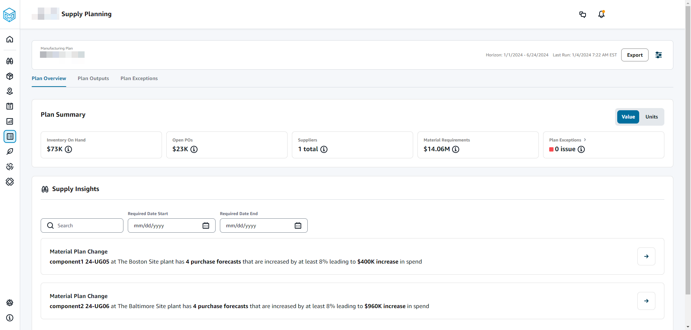
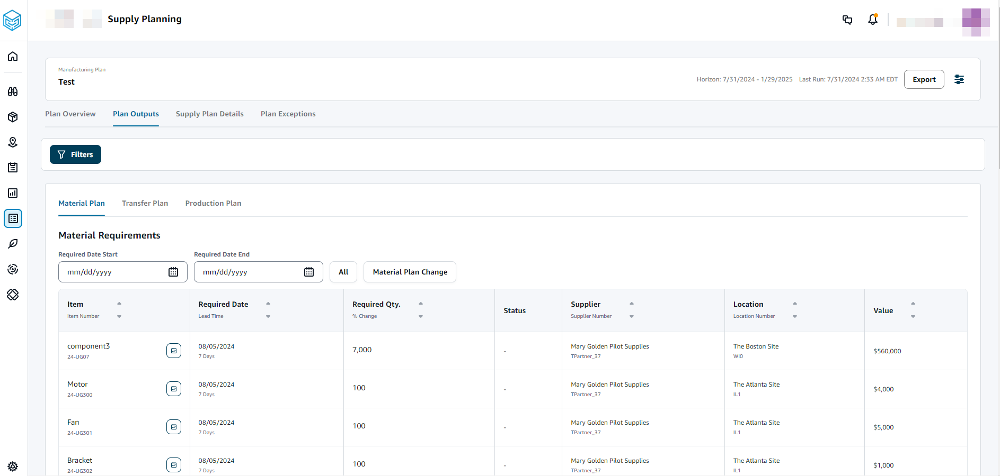
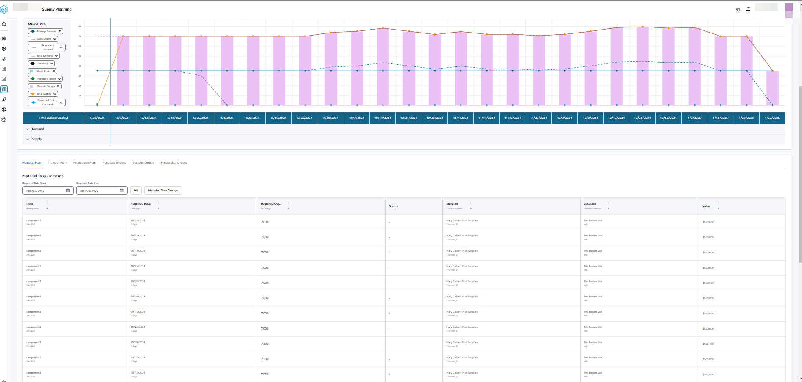

# Configuring Manufacturing Plans

Configure Manufacturing Plans to generate material, transfer, and production requirements for components and finished good items.

## Using Supply Planning

for the first time

You can define how and when you want to plan your supply chain.

When you log in to Supply Planning for the first time, you can view the
onboarding pages that highlight its key features. This helps you to get familiar
with the Supply Planning capabilities.

###### Note

Make sure that the required data is ingested before configuring Manufacturing Plans. For
information on the data fields required for Supply Planning, see [Supply Planning](entities-supply-planning.md "entities-supply-planning.md").

1. In the left navigation pane on the AWS Supply Chain dashboard, choose
   **Supply Planning**.

The **Supply Planning** page appears. 2. Choose **Get Started**. 3. On the **Choose your plan** page, select **Manufacturing Plans**. 4. Choose **Get Started**. 5. On the **Supply Planning** page, choose **Next**.

You can read through the description to understand what Supply
Planning offers, or you can choose **Next** to get to
the **Supply Planning Set-up** page. 6. On the **Material Plan Changes** page, you can view all the material plans that deviated from the predefined supply plan.

Under **Supply Insights**, you can search for a
particular material plan in the **Search** box, by
**Required Date** and **Insight
Type**.

You can also choose a particular material plan to view more
details. 7. Choose **Get Started**. 8. On the **Supply Planning Set-up** page, there are four steps to configure
Manufacturing Plans:

    * Name and Scope
    * Horizon and Schedule
    * Inputs
    * Output

9. On the **Name and Scope** page, under **Plan Name**, enter a
   name for your plan.

Under **Supply Planning Scope**, select all the product
groups and regions that must be included in the supply plan.

###### Note

If you do not see the Product Groups or Regions that you ingested through Supply Chain data
lake, ingest the Product BOM through the API and make sure that all
the other datasets, such as Product, ProductHierarchy, Site,
Geography, and SourcingRule, are already ingested. 10. Choose **Continue**. 11. On the **Horizon and Schedule** page, you can do the following:

    * **Planning Horizon** – You can set the planning period by defining the following:

    	+ **Start day of the week** – You can define your weekly
    	 supply planning. For example, if your **Start
    	 day of the week** is Monday, and today is
    	 July 3, then the supply planning period will be from
    	 July 3 to 9.
    	+ **Time Bucketization** – Define the time details. Daily
    	 and Weekly options are supported.
    	+ **Time Horizon** – Define the planning time horizon. The
    	 supported range is from 1 to 90 days, or from 1 to 104
    	 weeks.
    * **Plan Schedule** – Define when your supply plans must be executed.

    	+ **Planning Frequency** – Define how frequently you want to
    	 execute the supply plan.
    	+ **Start Time** – Define when to start planning on a scheduled day.
    	+ **Release Times** – Define the time Supply Planning
    	 releases the approved purchase orders into the ERP
    	 system.
    * **Demand and Forecast** – Define the demand forecast for Supply Planning.

    	+ *Demand Planning* – Supply Planning will use the forecast information from the demand plan generated from *Demand Planning* .
    	+ *External* – Supply Planning with use the *Forecast* data entity to extract the demand forecasts for Supply Planning.
    * **Past days for average demand calculation in consumption-based planning** – For each product-site combination, Supply Planning looks at the past 30 days of sales history
     from the *OutboundOrderLine* data entity to determine the average daily demand. You can choose between 30, 60, 90, 180, 270, or 365 days and Supply Planning will consider the corresponding number of days of historical sales data when generating
     the average.
    * **Forecast Netting**
     – Independent demand includes both actual customer
     orders and forecasted demand. Forecast Netting offers four
     different methods to manage and conslidate these demand
     measures. By combining actual customer needs with forecast
     data effectively, businesses can better manage inventory
     levels and improve operational processes. Selecting the
     appropriate netting method helps align supply with demand,
     reducing inefficiencies and enhancing customer satisfaction.

    	+ **Do not change forecasted
    	 demand**  – Rely solely on
    	 forecasted demand to drive supply planning,
    	 discregarding actual customer orders.
    	+ **Replace forecasted demand
    	 with actual orders if higher than
    	 forecast** – If both forecasted
    	 demand and actual customer orders fall within the
    	 same time bucket, use the higher of the two values.
    	+ **Add actual orders to
    	 forecasted demand**– If both
    	 forecasted demand and actual customer orders fall
    	 within the same time bucket, add the two values
    	 toghether.
    	+ **Enable demand time fence and
    	 forecast consumption**– Forecasted
    	 demand within the demand time fence is ignored.
    	 Ourside the time fence, forecasted demand is
    	 adjusted by substrating actual order quantity within
    	 the forecast consumption window. To use this option,
    	 users should also specify the demand time fence
    	 days, forecast consumption backward days, and
    	 forecast consumption forward days.

    		- **Demand Time Fence
    		 Days** –The number of days between
    		 the current date and the demand time fence date.
    		 All forecasts on or before the demand time fence
    		 date will be ignored by the planning engine.
    		- **Forecast Consumption
    		 Backward Days** –The number of
    		 days that the planning engine will go backward to
    		 find a matching forecast entry to consume starting
    		 from the due date of the sales order.
    		- **Forecast Consumption
    		 Forward Days**– The number of days
    		 that the planning engine will go forward to find a
    		 matching forecast entry to consume starting from
    		 the due date of the sales order.
    * **Carry over unmet demand (backorders) in your planning?** – Select **Yes** to carry over the orders that are not fulfilled in the current time period to the next time period.
    * **Supply** – Define your supply related inputs.

    	+ **Past Due Orders** – When an order in the *InboundOrderLine* data entity is not delivered and the expected delivery date is before the execution date, by default, Supply Planning ignores this order.
    	 However, you can configure the number of past due days to be considered for inbound inventory to reorder stock. For example, if you set the *Past Due Orders* for 7 days and if an order was expected 4 days ago, the item will still be considered for inbound inventory.

12. Choose **Continue**.
13. On the **Output** page, you can do the following:
    - **Plan Outputs** – Select the type of supply plan that you
      want Supply Planning to generate.
    - **Plan Insights** – Set the deviation criteria to generate supply plan insights.

14. Choose **Finish**.
15. (Optional) Choose **Invite Partners** to invite suppliers into your supply plan.

You can also choose **Skip for now** to return to Supply Planning.

## Plan overview

You can view the overall manufacturing plan for your organization.

1. In the left navigation pane on the AWS Supply Chain dashboard, choose
   **Supply Planning**.

The **Supply Planning** page appears. 2. Choose **Get Started**. 3. On the **Choose your plan** page, select **Manufacturing Plan**.

The **Manufacturing Plan** page appears. 4. Choose **Export** to download the _Material Plans_, _Production Plans_, or _Transfer Plans_ to your Amazon S3 bucket. 5. Choose the **Plan Overview** tab.

    * **Plan Summary** – Displays the overall manufacturing plan.

    ###### Note

    Plan Summary metrics will not be available for new users. You can view the Plan Summary metrics after the next supply planning cycle.

    	+ **Inventory On-hand** – Displays the current inventory on-hand in dollars.
    	+ **Open POs** – Displays the current open purchase orders and the required dollars.
    	+ **Suppliers** – Displays the total number of active suppliers.
    	+ **Purchase Requirements** – Displays the total quantity of
    	 end components required and their total cost.
    	+ **Plan Exceptions** – Displays exceptions for missing datasets or issues in any of the data entities.
    * **Supply Insights** – Supply Insights are only generated
     for all Material Plan changes end components when they satisfy
     the deviation percent change compared with the previous plan.
     You can select each insight to view it and take action
     it.

    You can use the **Search** box to search
     based on *Product Name* or *Site
     Name*, or you can search for specific supply
     insights by using the **Required Date Start**
     and **Required Date End**.

## Plan outputs

You can view the overall manufacturing plan for your organization.

1. In the left navigation pane on the AWS Supply Chain dashboard, choose
   **Supply Planning**.

The **Supply Planning** page appears. 2. Choose **Get Started**. 3. On the **Choose your plan** page, select **Manufacturing Plans**.

The **Manufacturing Plan** page appears. 4. Choose the **Plan Outputs** tab.

Choose **Filters** to filter the list based on
Products or Sites.

    * **Material Plan** – Displays the overall material plan for
     end components from the supply plan generated.
    * **Transfer Plan** – Displays the overall transfer plan for
     any materials or finished goods between sites from the supply
     plan generated.
    * **Production Plan** – Displays the overall production plan
     for finished goods from the supply plan generated.

5. Under **Material Plan** and **Material Requirements**, you
   can view the supply details for each item.
6. Under **Item**, choose the **Supply Plan Details** for the selected item.

The **Supply Plan Details** page appears.

The **Supply Plan Details** section displays item details
and attributes. Choose **View all attributes** to view
all the attributes of an item.

Under **Supply Plan**, you can view the supply plan for
the selected item. You can view the supply plan for a specific date
range by using **Start Date** and **End
Date**.

    * Demand Forecast – Displays the demand forecast or dependent demand related to an item
     or site.
    * Inventory – Displays the on-hand inventory level related to an item or site.
    * Open Order – Displays open order quantities based on the *expected\_delivery\_date* for an item or site.
     Supported order types are Purchase order, Transfer order, or
     Manufacturing order.
    * Inventory Target – Target inventory level calculated based on the inventory policy and order schedule. For more information, see [Inventory policies](inventory-policies.md "inventory-policies.md").
    * Planned Supply – Displays the planned supply.
    * Total Supply – The sum of open orders and planned supply.
    * Projected Ending on Hand – The projected order ending on hand.

    Projected Ending On Hand (EOH) is calculated based on Demand, Supply, and Inventory.

     EOH(T0) = Inventory(T0) + Open Orders(T0) + Planned Supply(T0) - Demand Forecast(T0)

     EOH(T1) = EOH(T0) + Open Orders(T1) + Planned Supply(T1) - Demand Forecast(T1).

7. You can also view the overall Supply Planning for an item:
   - Material Plan – Displays the material plan related to an item or site.
   - Transfer Plan – Displays the transfer plan related to an item or site.
   - Production Plan – Displays the production plan related to an item or site.
   - Purchase Orders – Displays the input purchase orders used in generating the supply plan.
   - Transfer Orders – Displays the input transfer orders used in generating the supply plan.
   - Production Orders – Displays the input production orders used in generating the supply plan.

## Plan exceptions

You can view the overall manufacturing exceptions for your organization.

1. In the left navigation pane on the AWS Supply Chain dashboard, choose
   **Supply Planning**.

The **Supply Planning** page appears. 2. Choose **Get Started**. 3. On the **Choose your plan** page, select **Manufacturing Plans**.

The **Manufacturing Plans** page appears. 4. Choose the **Plan Exceptions** tab.

You can use the **Filters** icon to filter exceptions based on Product and Site. Choose **View all** to view all the available filters.

## Importing product_bom data

To import _product_bom_ data using the AWS CLI, follow the procedure below:

###### Note

You can only use AWS CLI to import _product_bom_ data into AWS Supply Chain.

1. Make a note of your instance ID where you want to import your _product_bom_ data. Your _URI_ format for your supply chain data bucket will be
   **"s3://aws-supply-chain-data-`INSTANCE_ID`/product_bom.csv"**.
2. Use the following command to upload your _product_bom_ data to the Amazon S3 instance bucket.

**aws s3 cp `Path To Local Product BOM CSV`$S3_BOM_URI** **"s3://aws-supply-chain-data-`INSTANCE_ID`/product_bom.csv"**. 3. Use the following command to invoke the _create bill of materials_ import job.

**aws supplychain create-bill-of-materials-import-job --instance-id $`INSTANCE_ID` --s3uri** **"s3://aws-supply-chain-data-`INSTANCE_ID`/product_bom.csv"**

###### Note

Make sure to use the same destination Amazon S3 URI that you used when uploading the CSV in step 2. 4. Make a note of the _job ID_ returned. 5. Use the following command to view the imported result.

**aws supplychain get-bill-of-materials-import-job --instance-id $`INSTANCE_ID` --job-id `job-id from step 4`**

For more information on AWS Supply Chain API see the [AWS Supply Chain API Reference](../APIReference/API_CreateBillOfMaterialsImportJob.md "../APIReference/API_CreateBillOfMaterialsImportJob.md").
