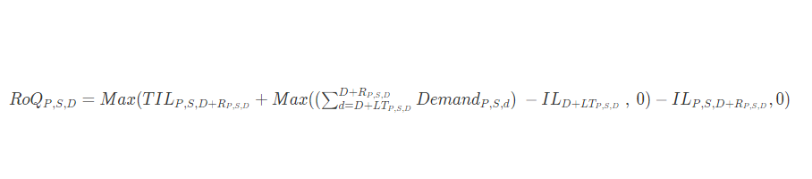

# Absolute inventory level

If you use _absolute quantities_ to manage your inventory
levels, you can use this policy setting to calculate target inventory level and
RoQ. The absolute inventory level policy uses the configured target inventory
level instead of computed inventory level (position). The target inventory level
is the value of _target_inventory_qty_ .

## Inputs and defaults

The absolute inventory level policy requires forecast, lead time, and
configuration for absolute inventory level policy, as shown in the following
table.

| Data required    | Entity              | Field                | Value                    | Notes                                              |
| ---------------- | ------------------- | -------------------- | ------------------------ | -------------------------------------------------- | --------------------------------------------------------------------------------------------------------------------------------------------------------------------------------------------------------------------------------------------------------------------------------------------------------------------------------------------------------------------------------------------------------------------------------------------------------------------------------------------------------------------------------------------------------------------------------------------------------------------------------------------------------------------------------------------------------------------------------------------------------------------------------------------------------------------------------------------------------------------------------------------------------------------------------------------------------------------------------------------------------------------------------------------------------------------------------------------------------------------------------------------------------------------------------------------------------------------------------------------------------------------------------------------------------------------------------------------------------------------------------------------------------------------------------------------------------------------------------------------------------------- |
| Inventory policy | inventory_policy    | ss_policy            | abs_level                | NA>                                                |
| Inventory policy | inventory_policy    | target_inventory_qty | Inventory level quantity | NA>                                                |
| Forecast         | forecast            | NA                   | NA                       | Mean or forecast quantities.>                      |
| Lead time        | transportation_lane | NA                   | NA                       | Lead time from a source location to a destination. |
| Lead time        | vendor_lead_time    | NA                   | NA                       | Lead time from a vendor to a destination location. | _target_inventory_qty_ from _inventory_policy_ data entity used at the target inventory level ## Calculating reorder quantity The inputs for the reorder quantity (RoQ) calculation is the target inventory level and the current inventory level. If the inventory level record is missing, AWS Supply Chain generates a plan exception to review. ## Calculation logic  The reorder quantity is the difference between the target inventory level and the current inventory level. If the current inventory level is higher than the target inventory level, the reorder quantity is 0. The goal of absolute policy is to make sure that on each review date there is enough on-hand inventory to match the desired inventory level. The inner max function computes the extra demand before the target review date (the first review date after delivery). The covering period starts from the expected deliver date and ends with the target review date. If the current on-hand inventory or delivery date is able to cover demand for a specific period, the reorder quantity is 0. The max function determines if you must order extra. The outer max function computes the deficit of inventory and determines whether an order should be placed. The reorder quantity calculation for sites that supply to other sites is calculated according to the logic explained in the Days of Cover (DOC) inventory policy. |
