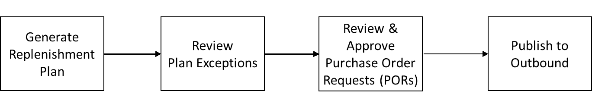

# Business workflow

Auto Replenishment provides the following workflow for you to manage your inventory replenishment process.

- Generate replenishment plan – Supply Planning generates the replenishment plan
  according to the configured schedule. Recent input data required to generate
  replenishment plans is retrieved from the AWS Supply Chain data lake.
  Supply Planning uses configuration data, transactional data, and plan
  settings to generate the replenishment plan that includes purchase order
  requests.
- Review plan exceptions – Supply Planning generates _Plan Exceptions_
  for products and site combinations that do not have either required
  configuration data (lead time, sourcing schedule, and so on) or required
  transactional data, such as on-hand inventory. Planners can review
  exceptions and provide required data before the next planning cycle in order
  to correct the issues and generate the replenishment plan.
- Review and approve purchase order requests – Generated purchase order requests are
  either auto-approved or flagged for manual approval, depending on the
  configured approval criteria in the plan settings. Planners can review,
  override, or approve purchase order requests by using AWS Supply Chain.
  - Users can manually update the order quantity, order-by date, and expected delivery date for system-generated purchase order requests. Once updated, users can mark these orders as Firmed and rerun the plan in ad-hoc mode by choosing Run Plan in the top-right corner of the page.
    When the plan runs, the system preserves Firmed purchase order requests and recalculates all planning measures on the Replenishment Plan page. It then automatically synchronizes the updated planning data with the supply_plan entity in the Data Lake.
    The next scheduled plan run will clear Firmed purchase order requests and generate new ones based on current data.

- Publish to outbound – Approved (auto or manual) purchase order requests are published
  to the outbound Amazon S3 at the configured schedule in Plan Settings. You can
  integrate these purchase order requests to your ERP or purchasing systems
  for execution. Purchase order requests that get converted to purchase orders
  are ingested back to the AWS Supply Chain data lake by using inbound
  connectors. AWS Supply Chain expects these purchase orders to carry the
  reference to the original purchase order request. This reference helps in
  tracking the conversion of purchase order requests to purchase
  orders.
