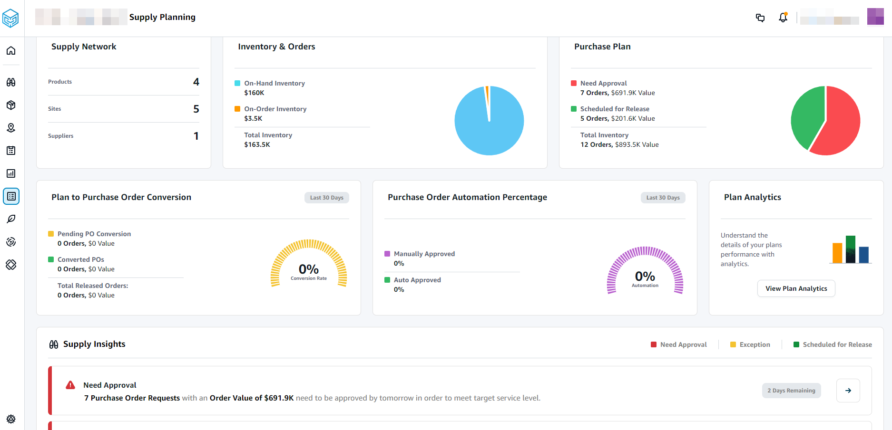
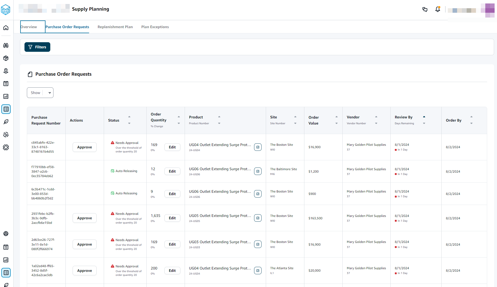
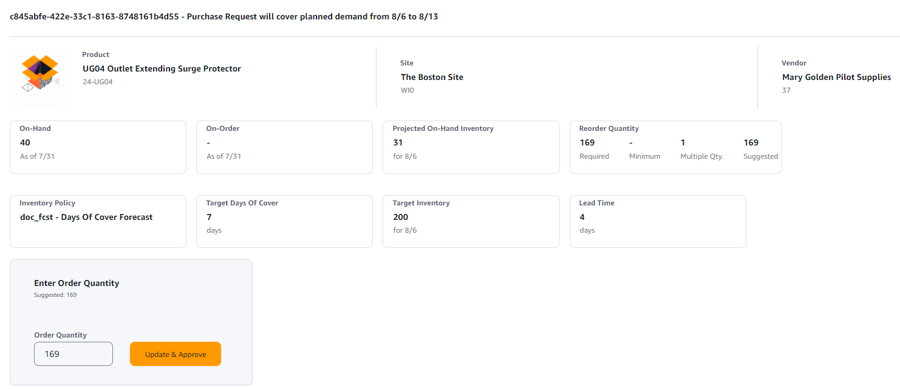

# Configuring Auto Replenishment

By using Auto Replenishment, you can view the amount of inventory to hold and when
to order more inventory by automating inventory management.

###### Topics

- [Using Supply Planning for the first
  time](#supply-planning-firsttime "#supply-planning-firsttime")
- [Overview](#sp_overview "#sp_overview")
- [Purchase order requests](#purchase_order_requests "#purchase_order_requests")
- [Plan exceptions](#exceptions "#exceptions")
- [Supply planning settings](#supply-planning-settings "#supply-planning-settings")

## Using Supply Planning for the first

time

You can define how and when you want to plan your supply chain.

###### Note

When you log in to Supply Planning for the first time, you can view the onboarding pages that
highlight its key features. This helps you to get familiar with the Supply
Planning capabilities.

1. In the left navigation pane on the AWS Supply Chain dashboard, choose
   **Supply Planning**.

The **Supply Planning** page appears. 2. Choose **Get Started**. 3. On the **Choose your plan** page, select **Auto Replenishment**. 4. Choose **Get Started**. 5. On the **Supply Planning** page, choose **Next**.

You can read through the description to understand what Supply
Planning offers, or you can choose **Next** to the
**Supply Planning Setup** page. 6. On the **Supply Planning Setup** page, there are four steps to configure
Supply Planning:

    * **Name and Scope** – Enter the name of the supply plan,
     and select the products and regions to be included in the supply
     plan.
    * **Horizon and Schedule** – Define the time frame for
     Supply Planning to generate plan schedules.
    * **Inputs** – Define how you want Supply Planning to use
     process demand forecasts.
    * **Output** – Choose the Supply Planning output to publish
     to your Amazon S3 connector. You can also use material deviation
     percentage for material plans.

7. Under **Horizon and Schedule**, you can do the following:
   - **Planning Horizon** – You can set the planning period by defining the following:
     - **Start day of the week** – You can define your weekly
       supply planning. For example, if your **Start
       day of the week** is Monday, and today is
       July 3, then the supply planning period will be from
       July 3 to 9.
     - **Time Bucketization** – Define the time details. Daily
       and Weekly options are supported.
     - **Time Horizon** – Define the planning time horizon. The
       supported range is from 1 to 90 days, or from 1 to 104
       weeks.

   - **Plan Schedule** – Define when your supply plans must be executed.
     - **Planning Frequency** – Define how frequently you want to
       execute the supply plan.
     - **Start Time** – Define when to start planning on a scheduled day.
     - **Release Times** – Define the time Supply Planning
       releases the approved purchase orders into the ERP
       system.

   - **Demand and Forecast** – Define the source for demand forecasts.
     - **Demand Planning** – Supply Planning will use the published forecasts from _Demand Planning_ .
     - **External** – Supply Planning with use the demand forecasts ingested into the _Forecast_ data entity in data lake.

   - **Past days for average demand calculation in consumption-based planning** – For product, site combinations with inventory policy set as _doc_dem_, Supply Planning looks at the past days of sales history
     from the _OutboundOrderLine_ data entity to determine the average daily demand. You can choose between 30, 60, 90, 180, 270, or 365 days and Supply Planning will consider the corresponding number of days of historical sales data when generating
     the average.
   - **Forecast Netting**
     – Independent demand includes both actual customer
     orders and forecasted demand. Forecast Netting offers four
     different methods to manage and conslidate these demand
     measures. By combining actual customer needs with forecast
     data effectively, businesses can better manage inventory
     levels and improve operational processes. Selecting the
     appropriate netting method helps align supply with demand,
     reducing inefficiencies and enhancing customer satisfaction.
     - **Do not change forecasted
       demand** Do not change forecasted
       demand – Rely solely on forecasted demand to
       drive supply planning, discregarding actual customer
       orders.
     - **Replace forecasted demand
       with actual orders if higher than
       forecast** – If both forecasted
       demand and actual customer orders fall within the
       same time bucket, use the higher of the two values.
     - **Add actual orders to
       forecasted demand**Add actual orders to
       forecasted demand – If both forecasted demand
       and actual customer orders fall within the same time
       bucket, add the two values toghether.
     - **Enable demand time fence and
       forecast consumption** –
       Forecasted demand within the demand time fence is
       ignored. Ourside the time fence, forecasted demand
       is adjusted by substrating actual order quantity
       within the forecast consumption window. To use this
       option, users should also specify the demand time
       fence days, forecast consumption backward days, and
       forecast consumption forward days.
       - **Demand Time Fence
         Days** –The number of days between
         the current date and the demand time fence date.
         All forecasts on or before the demand time fence
         date will be ignored by the planning engine.
       - **Forecast Consumption
         Backward Days** –The number of
         days that the planning engine will go backward to
         find a matching forecast entry to consume starting
         from the due date of the sales order.
       - **Forecast Consumption
         Forward Days**– The number of days
         that the planning engine will go forward to find a
         matching forecast entry to consume starting from
         the due date of the sales order.

   - **Carry over unmet demand (backorders) in
     your planning?** – Select
     **Yes** to carry over the orders that are
     not fulfilled in the current time period to the next time
     period.
   - **Supply** – Define your supply related inputs.
     - **Past Due Orders** – When an order in the _InboundOrderLine_ data entity is not delivered and the expected delivery date is before the execution date, by default, Supply Planning ignores this order.
       However, you can configure the number of past due days to be considered for inbound inventory to reorder stock. For example, if you set the _Past Due Orders_ for 7 days and if an order was expected 4 days ago, the item will still be considered for inbound inventory.

8. Choose **Continue**.
9. Choose **Finish**.

## Overview

You can view the overall supply plan for your organization, as shown in the
following example page.

- **Supply Network** – Under supply network, you can view the current products, sites, and suppliers in the current supply plan.
- **Inventory and Orders** – Displays the total inventory
  across sites, including inventory on-hand and the inventory that is
  currently on-order with the suppliers.
- **Purchase Plan** – Displays the system-generated purchase
  order requests to replenish inventory at sites.
  - **Need Approval** – Supply Planning uses the approval criteria you set under **Settings** to flag purchase order requests for approval.
  - **Scheduled for Release** – Approved or auto-approved purchase order requests scheduled to be released to outbound connectors at the time you scheduled under **Settings**.

- **Plan to Purchase Order Conversion** – Purchase order
  requests converted to POs in your ERP or purchasing systems. To
  calculate the accurate metrics, Purchase Order data coming from your
  source system must carry the reference back to the Purchase Order
  Request ID published to the outbound. This metric helps planners
  identify purchase order requests that are not converted to POs and take
  corrective actions.
- **Purchase Order Automation Percentage** – Percentage of
  Purchase Order Requests that are auto-approved and released to outbound
  without user overrides to order quantity.
- **Supply Insights** – You can view all the purchase orders
  that are currently in-progress or awaiting approval. You can choose each
  insight to view and take action on. For more information, see [Plan exceptions](#exceptions "#exceptions").

You can download the supply plan report, which includes the inputs, intermediate calculations, and outputs for an auto-replenishment plan to your local computer.

1. On the Supply Planning **Overview** page, choose **Export**.

The **Export Supply Plan** window appears. 2. Choose **Download**.

## Purchase order requests

You can view current purchase order request details and status.

1. You can use the **Filters** option to filter your purchase
   orders according to your search criteria. Your can search purchase orders based
   on vendors, products, sites, order value, order quantity, and requested delivery
   date.
2. Choose **Apply** to apply your filter criteria to the
   current purchase orders, and choose **Save filter group** to
   save the search filter.

 3. Under **Order Quantity**, choose **Edit** to view and update the quantity.

You can update the quantity based on the following inputs:

    * **On-Hand** – Inventory currently in-stock.
    * **On-Order** – Total product quantity of released purchase
     orders in the selected site.
    * **Reorder Quantity** – The product quantity required to
     meet the inventory.

    	+ **Required** – Reorder quantity required to meet the inventory and fulfill the forecast.
    	+ **Minimum** – Minimum order quantity defined under
    	 *VendorProduct.min\_order\_unit* in the
    	 dataset. Supply Planning rounds the number to meet the minimum
    	 quantity.
    	+ **Suggested** – Final reorder quantity after adjustment.
    	+ **Days of Cover** – Number of days to replenish.

4. Choose **Update** to update the quantity request.
5. Under **Product**, choose the product to view the planned demand for the product.

 6. Under **Planned Demand**, select the site to view the replenishment plan. 7. The **Replenishment Plan** tab appears.

###### Note

The **Replenishment Plan** page will appear empty. Make sure to select the product and site to view the demand forecast. 8. Choose **Change Product/Site**.

The **Choose a product and site combination** page appears. 9. Under **Product**, enter the product. 10. Under **Site**, enter the site. 11. Choose **Apply**. 12. Under **Enter order quantity**, you can update the suggested **Order Quantity**. 13. Choose **Update and Approve**. 14. Under **Actions**, choose **Approve** to
approve a purchase order. 15. You can also use the **Show** dropdown to filter your
purchase orders based on status and release time.

## Plan exceptions

You can view the list of product-site combinations that could not be planned.
The **Exception Type** column displays the root cause of the
exemption. You can provide the missing information, such as inventory
policy-related attributes or lead times through data connectors, or you can
upload the updated dataset in Amazon S3.

Under **Product**, you can choose multiple exceptions to delete or choose the **Product** header to delete all exceptions. Once selected, from the **Actions** drop-down, choose **Delete Exception(s)**.

## Supply planning settings

You can define how and when you want to plan and execute purchase
orders.

1. In the left navigation pane on the AWS Supply Chain dashboard, choose the
   **Settings** icon. Choose
   **Enterprise and Configuration**, and then choose **Supply
   Planning**.

The **Plan Settings** page appears. 2. Follow the steps in [Using Supply Planning for the first
time](#supply-planning-firsttime "#supply-planning-firsttime") to edit the Supply Planning configuration settings. 3. Under **Reset Plan**, choose **Reset Plan** to delete the existing plan and start a new supply plan.

###### Note

Only an administrator can reset a supply plan.

The **Reset entire plan** page appears. 4. Choose **Yes, reset the plan** to delete the current supply plan and all the existing purchase orders requests. 5. Choose **Save**.
