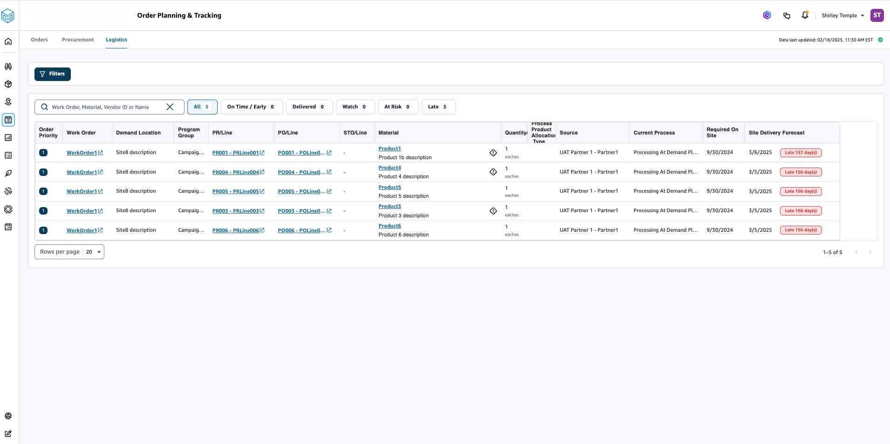
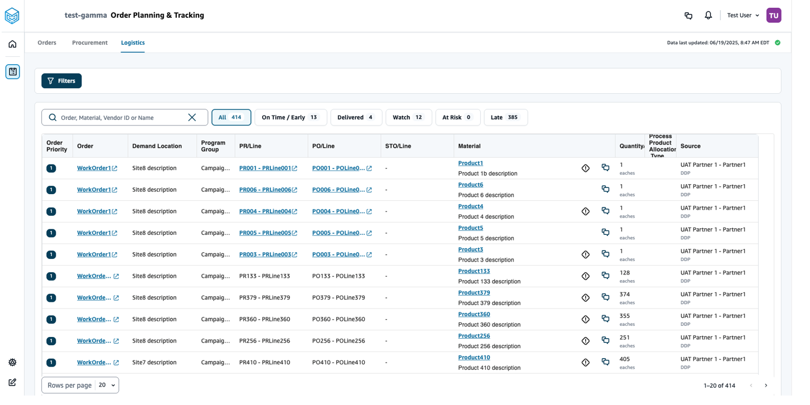

# Logistics

You can view the logistics details for all the items ordered as part of a order. You can select the **Material Name** to view the corresponding material summary for any supply chain process.

In the left navigation pane on the AWS Supply Chain dashboard, choose
**Order Planning and Tracking**.

The **Order Planning and Tracking** page appears. Choose the **Logistics** tab.

You can choose **Filters** to filter the orders based on **Country/Location**, **Campaign**, **Revision**
, **Main Work Center**, **Process Name**, and **Planner Group**. Once you set your filters, choose **Apply**. You can also choose **Save filter group** to save your filters.

You can also filter the orders by **All**, **On Time**, **Delivered**, **Watch**, **At Risk**, and **Late** status. For example. if you choose
**Late**, you will see all the orders that are currently late or delayed.

You can use the **Search** field to search for the required orders. You can sort them by any of the headers but by default, the orders are sorted first by
**Site Delivery Forecast** and second by **Work Priority**.

You can use the expandable **Comments** feature to do the following:

- Add a comment (under 400 characters).
- Edit or delete a comment.
- See other users' comments.

The **Logistics** page, displays the following from your ERP or source system:

| Logistics column            | Description                                                                                                                                                                                                                                                                                                                                                                                                                                                                                                                                                                                                                                                                                                                                                                                                                                                                        | Data entity                                | Column                                     |
| --------------------------- | ---------------------------------------------------------------------------------------------------------------------------------------------------------------------------------------------------------------------------------------------------------------------------------------------------------------------------------------------------------------------------------------------------------------------------------------------------------------------------------------------------------------------------------------------------------------------------------------------------------------------------------------------------------------------------------------------------------------------------------------------------------------------------------------------------------------------------------------------------------------------------------- | ------------------------------------------ | ------------------------------------------ |
| Order                       | Display the order number. You can select the order to view your ERP or source system.                                                                                                                                                                                                                                                                                                                                                                                                                                                                                                                                                                                                                                                                                                                                                                                              | process_product                            | process_id                                 |
| process_header              | process_url                                                                                                                                                                                                                                                                                                                                                                                                                                                                                                                                                                                                                                                                                                                                                                                                                                                                        |
| Revision                    | Displays the material revision.                                                                                                                                                                                                                                                                                                                                                                                                                                                                                                                                                                                                                                                                                                                                                                                                                                                    | process_header                             | revision                                   |
| Order type                  | Displays the order type.                                                                                                                                                                                                                                                                                                                                                                                                                                                                                                                                                                                                                                                                                                                                                                                                                                                           | process_header                             | type                                       |
| PR/Line                     | You can select the procurement or line number to view in your ERP or source system.                                                                                                                                                                                                                                                                                                                                                                                                                                                                                                                                                                                                                                                                                                                                                                                                | reservation                                | requisition_id                             |
| reservation                 | requisition_line_id                                                                                                                                                                                                                                                                                                                                                                                                                                                                                                                                                                                                                                                                                                                                                                                                                                                                |
| inbound_order_line          | inbound_order_line_url                                                                                                                                                                                                                                                                                                                                                                                                                                                                                                                                                                                                                                                                                                                                                                                                                                                             |
| PO/Line                     | You can select the purchase order (PO) or line number to view in your ERP or source system.                                                                                                                                                                                                                                                                                                                                                                                                                                                                                                                                                                                                                                                                                                                                                                                        | reservation                                | order_id                                   |
| reservation                 | order_line_id                                                                                                                                                                                                                                                                                                                                                                                                                                                                                                                                                                                                                                                                                                                                                                                                                                                                      |
| inbound_order_line          | inbound_order_line_url                                                                                                                                                                                                                                                                                                                                                                                                                                                                                                                                                                                                                                                                                                                                                                                                                                                             |
| STO/Line                    | You can select the standard transfer order (STO) or line number to view in your ERP or source system.                                                                                                                                                                                                                                                                                                                                                                                                                                                                                                                                                                                                                                                                                                                                                                              | reservation                                | stock_transfer_1_order_id                  |
| reservation                 | stock_transfer_1_order_line_id                                                                                                                                                                                                                                                                                                                                                                                                                                                                                                                                                                                                                                                                                                                                                                                                                                                     |
| reservation                 | stock_transfer_2_order_id                                                                                                                                                                                                                                                                                                                                                                                                                                                                                                                                                                                                                                                                                                                                                                                                                                                          |
| reservation                 | stock_transfer_2_order_line_id                                                                                                                                                                                                                                                                                                                                                                                                                                                                                                                                                                                                                                                                                                                                                                                                                                                     |
| Order Priority              | Displays the priority of the order. AWS Supply Chain will only accept a numerical value for this field. For example, 1,2,3, and so on. If your ERP system doesn't contain a numerical value for this field, you will not be able to sort the order by priority.                                                                                                                                                                                                                                                                                                                                                                                                                                                                                                                                                                                                                 | process_header                             | priority                                   |
| Material Name               | Displays the name of material that is being procured. If a material is marked Hazmat in your ERP system, AWS Supply Chain will display the Hazmat sign next to the material. You can select the material name to view the current order milestone. Slide the Show Completed Milestones button to view all the completed milestones for a material.                                                                                                                                                                                                                                                                                                                                                                                                                                                                                                                              | process_product                            | product_id                                 |
| QTY/UoM                     | Displays the quantity of the material that is being procured.                                                                                                                                                                                                                                                                                                                                                                                                                                                                                                                                                                                                                                                                                                                                                                                                                      | reservation                                | quantity                                   |
| reservation                 | quantity_uom                                                                                                                                                                                                                                                                                                                                                                                                                                                                                                                                                                                                                                                                                                                                                                                                                                                                       |
| Source                      | Display the source from which the material is being procured.                                                                                                                                                                                                                                                                                                                                                                                                                                                                                                                                                                                                                                                                                                                                                                                                                      | trading_partner                            | description                                |
| inbound_order               | tpartner_id                                                                                                                                                                                                                                                                                                                                                                                                                                                                                                                                                                                                                                                                                                                                                                                                                                                                        |
| Required on Site            | Displays the date on which the material is required on-site.                                                                                                                                                                                                                                                                                                                                                                                                                                                                                                                                                                                                                                                                                                                                                                                                                       | process_header                             | planned_start_date                         |
| process_product             | request_availability_date                                                                                                                                                                                                                                                                                                                                                                                                                                                                                                                                                                                                                                                                                                                                                                                                                                                          |
| Site Delivery Forecast      | Displays the current process of the order. • **Late** – Displayed when the order is running late due to the underlying order material with the latest delivery date estimated to arrive late. This item is displayed in Red. • **On-time** – Displayed when the materials under the order is reaching the site within the required on-site date. This item is displayed in Green. • **At risk** – Displayed when the material with the latest arrival date has a process that is either delayed or is in a blocked milestone. This item can still make the required date and is displayed in Yellow. • **Watch** – Displayed when the material with the latest date is either blocked or late in a current supply chain process. • **Delivered** – Displayed after the last milestone of the last process is initiated indicating the completion of the process. | Calculated by order planning and tracking. | Calculated by order planning and tracking. |
| Current Process             | Displays the current milestone.                                                                                                                                                                                                                                                                                                                                                                                                                                                                                                                                                                                                                                                                                                                                                                                                                                                    |
| Recommended Action Due Date | Displays the current process of the order.                                                                                                                                                                                                                                                                                                                                                                                                                                                                                                                                                                                                                                                                                                                                                                                                                                         |
| Recommendation              | Displays all actionable items and is linked to a milestone.                                                                                                                                                                                                                                                                                                                                                                                                                                                                                                                                                                                                                                                                                                                                                                                                                        |
