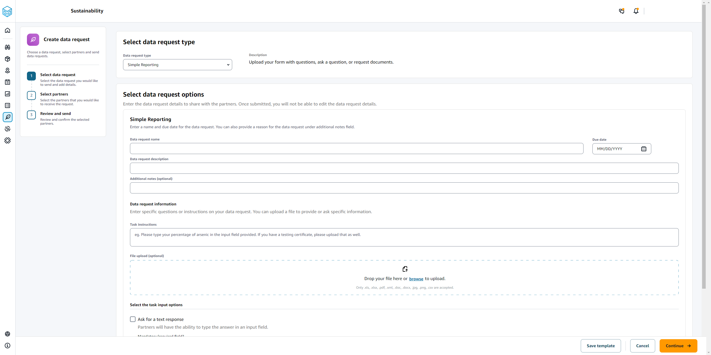
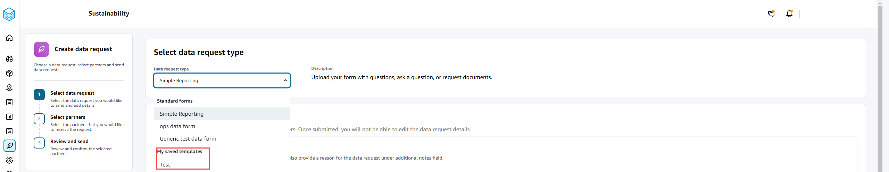

# Creating data requests

You can use the simple reporting template to request any type of data from your partners. For example, you can request compliance information such as product brochure, safety report, or lab testing results of
a product. You can also upload your own form for the partner to download, update information, and repload to answer the data requst.

To create a data request, do the following:

1. In the left navigation pane on the AWS Supply Chain dashboard, choose **Sustainability**.

The Sustainability page appears. 2. Choose the **Data Requests** tab. 3. On the **Data Requests** page, choose **Create data request**.

The **Create data requests** page appears.

 4. On the **Create data requests** page, under **Select data
request type**, select the data request type. 5. Under **Select data request options**, enter the details for the data request. 6. Under **Select the task input options**, select **Ask for a text
response** to receive the data request response in a text field. 7. Select **Ask for a file response** if you want your partners to upload a response file to
your data request. 8. Choose **Save template** to save the details you entered and reuse again for additional data requests (due date and notes field will not be saved, as these change per data request).

The **Save template** page appears. 9. Enter the name and description for your new template and choose **Save template**. Make sure you enter a name and description that is meaningful since you will use the name and description to find the template, understand it's usage, and reuse to request data.

Under **Saved templates**, you will see the template listed under **Data request type**.

 10. Choose **Continue** to send the data request. 11. Choose **Cancel** if you only want to create a new template for you and your team. The create data request flow will be canceled. 12. On the **Select partners to request data** page, under **Partner name**, select the
partner to request data.

You can choose from the partners listed under **Partner name** or invite a new partner. For information on how to invite partners, see [Inviting partners](partner_network_dashboard.md#inviting_partners "partner_network_dashboard.md#inviting_partners"). 13. Under **Selected partners**, review the partner details and choose **Send Request**.

The invited partner will receive an email invite requesting data.
