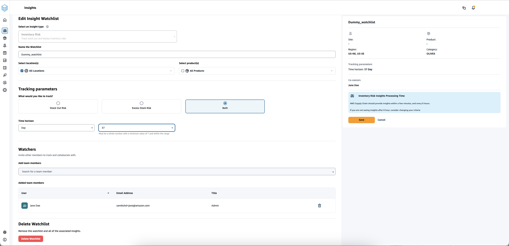
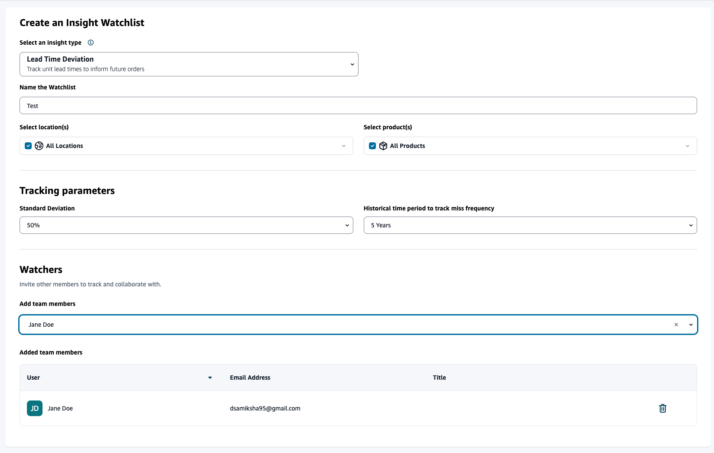

# Creating insight watchlist

You can create an insight watchlist to track and notify you on supply chain risks and
deviations.

1. In the left navigation pane on the AWS Supply Chain dashboard, choose
   **Insights**.

The **Insights** page appears. 2. If you are a first-time user, select an insight type to create an insight watchlist. See
[Creating an inventory risk watchlist](#creating-risk-watchlist "#creating-risk-watchlist") and [Creating a lead time deviation watchlist](#creating-lead-time-watchlist "#creating-lead-time-watchlist").

To view existing watchlists, see [Viewing inventory insights](viewing-inventory-insights.md "viewing-inventory-insights.md").

## Creating an inventory risk watchlist

You can create an inventory risk insight watchlist to view projected stock out and excess stock risks generated by Insights from the tracking parameters you selected.

1. In the left navigation pane on the AWS Supply Chain dashboard, choose
   **Insights**.

The **Insights** page appears. 2. Choose **New Insight Watchlist**.

The **Create an Insight Watchlist** page appears. 3. Under **Select an insight type**, choose **Inventory
Risk**. 4. Under **Name the watchlist**, enter a name to track your insight
watchlist. 5. Under **Select location(s)**, select the locations from the drop-down
that you want to add to your watchlist. 6. Under **Select product(s)**, select the products from the dropdown that
you want to add to your watchlist. 7. Under **Tracking Parameters**, choose what you want to track. The
options are Stock Out Risk, Excess Stock Risk, or Both. 8. Under **Time Horizon**, enter the time frame to generate inventory risk notifications. 9. Under **Watchers**, you can add other users who you think might benefit
from this insight. The users within this insight can track and collaborate to resolve
risks.

All the settings you chose are displayed on the right. 10. Choose **Save** to save and create an inventory risk watchlist.

## Creating a lead time deviation watchlist

You can view and receive notifications for lead time deviations that AWS Supply Chain discovers. You can select any insight,
and AWS Supply Chain will recommend how to address it.

1. In the left navigation pane on the AWS Supply Chain dashboard, choose
   **Insights**.

The **Insights** page appears. 2. Choose **New Insight Watchlist**.

The **Create an Insight Watchlist** page appears. 3. Under **Select an insight type**, choose **Lead Time
Deviation**. 4. Under **Name the watchlist**, enter a name to track your insight
watchlist. 5. Under **Select location(s)**, select the locations from the drop-down to
add to your watchlist. 6. Under **Select product(s)**, select the products from the drop-down to
add to your watchlist. 7. Under **Tracking Parameters**, **Standard deviation**, select the lead time deviation percentage from the drop-down. When the
percentage is met, AWS Supply Chain will generate an insight and notify you about the lead time deviation. 8. Under **Tracking Parameters**, **Historical time period to track
miss frequency**, select the historical time period of your ingested data from the drop-down to analyze lead time
deviations. 9. Under **Watchers**, you can add other users to collaborate and share the risks and notifications.

All the settings you chose are displayed on the right. 10. Choose **Save** to save and create an inventory risk watchlist.

###### Note

AWS Supply Chain only supports 1000 insights per watchlist and 100 watchlists per instance. To increase the limit, contact [AWS Support](admin-support-ug.md "admin-support-ug.md").
