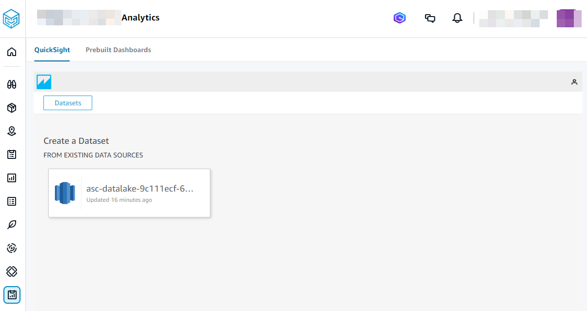
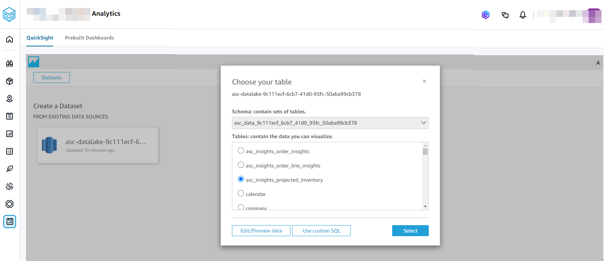

# Creating new analysis

To create a new analysis, follow the below procedure.

###### Note

Granular access based on Location and Product is not supported in AWS Supply Chain Analytics.

1. On the Quick Suite dashboard page, choose **New analysis**.
2. Choose **New dataset**

The **Create a Dataset** page appears. You will see the AWS Supply Chain data lake as an existing dataset for you to pick. For example, ask-datalake-_your instance id_.

 3. Choose the data source.

###### Note

Select the blue Quick Suite logo to navigate to the Quick Suite menu to view the datasets or analyses. 4. Choose **Create dataset**. 5. Under **Schema:contain set of tables** drop-down, select one of the following data source names:

    * asc\_data\_<your instance id>: Contains datasets processed and transformed by AWS Supply Chain for use within the application.
     These can be used for creating dashboards and custom analyses. Examples include asc\_insights\_order\_insights and asc\_adp\_forecast. For more
     information on available datasets and their uses, see [Application datasets used in AWS Supply Chain Analytics](application_datasets.md "application_datasets.md").
    * asc\_custom\_data\_<your instance id>: Contains original, non-transformed data as provided. You can query these datasets to access and analyze your raw data directly and build dashboards out of them.

6. Under **Tables: contain the data you can visualize**, choose the dataset from the list of AWS Supply Chain datasets.

 7. Choose **Select**. 8. Under **Finish dataset creation**, choose **Visualize**. 9. Under **Data**, choose the fields you want to visualize and choose **Publish**.

The **Publish a dashboard** page appears. 10. Under **Publish new dashboard as**, enter a name for your dashboard. 11. Choose **Publish dashboard**.

You will see the new dashboard created under **Dashboards** and a new analysis created under **Analyses**. For more information on using Dashboards or Analyses, see [Amazon QuickSight](../../../quicksight/latest/user/welcome.md "../../../quicksight/latest/user/welcome.md").
