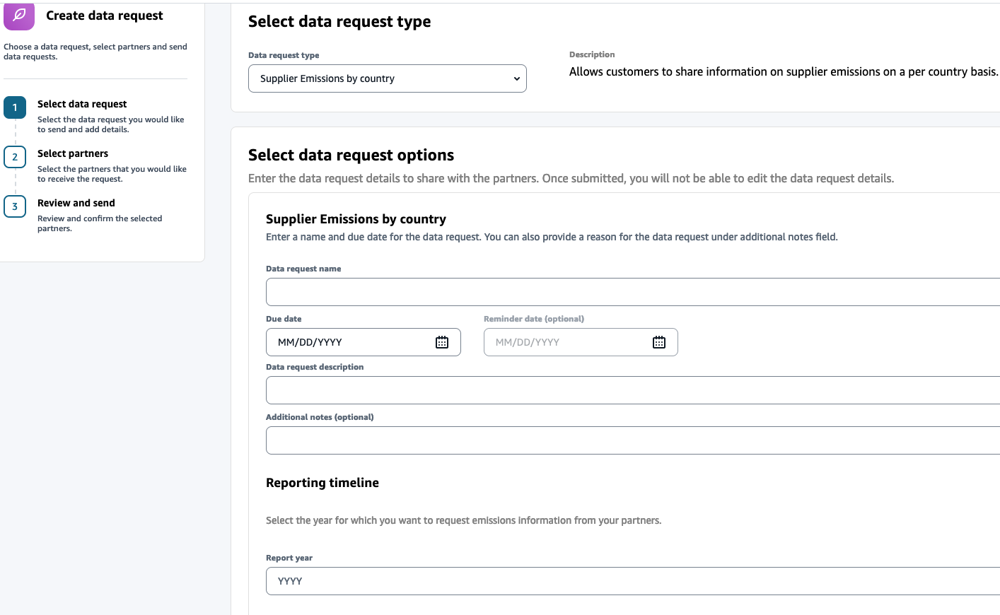
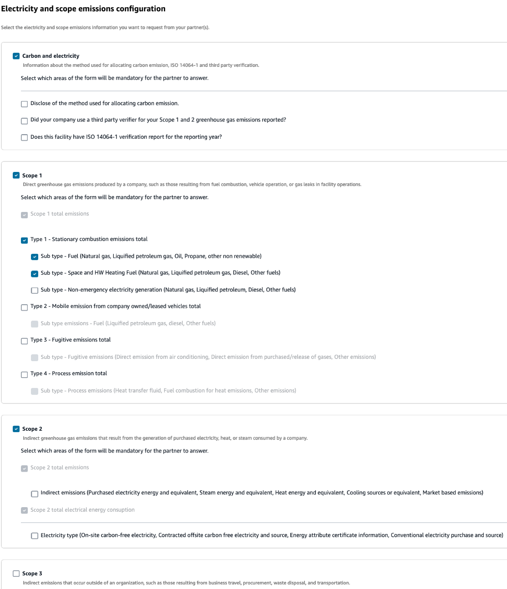
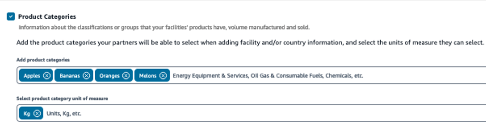

# Emission data forms

You can use the emission data forms to collect scope 1, 2, and 3 emissions from your partner network at the granularity level of a country or facility. The following are the data request emission forms available.

- Supplier Emissions by country
- Supplier Emissions by facility
  Additionally, you can use the Supplier Emissions by facility form to request address information for each facility. These forms can also be used to collect revenue information about products or services provided by the partner that can be used to measure year over year
  changes per products produced and sold. You can also use these forms to configure the sections to show or hide for your partners. You can also set the hierarchical level of information for emissions collection to optional or mandatory when setting up the form.

To send a data request emission form, follow the procedure below:

1. Configure the data request type and the data request options. For information on how to configure the data request type and option, see [Creating data requests](create_data_requests.md "create_data_requests.md").
2. Under **Reporting timeline**, enter the reporting year of your partner.
3. Under **Electricity and scope emissions configuration**, select the top-level headings to be displayed for the partner. For example, in the below screen shot, Scope 3 emissions is not selected and will not be displayed to the partner.

Once you select a section or a sub-section to request emission information from your partner, it becomes mandatory for your partner to provide information for all the sections selected. For example, in the screen shot below, under Scope 1 > Type 1 - Stationary
combustion emissions total, there are two sub-types that are selected and your partner must provide information for these fields.

 4. Select **Product Categories** to request product category information from your partner on volumes manufactured, sold, and revenue. 5. Under **Add product categories**, you can select a category from a predefined industry list, or choose your own products. For example, in the below screen shot, there are four products and one unit of measure added. Your partner will provide details for these
products as applicable to them.

 6. Under **Add product category unit of measure**, you can select a category from a predefined industry list, or choose your own unit of measure. 7. Under **Additional questions**, you can upload additional documents with supplementary questions to ask your partner. Make sure you enter the details of the supplementary questions in the data request description for the partner to understand and answer the
supplementary questions.
