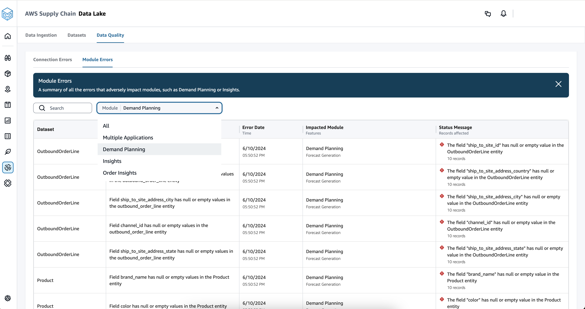
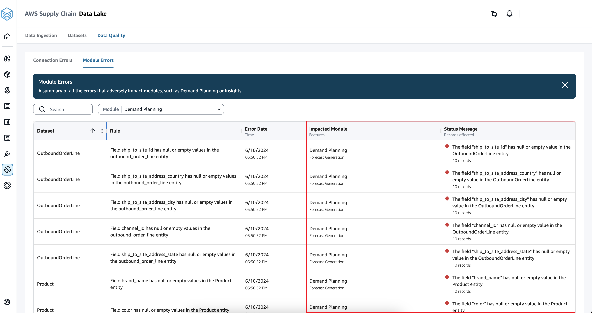
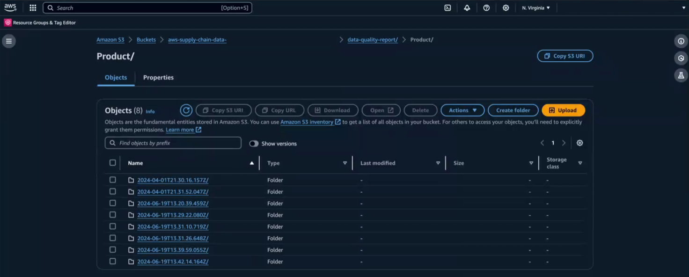
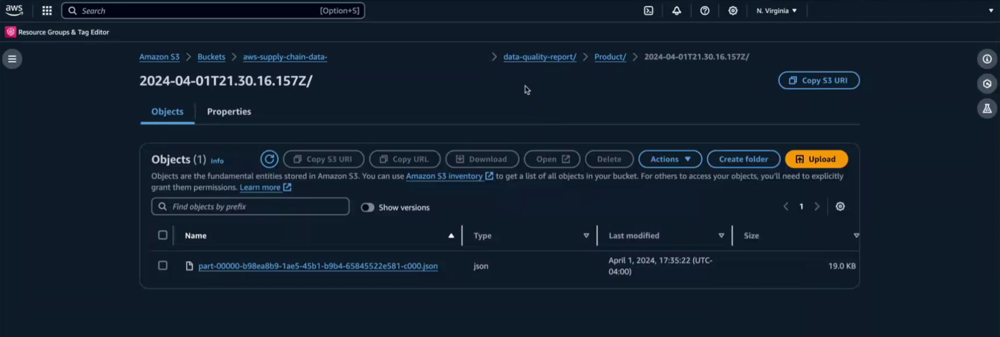

# Data quality

Any identified data quality errors are displayed on the web application under
Module errors. You can view the dataset that has errors and the impacted
AWS Supply Chain module. Additionally, you can download the data quality report
from your Amazon S3 bucket. The report provides detailed information on the dataset
errors in the ingested data.

## Viewing data quality reports

To view the AWS Supply Chain module errors, complete the following steps:

###### Note

For information on required and optional data entities for each
AWS Supply Chain module, see the Demand Planning, Insights, and Work Order
Insights sections under [Data entities and columns used in AWS Supply Chain](data-model.md "data-model.md").

1. On the AWS Supply Chain dashboard, on the left navigation pane, choose
   **Data Lake** and then choose the **Data
   Quality** tab.
2. Choose the **Module Errors** tab. You can view the data ingestion errors for
   the AWS Supply Chain modules.

###### Note

You can also view the dataset errors and the affected modules after
the first ingestion is complete and the destination flows are
successful. If the destination flows are unsuccessful, you can view the
data quality errors under the **Detail** column of the
**Destination Flows** tab.

You can filter the errors using the following filters in the
**Module** dropdown box:

    * All
    * Multiple Applications
    * Demand Planning
    * Insights
    * Order Insights

    

3. View the data quality errors under the **Impacted
   Module** and **Status Message**
   columns.

The **Impacted Module** column displays the
AWS Supply Chain application and the related feature that was
impacted.

The **Status Message** column displays the product entity
and the number of errors under each product entity. For example, the "The
field "channel_id" has null or empty value..." error means that the
"channel_id" column in the ingested outbound_order_line file is missing
data.

## Downloading data quality reports

To download the data quality report, complete the following steps:

1. Open the Amazon S3 console at [https://console.aws.amazon.com/s3/](https://console.aws.amazon.com/s3/ "https://console.aws.amazon.com/s3/") and sign in.
2. Navigate to the **aws-supply-chain-data**
   instance ID folder, then **data-quality-report**.
3. Select the folder for the data entity you want to view.

Individual folders for each data ingestion will appear.

 4. Select the folder for the data ingestion you want to view.

The data quality report will appear.

 5. Select the file and choose **Download** to download the
data quality report in json format.
