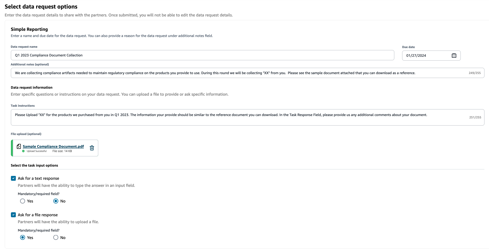
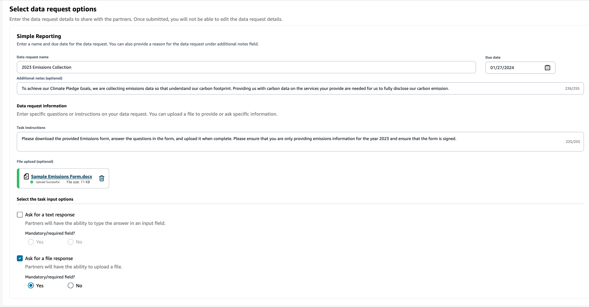
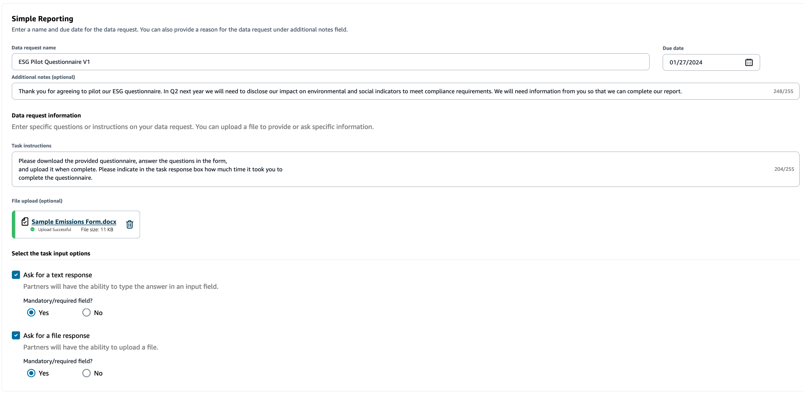

# Data requests examples

Here are some examples on how you can structure the Simple Reporting data form to meet your needs.

## Collect compliance documents from partners

To collect compliance documents from your partners, you can do the following:

- **Data request name** – Q1 2023 Sample Compliance Document Collection
- **Additional Notes** – We are collecting [name of document] from our suppliers to fulfill our Q1 2023 compliance documents needed for [purpose for collecting documents] for the products we buy from you.
- **Task instructions** – Please upload [name of document] for the products we have purchased from you in Q1 2023. The information on this document should be similar to the reference document we have
  uploaded for you to review. In the Task Response field, provide us any comments you have about the document provided.
- **Ask for a text response** – Select _No_ to make this field mandatory.
- **Ask for a file response** – Select _Yes_ to make this field mandatory.

## Collect emissions documents

To collect emissions information, you can do the following:

- **Data request name** – 2023 Emissions Collection
- **Additional Notes** – To achieve our Climate Pledge Goals, we are collecting emissions data so that we have the information needed to understand our carbon footprint. Providing us with carbon data on the services your provide are
  needed for us to fully disclose our carbon emission.
- **Task instructions** – Please download the provided Emissions form, answer the questions in the form, and upload it when complete. Please ensure that you are only providing emissions information
  for the year 2023 and ensure that the form is signed.
- **Ask for a text response** – Not selected
- **Ask for a file response** – Select _Yes_ to make this field mandatory.

## Collect pilot ESG data

To collect pilot ESG data, you can do the following:

- **Data request name** – ESG Pilot Questionnaire V1
- **Additional Notes** – Thank you for agreeing to pilot our ESG questionnaire. In Q2 next year, we
  must disclose our impact on environmental and social indicators to meet
  compliance requirements. We need information from you so that we can complete
  our report.
- **Task instructions** – Download the provided questionnaire, answer the questions in the form, and
  upload it when complete. Indicate in the task response box how much time it took
  you to complete the questionnaire.
- **Ask for a text response** – Select _Yes_ to make this field mandatory.
- **Ask for a file response** – Select _Yes_ to make this field mandatory.

