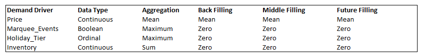

# Demand driver recommendations

While configuring aggregation and filling methods for demand drivers, a general
guideline is to assign _mean_ aggregation for both boolean and continuous
data types. To fill a missing value, use _zero_ filling for boolean data
while _mean_ filling is suitable for continuous data.

Note that the choice of aggregation and filling method configuration depends on the data
characteristics and assumptions about missing values. Here is an example.

Demand Planning recommends adjusting the demand driver configuration to best suit your
dataset needs. The demand driver configuration will impact the forecast accuracy.

On the AWS Supply Chain web application, under **Demand
planning**, **Overview**, you will view the impact
scores associated with demand drivers, aggregated at the demand plan level. These impact
scores measure the relative influence of demand drivers on forecast. A low impact score does
not indicate that the demand driver has a minimal effect on forecast values. Instead, it
suggests that its influence on forecast value is comparatively lower than the other demand
drivers. When the impact score is zero under certain circumstances, it should be interpreted
as the demand driver has no impact on the forecast values. Demand Planning recommends
revisiting the aggregation and filling method configuration applied to that particular
demand driver.
