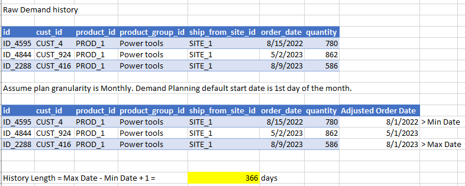

# Demand Patterns Components

Demand Patterns analysis happens on three dimensions:

- Demand Patterns (based on how demand changes over time and in quantity)
- Annual Demand (total quantity demanded over a 12-month period)
- History Length (the time period for which historical demand data is
  available)
  The analysis categorizes your demand patterns into four distinct types: smooth,
  intermittent, erratic, and lumpy. Each is determined by analyzing the frequency and
  variability of demand. If there are eligible in-scope products with no historical data, it
  is grouped under the **Zero Forecast Demand** section. For more information, see [Demand pattern](overview_dp.md#demand-pattern "overview_dp.md#demand-pattern").

The distribution of demand patterns across your products provides valuable insights
into expected forecast reliability. Products with smooth demand patterns (showing
consistent order volumes and frequencies) typically yield the most reliable forecasts,
because their behavior is more predictable. In contrast, erratic or lumpy patterns,
characterized by irregular spikes and varying order frequencies, generally result in lower
forecast reliability due to their unpredictable nature. By understanding this
distribution, demand planners can set appropriate expectations and take proactive
measures.

The system also analyzes your trailing 12-month demand (subject to trimming configuration), also known as Annual Demand,
immediately preceding your forecast start date. For example, assume the forecast start
date is January 15, 2024 (Monday) and the planning bucket is weekly. The system considers the trailing 12 month analysis
period to be from January 16, 2023 to January 14, 2024. The trailing 12-month demand
analysis helps demand planners distinguish between active and inactive products, while
identifying products transitioning between these states - patterns that directly impact
forecast reliability. By focusing on recent history rather than older data patterns, you
can make more informed decisions about which products need special attention or
alternative forecasting approaches, particularly for cases like seasonal items,
discontinued products, or items in phase-out. For more information, see [Forecast Algorithms](forecast-algorithims.md "forecast-algorithims.md").

The history length in years is calculated for each forecast granularity (for example,
product-location combination) based on the earliest and latest dates available in your preprocessed
historical demand data, after adjusting the dates to the default start of the period. This analysis helps determine if products have accumulated enough
historical data to generate reliable forecasts, with a minimum of two years typically
needed to capture seasonal patterns and long-term trends.

