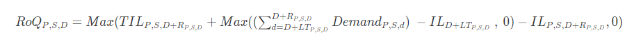
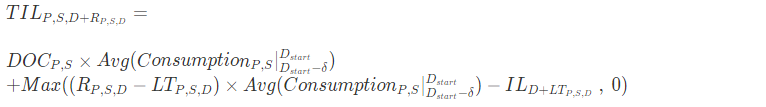
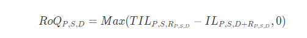

# Days of Cover

If you use Days of Cover (DoC) to manage your inventory levels, then this
would be an appropriate policy setting to drive the calculation of target
inventory levels and RoQ. DoC inventory policy uses the configured days of
coverage. This policy doesn’t consider sourcing schedule (vendor review
calendar) or vendor lead times to compute DOC. DOC is based on the
_target_doc_limit_ field in the
_inventory_policy_ data entity. Note that, for weekly
planning, _target_doc_limit_ still uses unit of
day. A coverage of 2 weeks translates to 14 days. DoC policy can be used with
forecast (_doc_fcst_) or demand (_doc_dem_). The difference between
_doc_fcst_ and _doc_dem_ is the
forecast source. _doc_fcst_ is based on forecast, while
_doc_dem_ is based on the demand history in _outbound_order_line_. The forecast based days of
coverage uses P50 of forecast, while the demand based planning uses the last 30
days of demand history to calculate average consumption rate.

## Inputs and defaults

Target inventory level or Target inventory position (TIP) is the desired
inventory position or level on a given date. Inventory position includes
inventory on hand, in-transit, or on-order, while the inventory level is
only the inventory on-hand. Inventory position is used for service level
(sl) inventory policy, and inventory level is used for
_doc_fcst_, _doc_dem_, and
_abs_level_ inventory policies. DOC policy requires
forecast, lead time, and configuration for inventory policy.

For _doc_fcst_ policy, you must provide the following
information:

| Data required 1  | Entity              | Field            | Value          | Notes                                                 |
| ---------------- | ------------------- | ---------------- | -------------- | ----------------------------------------------------- |
| Inventory policy | inventory_policy    | ss_policy        | doc_fcst       | NA>                                                   |
| Inventory policy | inventory_policy    | target_doc_limit | Number of days | NA>                                                   |
| Forecast         | forecast            | NA               | NA             | Mean or forecast quantities.>                         |
| Lead time        | transportation_lane | NA               | NA             | Lead time from a source location to a destination.    |
| Lead time        | vendor_lead_time    | NA               | NA             | Lead time from a vendor to a destination location. |

For inventory policy based on days of coverage, the days to cover is the _target_doc_limit_ value.

## Calculation logic for DOC_fcst policy

## Calculation Logic for doc_dem policy

The goal of days of coverage policy is to make sure on each review date
that there is enough on-hand inventory to cover the configured days of
coverage. The first part of the formula computes the days of coverage from
the next review date until the end of days of coverage configured. The total
covering period is *DOCP,S*​ for product
_P_ and site _S_. The second part of the formula computes the extra demand
before the target review date (the first review date after delivery). The
covering period starts from the expected deliver date and ends with the
target review date. If the current on-hand inventory on the delivery date is
able to cover demand of this period, the system reorders 0. The max function
determines whether we must order extra.

## Calculating reorder quantity

The input for the reorder quantity calculation is the target inventory
level and the current inventory level. If the inventory level record is
missing, the system generates plan exceptions for you to review.

The reorder quantity of product _P_, site
_S_, and date _D_ is the difference between the target inventory level and
the current inventory level. If the current inventory level is higher than
the target inventory level, the reorder quantity is 0.
