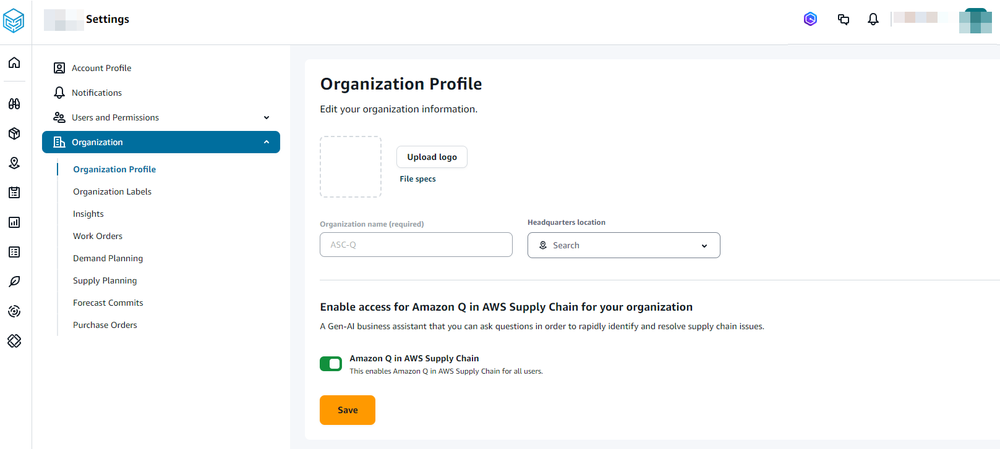

# Enabling Amazon Q in AWS Supply Chain

###### Note

Only an AWS Supply Chain administrator can enable Amazon Q in AWS Supply Chain.

To enable Amazon Q in AWS Supply Chain, perform the following procedure:

1. In the left navigation pane on the AWS Supply Chain dashboard, choose the
   **Settings** icon.
2. Under **Organization**, choose **Organization Profile**.

The **Organization Profile** page appears.

 3. Under **Enable access for Amazon Q...**, slide the **Amazon Q in AWS Supply Chain** button to enable Amazon Q in AWS Supply Chain and ask questions regarding your supply chain. 4. Choose **Save**.

The **Confirm Amazon Q in AWS Supply Chain access** window appears. 5. Choose **Acknowledge**.

The Amazon Q dialog window should automatically appear on the right side of the page. You can hide or unhide the page by choosing the Amazon Q icon.

## Prerequisites for existing AWS Supply Chain users

###### Note

If your AWS Supply Chain instance was created before the Amazon Q in AWS Supply Chain release, you will need to follow the procedure below to update the instance permissions.

To update the instance role in the IAM console, perform the following steps:

1. Make sure all the permissions listed under [KMS policy](../adminguide/creating-instance.md "../adminguide/creating-instance.md") are added to the KMS key policy used in the AWS Supply Chain instance.
2. In the IAM console, find the instance role with the AWS Supply Chain _InstanceId_. You can find the AWS Supply Chain _InstanceId_ in the AWS Supply Chain console.
3. Attach the following policy as an inline policy to the role.

JSON

```


```

Replace the `kmsKeyArn` with the actual AWS KMS Key Arn used in the AWS Supply Chain instance.
