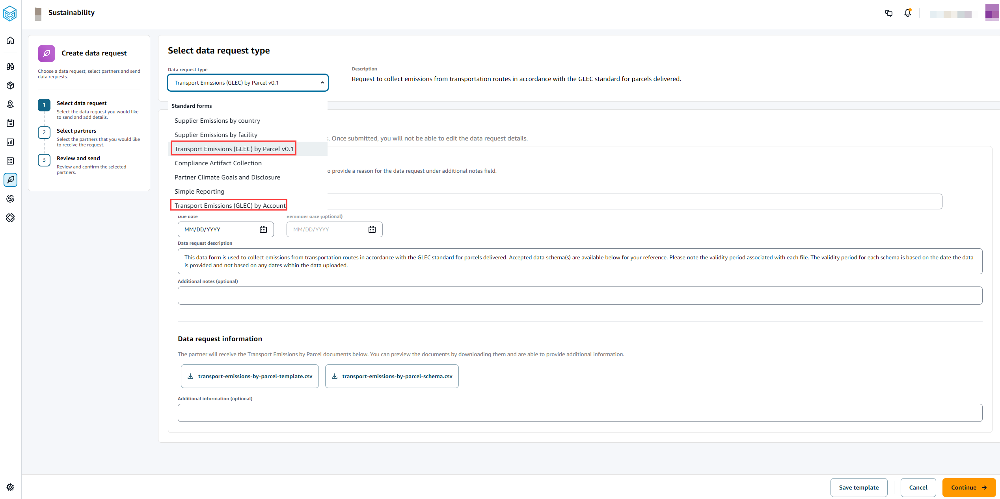

# Transportation emission forms

You can use the transport emission Global Logistics Emissions Council (GLEC) data forms to collect the emission reports from transportation routes by parcels delivered or by account. The following are the transportation emission request forms available.

- Transportation Emissions (GLEC) by Parcel v0.1 – You can collect emissions from transport routes in accordance with the GLEC standard for parcels delivered.
- Transport Emissions (GLEC) by Account – You can collect emissions from transportation routes in accordance with the GLEC standard per account.
  To send a transport emissions data request form, follow the procedure below:

1. In the left navigation pane on the AWS Supply Chain dashboard, choose **Sustainability**.

The Sustainability page appears. 2. Choose the **Data Requests** tab. 3. On the **Data Requests** page, choose **Create data request**.

The **Create data requests** page appears.

 4. Depending on your request type, under **Data request type**, choose **Transport Emissions (GLEC) by Parcel v0.1** or **Transport Emissions (GLEC) by Account** 5. Under **Transport Emissions (GLEC) by Parcel v0.1, enter a name, due date, and description for the data request.** 6. Under **Data request information**, the .csv template to request information from the partner is auto-populated. You can add any additional notes. 7. Choose **Continue**. 8. Under **Select partners to request data**, select the partners you would like to request transport emissions information. 9. Choose **Continue**. 10. Under **Selected partners**, choose **Send data request**. 11. If the formatting in the .csv file is not in the correct format, the system automatically changes the data request _Status_ to _Rework requested_. You can select the data request to
view the information that needs to be reworked.
