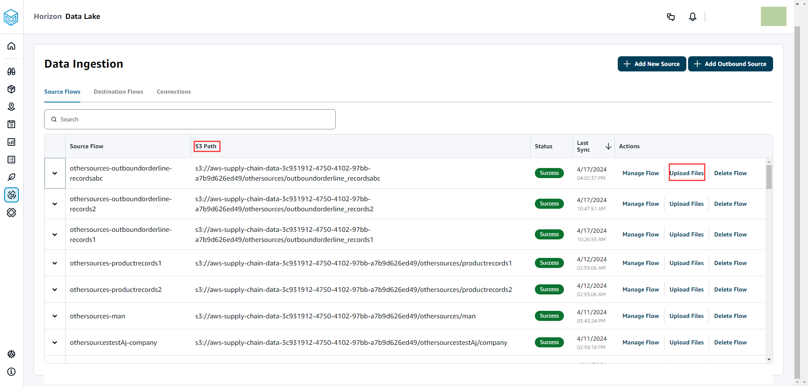

# Uploading subsequent files to an existing source

There are two ways to upload subsequent datasets to an existing source. You
can either upload the dataset on the Amazon S3 path displayed under the
**Source Flows** tab, or choose **Upload
files** under the **Actions** tab.

If you're using an automated connector, executing scripts, or using a
middle ware solution to ingest the dataset into AWS Supply Chain, you must
update the Amazon S3 path with the Amazon S3 path displayed under the **Source
Flows** tab.

###### Note

If an existing file with the same file name is re uploaded to Amazon S3, AWS Supply Chain will
overwrite the file on Amazon S3.

