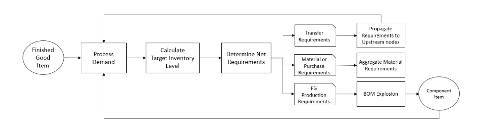

# Planning process

Manufacturing Plans include material, transfer, and production plans. These plans
are created based on the configured network topology for an item. The following
illustration shows the steps involved in generating these plans. These steps are
repeated for each product or site combination that is in the scope of a
Manufacturing Plan.

The steps and logic for Demand Processing, Inventory Target calculation, and Net Requirements calculation are common between Manufacturing Plans and Auto Replenishment.
For more information, see [Planning process](planning-process.md "planning-process.md") and [Inventory policies](inventory-policies.md "inventory-policies.md").

- **Production requirements** – For products with site
  combinations with sourcing rule type _Manufacture_,
  Supply Planning uses the production process referenced in the sourcing rule
  to calculate production requirements. Make type should be used for finished
  goods or sub-assemblies that go through a production process. Lead times and
  setup times from the _production_process_
  data entity, along with the BOM, is used to determine the material or
  component requirements. Supply Planning also applies the frozen horizon
  defined in the production process or the default setting to freeze supply
  during this time period and move all requirements to the first time period
  after the frozen time horizon.
- **BOM explosion** – For products or sites with sourcing
  rules of type _Manufacture_, Supply Planning uses the BOM
  defined in the _product_bom_ entity to
  determine production requirements for sub-assemblies and material
  requirements for component items. Supply Planning traverses the tree
  structure defined in the BOM for the finished good or sub-assembly item. If
  there are multiple components for a parent item with the same alternate
  group, Supply Planning prioritizes one of the component items that belong to
  the same alternate group. Component material requirements are calculated
  from the start date until the end date of the planning horizon, as defined
  in the planning settings. After component requirements are determined,
  Supply Planning applies Demand Processing and Target Inventory level
  calculation steps to determine net component requirements by considering
  inventory policy, lead times, and on-hand and on-order inventories.
