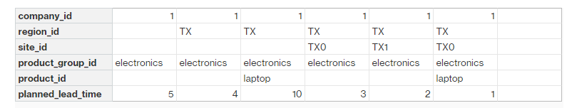
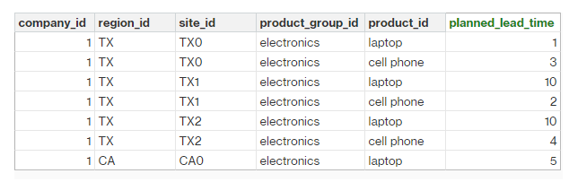
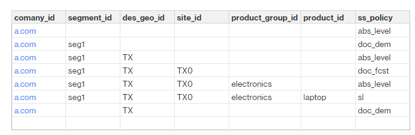
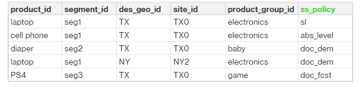
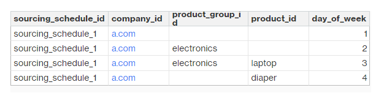
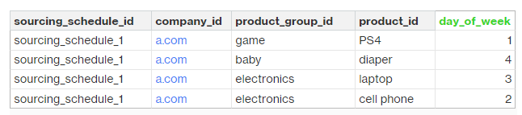
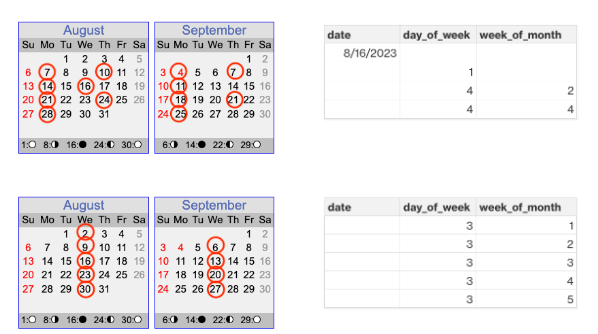

# Planning configuration data

This section lists all the required fields used by Supply Planning and describes how
each field is used. For information on data fields required for Supply Planning, see
[Supply Planning](entities-supply-planning.md "entities-supply-planning.md").

###### Topics

- [Product](#product "#product")
- [Site](#site "#site")
- [Trading partner](#trading-partners "#trading-partners")
- [Vendor product](#vendor-product "#vendor-product")
- [Vendor lead time](#vendor-leadtime "#vendor-leadtime")
- [Sourcing rule](#sourcing-rule "#sourcing-rule")
- [Inventory policy](#inventory-policy "#inventory-policy")
- [Sourcing schedule](#sourcing-schedule "#sourcing-schedule")
- [Bill of Material (BOM)](#product-bom "#product-bom")
- [Production process](#production-process "#production-process")
- [Supply planning parameters](#production-process2 "#production-process2")
- [Transactional data](transactional.md "transactional.md")

## Product

The product entity defines the list of items or products that must be included
in the planning. The purchase order requests use _unit_cost
field_ from the _Product_ entity to determine
the order value or amount. The _Product_ entity also contains
the product group corresponding to a specific product, which is a foreign key
into a _product_hierarchy_ entity. Product groups can be used
in configuring inventory policies, sourcing schedules, lead times, and so on, at
the aggregate level.

## Site

The _Site_ entity defines the list of sites or locations
that must be included in the planning. The _Site_ entity also
contains Regions corresponding to a specific site, which is a foreign key into a
Geography entity. Regions can be used in configuring inventory policies, sourcing
schedules, lead times, and so on, at the aggregate level.

## Trading partner

The _Trading_partner_ entity defines the list of suppliers.
_tpartner_type_ should be set to
_Vendor_ when uploading supplier information.

## Vendor product

Products supplied by each supplier are defined in the
_vendor_product_ entity. This entity also contains
vendor-specific cost information.

## Vendor lead time

Vendor lead time is the time period between placing an order to a vendor and
receiving the order. This data is defined in the _VendorMgmt_
category under the _vendor_lead_time_ data entity. Vendor
lead time follows the following override logic:

- Product level vendor lead time overrides product group level vendor lead time.
- Site level vendor lead time overrides region level vendor lead time.
- Region level vendor lead time overrides company level vendor lead time.

To look for a record, Supply Planning uses the following fields:

- company_id
- region_id
- site_id
- product_group_id
- product_id

The following is an example of the override logic:

The following is an example of how Supply Planning calculates vendor lead time:

Prioritization order is _product_ > _product_group_ > _site_ > _dest_geo (region)_ > _product segment_ > _company_.

## Sourcing rule

Supply Planning generates a plan based on the supply chain network topology defined under the _sourcing_rules_ entity.

The supported sourcing rule types are transfer, buy, and manufacture.

Sourcing rules follow the _product_id_ >
_product_group_id_ > _company_id_
override logic.

Supply Planning retrieves the transportation lead time by referencing _transportation_lane_id_ and
accessing _transit_time_ in _transportation_lane_.
There are two steps to retrieve the transfer lead time.

1. Find _transportation_lane_id_ in _sourcing_rules_. Only the sourcing rules that have both
   _to_site_id_ and _from_site_id_ are eligible for retrieving
   _transfer_lead_time_.
2. Use _transportation_lane_id_ to look up _transportation_lane_.

When there are multiple records with the same _to_site_id_ and _product_id_
(_product_group_id_) in the _sourcing_rule_ entity, only the records with the highest
priority (the smallest number) will be used.

Sourcing rules example:

Based on the preceding definition, Supply Planning selects the following
sourcing rule SR1: Laptop at site `TX0` is sourced from site `IL0`
via `transportation_lane_9`.

| sourcing_rule_id
| product_id
| product_group_id
| sourcing_rule_type
| from_site_id
| to_site_id
| sourcing_priority
| transportation_lane_id
|
| --- | --- | --- | --- | --- | --- | --- | --- |
| SR1 | laptop | electronics | transfer | IL0 | TX0 | 1 | transportation_lane_9 |
| SR2 | laptop | electronics | transfer | NJ1 | TX0 | 2 | transportation_lane_21 |
| SR3 | laptop | electronics | transfer | IL0 | TX0 | 1 | transportation_lane_11 | When multiple records with the same priority exist for the same combination of _to_site_id_, _product_id_ (or _product_group_id_), the reorder quantity will be distributed among the available sourcing options based on the _sourcing_ratio_ field. Note that multiple sourcing is currently only supported for the `buy` sourcing rule type. Multi-sourcing example:
| sourcing_rule_id | product_id | product_group_id | sourcing_rule_type | tpartner_id | to_site_id | sourcing_priority | sourcing_ratio |
| --- | --- | --- | --- | --- | --- | --- | --- |
| SR1 | laptop | electronics | buy | supplier1 | TX0 | 1 | 4 |
| SR2 | laptop | electronics | buy | supplier2 | TX0 | 1 | 6 | Both sourcing rules, SR1 and SR2, are selected, and the order quantity will be allocated between Supplier 1 and Supplier 2 in a 4:6 ratio. ## Inventory policy Supply Planning searches for a record in the dataset by using the following fields:  • _site_id_  • _geodesic_  • _company_id_  • _product_id_  • _product_group_id_  • _segment_id_ Supply Planning uses _ss_policy_ to determine the inventory policy. The override logic uses the following priority: _product_id_ > _product_group_id_ > _site_id_ > and _dest_geo_id_ > _segment_id_ > _company_id_. The supported _ss_policy_ values are _abs_level_, _doc_dem_, _doc_fcst_, and _sl_. The following example displays the override priority logic.  The following is an example of the _ss_policy_ value based on the override logic.  ## Sourcing schedule ###### Note Sourcing schedule is an optional entity. If this entity is not provided, Supply Planning uses a continuous review process to generate _required_date_ based on when products are needed. Supply Planning uses sourcing schedule to generate purchase plans by using the following steps:  • Find _sourcing_schedule_id_ in _sourcing_schedule_.  • Find the schedule by _using sourcing_schedule_id_ in _sourcing_schedule_details_. Supply Planning searches for the following fields in _sourcing_schedule_id_ under _sourcing_schedule_.  • _to_site_id_  • _tpartner_id_ or _from_site_id_ Based on the sourcing path in sourcing rules, Supply Planning determines whether to use _from_site_id_ or _tpartner_id_. Supply Planning reads the value in the _sourcing_schedule_id_ field to determine the next step. Supply Planning reads the schedule details under _sourcing_schedule_details_ with the following fields:  • _sourcing_schedule_id_  • _company_id_  • _product_group_id_  • _product_id_ _sourcing_schedule_details_ follows the override logic, _product_id_ > _product_group_id_ > _company_id_. The following is an example of the override logic in _sourcing_schedule_details_.  The following are the selected schedules after applying the override logic.  The actual schedule can be from one row to multiple rows, based on the complexity of the schedule. For the field _week_of_month_, only one number is allowed in each row. For multiple weeks of the month, multiple records are required (see the following example). For the field _day_of_week_, both integer and name of day are allowed (Sun: 0, Mon: 1, Tue: 2, Wed: 3, Thu: 4, Fri: 5, Sat: 6). In the sourcing schedule details, weekly planning requires _week_of_month_. While in daily planning, _week_of_month_ can be empty, which means every week. See the following examples.  Note that for weekly planning, _week_of_month_ is required if _day_of_week_ is provided. The following example shows the dates that can be used for daily planning.
| Date | Day of the week | Week of the month | | --- | --- | --- | | 8/1/2023 | NA | NA |
| 8/12/2023 | NA | NA | | NA | 2 | NA | | NA | 5 | NA | The following example can be used for both daily and weekly planning.
| Date | Day of the week | Week of the month | | --- | --- | --- | | 8/1/2023 | NA | NA |
| 8/12/2023 | NA | NA | | NA | 2 | 1 | | NA | 2 | 2 |
| NA | 2 | 3 | | NA | 2 | 4 | | NA | 2 | 5 |
| NA | 5 | 1 | | NA | 5 | 2 | | NA | 5 | 3 |
| NA | 5 | 4 | | NA | 5 | 5 | ## Bill of Material (BOM) Product BOM is used in Manufacturing Plans when _sourcing_rule_ is set to Manufacture. For information on how to ingest Product BOM, see the AWS Supply Chain API Reference document. ## Production process _production_process_id_ is referenced in the _sourcing_rule_ and _product_bom_ entities. These fields are used to consume lead time information to make or assemble a BOM. ## Supply planning parameters In _supply_planning_parameters_ entity, _planner_name_ of the supply planner can be assigned at _product_id_ level. Planner name will be displayed on the planned orders generated by the supply planning engine.
