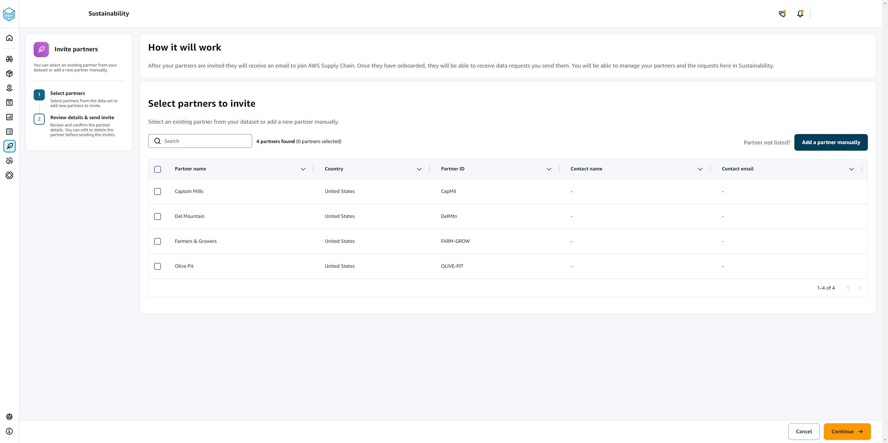
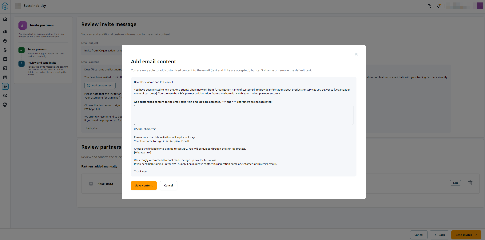

# Partner Network

You can view the partners in your scn network.

1. In the left navigation pane on the AWS Supply Chain dashboard, choose **Sustainability**.

The Sustainability page appears. 2. On the **Sustainability** dashboard page, choose the **Partner Network** tab.

    * **Getting Started** – You can choose **Invite
     Partners** to invite Partners into your AWS Supply Chain
     network, and you can choose **Create data requests** to
     request data from your partners.

    * **Partner Overview** – The **Onboarding
     metrics** section displays the partners who are currently
     onboarding, invites that are pending acceptance by partners, expired
     invites and acceptance rate. The **Data requests**
     section displays data request details from the partners, including the
     status of data requests.
    * **Partners** – You can view the list of partners that were
     imported through data lake, or you can invite new partners.

    Under **Partners**, you can use the
     **Search** field to search for a specific partner,
     and you can use the **Show** dropdown to filter your
     partners based on invite status.

    	+ **Partner name** – Displays the partner name.
    	+ **Partner ID** – Displays the partner ID. The partner ID
    	 link to your source system.
    	+ **Supplier DUNS** – Displays the partner DUNS.
    	+ **Open Supplier ID** – Displays the open partner hub ID.
    	+ **Contact name** – Displays the partner's contact name.
    	+ **Contact email** – Displays the partner's contact
    	 email.
    	+ **Invite date** – Displays the date when the partner was invited.
    	+ **Portal status** – Displays the status of the invitation.

    		- **Not invited** – Partner is not yet invited.
    		- **Pending sign up** – Partner is invited but hasn't responded to the invite.
    		- **Active** – Partner has accepted the invite and is active. Partner has to be active to receive data requests.
    		- **Invite expired** – Partner was sent the invite but the invite expired without any response.
    		- **Invite declined** – Partner declined the invitation.

You can choose a partner under **Partner name** to view
partner details and details of the data request that are specific to the
partner.

To resend a partner invite, choose a partner with an
_Expired_ portal status and, under the
**Actions** dropdown, choose **Resend
invite**.

## Inviting partners

You can invite or add new partners from the dataset into the AWS Supply Chain network.

1. In the left navigation pane on the AWS Supply Chain dashboard, choose **Sustainability**.

The Sustainability page appears. 2. Choose the **Partner Network** tab. 3. On the **Partner Network** page, choose **Invite partners**.

The **Invite Partners** page appears.

 4. Under **Select partners to invite**, to add an existing partner, under **Partner name**, select the partner from the list. 5. To add a new partner, choose **Add a partner manually**.

On the **Enter new partner details** page, enter the
**Partner details** and **Account
administrator** information, and then choose **Add new
partner**. 6. On the **Select partners to invite** page, you will see the partners that you
added manually under **Manually entered partners**. 7. Choose **Continue**. 8. On the **Review invite message**, choose **Add custom text** to add a customized message to the partner invite.

 9. Choose **Save content**. 10. Choose **Send Invites**.
