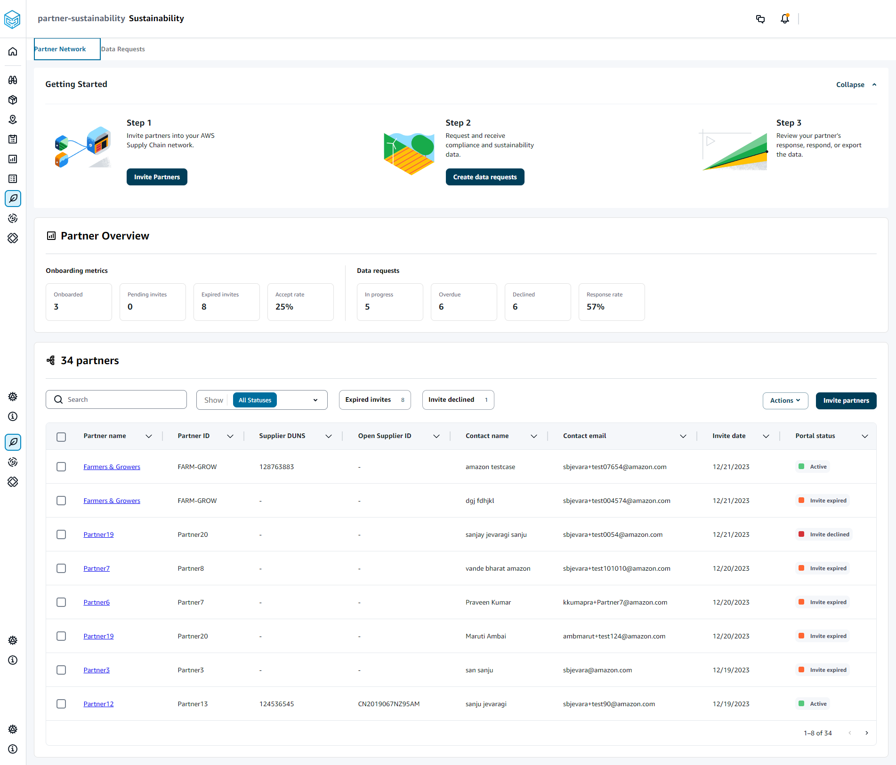

# Sustainability dashboard

You can invite partners by using the AWS Supply Chain data lake connectors and by mapping
the partner information to Partners or Partner's point-of-contact from Amazon S3 or other ERP
systems. Make sure that the partner list or partner point-of-contact does not contain
duplicate information and that it is up-to-date before you upload the partner information
dataset. You can also manually add and invite partners. For more information on how to
upload your data, see [Data lake](data-connections.md "data-connections.md").

