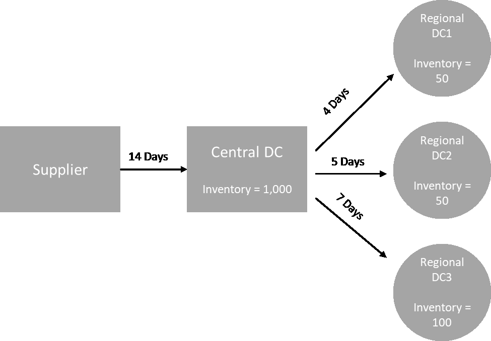
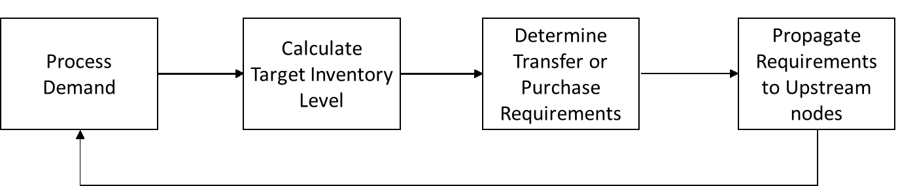
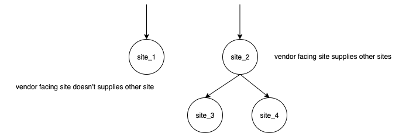
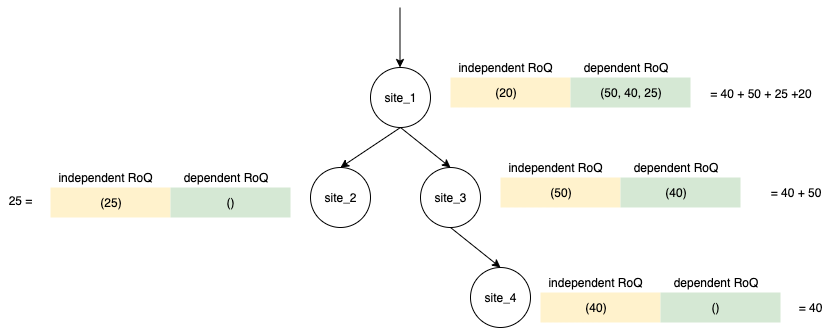

# Planning process

Replenishment requirements are calculated based on the configured network topology
for an item. The following is a sample network topology that we use to describe
various calculations involved in generating replenishment orders.


Auto Replenishment generates transfer requirements from spoke nodes to hub nodes
(for example, regional DCs to the central DC), and it generates purchase
requirements from hub nodes to suppliers (for example, central DC to suppliers). The
following steps are involved in generating replenishment orders. These steps are
repeated for each product and site combination that is in scope for replenishment
planning. Requirements from downstream nodes are propagated upstream based on
sourcing rules information, and the process repeats at the upstream node until it
reaches the root node for that item.



- **Demand processing** – AWS Supply Chain prepares the
  historical demand or forecast data based on the replenishment plan
  configuration. Demand or forecasts are processed at the level of product,
  site, day, or week based on the replenishment plan configuration settings.
  Sales history or forecast data are aggregated at the product and site level
  if they are provided at a more detailed level, such as product, site, customer or product, site, channel.
  Similarly, day to week aggregation occurs if a replenishment plan is
  configured at the week level. In the preceding example, demand is taken from
  spoke nodes, which are regional DCs, and it is aggregated at the product,
  site, and day/week level. If consumption or demand based inventory policy is
  used, the last 30 days of demand (sales history) is used to calculate
  average consumption.
- **Target inventory level** – Use the demand or forecasts along with the configured inventory policy to determine target inventory level for a specific time period. Auto Replenishment supports two different replenishment models.

      + Forecast-driven replenishment
      + Consumption-based replenishment

  AWS Supply Chain generates inventory targets based on the forecast. These
  inventory targets are determined based on lead time and sourcing schedules
  to ensure inventory levels account for the variability in demand and supply
  lead times.

- **Transfer or purchase requirements** – AWS Supply Chain
  nets demand in each period from the supply (on-hand + on-order inventory) to
  project inventory into future time. AWS Supply Chain maintains the
  projected inventory levels at the same level as the target inventory level
  calculated in the previous step. The difference between projected inventory
  level and target inventory level is the net supply requirement or reorder
  quantity (RoQ). AWS Supply Chain applies minimum order quantity, or it
  orders multiples to generate the final transfer requirements or purchase
  requirement (POR). AWS Supply Chain uses the transfer or vendor lead time
  to determine the order by date. The default for lot size is 1.0, and the
  minimum order quantity is 0.

**Calculation logic**

```

                    rounding=f(RoQ,MOQ,Lot_Size)

                    =Lot_Size×Max(RoQ,MOQ)


```

The preceding formula describes the rounding logic in Auto Replenishment.
AWS Supply Chain first compares the reorder quantity RoQ and minimum order
quantity MOQ, gets the final order proposal, and then multiplies by the lot
size factor for the actual quantity. The lot size is configured in the
sourcing rules entity with the field _qty_multiple_.

- **Requirement propagation** – For spoke nodes,
  AWS Supply Chain uses sourcing rules to look up parent nodes and propagate
  transfer requirements to the upstream node. AWS Supply Chain offsets the
  required delivery date by transfer lead time to determine the required date
  at the parent node. AWS Supply Chain only supports single sourcing. When
  this step is completed for all child or spoke nodes under a hub node,
  AWS Supply Chain repeats the previous steps on the hub node. This process
  is repeated until it reaches the root node in an item’s topology.

Auto Replenishment only shows purchase order requests for vendor-facing
sites. There are two kinds of vendor-facing sites:

    + Vendor-facing sites that supply other sites
    + Vendor-facing sites that don't supply other sites



For vendor facing-sites that supply other sites, the reorder quantity is
the reorder quantity from its child sites, plus the independent reorder
quantity from its own demand. For vendor-facing sites that don't supply
other sites, the reorder quantity is computed based on the demand forecast
of the site. The independent reorder quantity for vendor-facing sites
follows the same logic in the reorder quantity computation. The dependent
demand is the summation of all the child sites. If the days of coverage is
7, the RoQ is the summation of the quantity of all orders in the covered
period. The following example shows a scenario in the planning horizon where
there is only one order for each site, and it explains the
computation.


