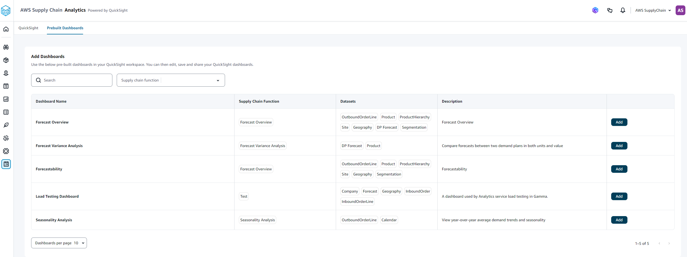
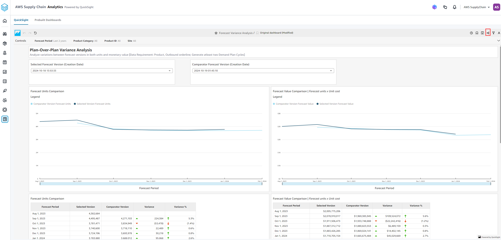

# Prebuilt dashboards

AWS Supply Chain Analytics supports the following prebuilt dashboards.

- Plan-over-plan variance analysis – Use this dashboard to compare two demand plans and view the difference in both units and values across key dimensions such as product, site, and time periods.
- Seasonality analysis – Displays the year-over-year view of demand, displaying the trends in average demand quantities, and highlighting seasonality patterns through peaks at both monthly and weekly intervals. You can identify the demand patterns and assign the appropriate forecasting levels.
  To add a prebuilt dashboard to your dashboard page, follow the below procedure.

1. In the left navigation pane on the AWS Supply Chain dashboard, choose
   **Analytics**.

The **AWS Supply Chain Analytics** page appears.

 2. Choose the **Prebuilt Dashboards** tab. 3. Under **Add Dashboards**, select the dashboard you want to add and choose **Add**. 4. Choose the **Quick Suite** tab. 5. Choose **Dashboards**.

You should see the prebuilt dashboard you added from **Prebuilt Dashboards**. 6. Choose the dashboard you want to view.

 7. Choose the share icon to share the dashboard with other AWS Supply Chain Analytics users. For more information on permission roles, see [Setting AWS Supply Chain Analytics](setting_analytics.md "setting_analytics.md").
