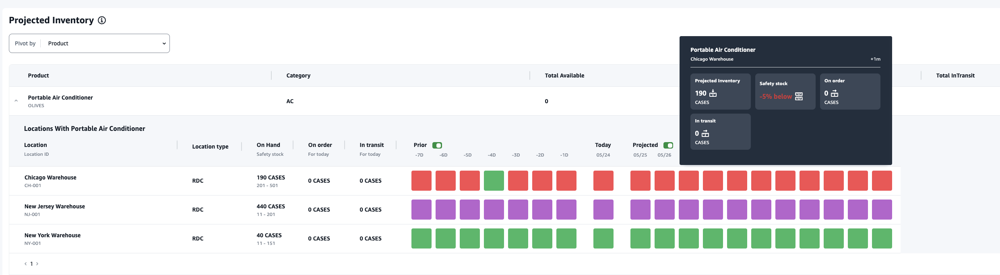

# Understanding inventory projections

This section explains how to read the inventory projections.

- What is **On Hand** and **Safety stock?** – Displays the on-hand inventory value from the latest snapshot for both past dates and current date. This information is extracted from the _inv_level_ data entity.
  When there are multiple records with different on-hand values for the same snapshot date, Insights will select the latest snapshot record for processing. The safety stock is the range specified in the inventory policy.
- **How is demand calculated?** – Insights gathers data from the forecast, outbound sales orders, and the transfers orders (that is, products moving out of site for a given time frame)
  to calculate the total demand. When demand is available at a higher granularity, such as, weekly, monthly, and so on, Insights will spread the forecasted value across the given time frame.
- **Prior** – When you slide the **Prior** button, you can view the inventory values for the last seven days, including any day in the past.
- **How is **Projected** inventory different from **On Hand**?** – On hand inventory is the current stock in your ERP system
  and projected inventory is the future inventory level prediction based on factors such as previous day’s ending on hand/projected level, inbound supply (inbound order line, inbound shipment,
  inbound order line schedules), outbound sales (outbound order line, outbound shipment, and the demand forecast. Using projected inventory, you can plan the future inventory required to avoid stockouts or overpricing.
- **How is **On Hand** different from **Projected On Hand?\*\*\*\* – Insights calculates projected on hand when there
  are no records available for the current date using the same logic used to calculate the projected inventory for future dates.
- **How is quantity unit of measure (UOM) calculated and are there any defaults used?** – The unit for inventory quantity measures, such as on hand, on order, in transit,
  and projected inventory are displayed to distinguish between eaches, pallets, and cases. To prevent UOM mismatches and streamline calculations, Insights defaults to using the product’s base UOM specified in the product data entity for conversions.
  The unit conversions are derived from _product_uom_ and _uom_conversion_. For more information on the data entities, see [Insights](entities-insights.md "entities-insights.md").

You can also set the default UOM by adjusting the default configuration. For more information on how to change the default configuration, see [Get support for AWS Supply Chain](admin-support-ug.md "admin-support-ug.md").

- **Are inventory projections and risks generated for products that are not in stock?** – Adjust the inventory policy safety stock range to zero for products that are
  not in stock. This adjustment will prompt Insights to categorize such product-site combinations as products not in stock. Similarly, you will be alerted to excess stock risks when stock is held at a location. Insights also offers
  recommendations to move excess stock out and receive stock when there is a stock out.

###### Note

This feature is only available in US East (N. Virginia).

- **How does Insights handle unallocated demand?** – When _outbound_shipment_ information is unavailable, Insights will allocate demand from _outbound_order_line_ to either the promised delivery date or the requested delivery date.
  When _outbound_shipment_ information is available, Insights will distribute the total demand quantity across ship dates. Any unallocated demand in a day and up to six months are carry forwarded. When there is a cancellation, Insights will stop carrying forward the demand.

###### Note

This feature is only available in US East (N. Virginia).
