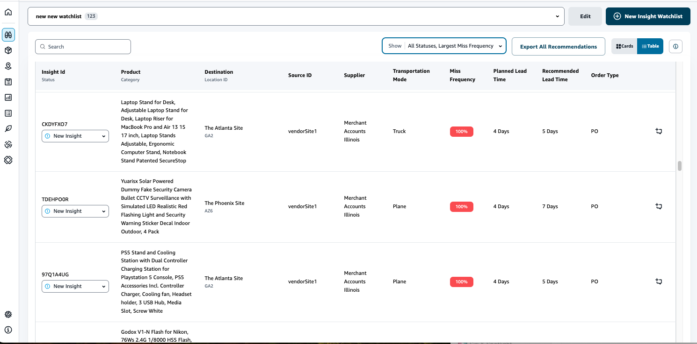

# Lead time insights

AWS Supply Chain provides insights on the lead time deviation for a vendor, product, and destination site level. The vendor lead time deviation insights also includes transportation mode, source locations, and identify lead
time deviations at a more granular level. You can incorporate the recommended lead times in your planning cycle for enhanced planning accuracy and to avoid stock out risks.

For example, for supplier S, product P, destination site D, source site S, and transportation mode like Truck, Ship, and so on, the **Miss Frequency** displays the frequency of time the lead time was missed, compared to the planned lead time (that is, contractual lead times) shared in the vendor_lead_time entity.
Therefore, Insights recommends to update the planned lead time for the same vendor, product, and site to avoid future lead time issues.

Choose **Export All Recommendations** to export the vendor lead time recommendations for the ingested product, site, or vendor combinations in a .csv file into your Amazon S3 bucket. Once the export is completed, you will receive an email and notification on
the AWS Supply Chain web application with a link to the Amazon S3 bucket where the recommendations are exported.

When values for optional columns _source_site_id_ and _trans_mode_ in the _vendor_lead_time_ data entity are not available, Insights will use the master records for lead times. However, when
transactional data for product, source site, destination site, vendor, and transportation mode is at a more granular level, that is, _inbound_order_line_ and _inbound_shipment_, it influences the recommendations and the planned lead time. When there are multiple planned lead time records in the master data
file, Insights will use the highest planned lead time for calculation.
