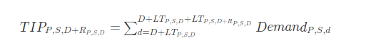
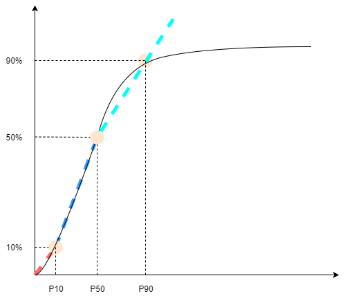
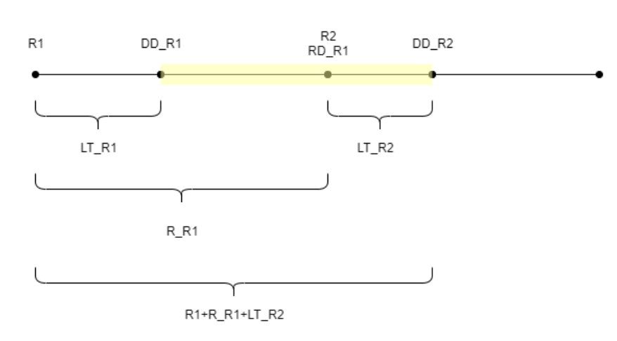
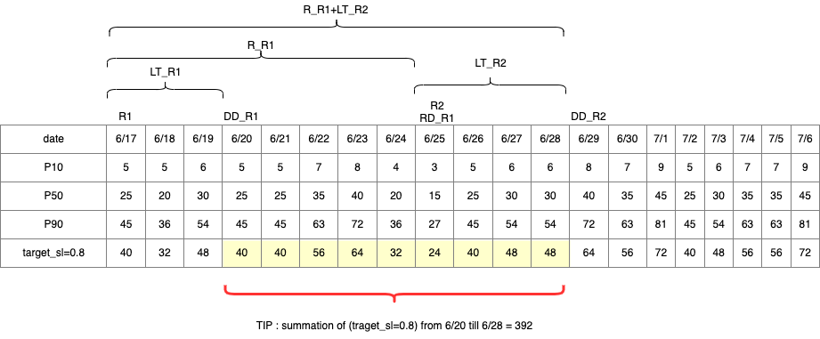
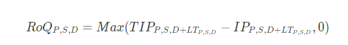

# Service level

If you use in-stock percentage to manage your inventory levels, you can use
this policy setting to drive the calculation of target inventory level and
replenishment.

## Inputs and defaults

For _sl_ policy, Supply Planning requires the following
fields. If these fields are empty, the default value is set to _null_, and the application throws an
exception.

| Data required                        | Entity                                          | Field     | Value            | Notes                                                            |
| ------------------------------------ | ----------------------------------------------- | --------- | ---------------- | ---------------------------------------------------------------- | -------------------------------------------------------------------------------------------------------------------------------------------------------------------------------------------------------------------------------------------------------------------------------------------------------------------------------------------------------------------------------------------------------------------------------------------------------------------------------------------------------------------------------------------------------------------------------------------------------------------------------------------------------------------------------------------------------------------------------------------------------------------------------------------------------------------------------------------------------------------------------------------------------------------------------------------------------------------------------------------------------------------------------------------------------------------------------------------------------------------------------------------------------------------------------------------------------------------------------------------------------------------------------------------------------------------------------------------------------------------------------------------------------------------------------------------------------------------------------------------------------------------------------------------------------------------------------------------------------------------------------------------------------------------------------------------------------------------------------------------------------------------------------------------------------------------------------------------------------------------------------------------------------------------------------------------------------------------------------------------------------------------------------------------------------------------------------------------------------------------------------------------------------------------------------------------------------------------------------------------------------------------------------------------------------------------------------------------------------------------------------------------------------------------------------------------------------------------------------------------------------------------------------------------------------------------------------------------------------------------------------------------------------------------------------------------------------------------------------------------------------------------------------------------------------------------------------------------------------------------------------------------------------------------------------------------------------------------------------------------------------------------------------------------------------------------------------------------------------------------------------------------------------------- |
| Inventory policy                     | inventory_policy                                | ss_policy | sl               | Service level is abbreviated as _sl_.>                           |
| Inventory policy                     | inventory_policy                                | target_sl | percentage value | For example, 0.8>                                                |
| Forecast                             | forecast                                        | NA        | NA               | Mean or forecast quantities.>                                    |
| Lead time                            | transportation_lane                             | NA        | NA               | Lead time from a source location to a destination.               |
| Lead time                            | vendor_lead_time                                | NA        | NA               | Lead time from a vendor to a destination location.               |
| Sourcing schedule or Vendor schedule | sourcing_schedule and sourcing_schedule_details | NA        | NA               | Defines the calendar or days during which vendors accept orders. | ## Calculating target inventory level Target Inventory Position (TIP) is used for service level (sl) inventory policy. TIP represents the desired inventory position on a given date. TIP includes on-hand and on-order inventory. The inputs required for service-level policy are forecast, lead time, sourcing schedule (plus sourcing schedule details), and configuration for service level.  TIP is based on forecast distribution. Supply Planning applies the critical ratio (CR or service_level) to forecast distribution, computes the demand, and sums up on days to cover. The available method to apply the critical ratio (service level) to forecast distribution is listed in the following. First, Supply Planning applies a CR to distribution in forecast (P10/P50/P90) by using linear interpolate.  Supply Planning uses P10 for target_sl=0.1, P50 for target_sl=0.5, and P90 for target_sl=0.9. For a percentile that doesn’t exist in the forecast entity, Supply Planning uses a linear interpolate approach. Supply Planning computes other percentiles of demand forecast based on P10/P50/P90. Here are formulas for computing P40 (target_sl=0.4) and P75 (target_sl=0.75): P40=50−1040−10​×(P50−P10)+P10 P75=90−5075−50​×(P90−P50)+P50 When Supply Planning gets demand, the demand is summed up to use arbitrary summation by days to cover. Days to cover starts from the upcoming deliver date until the deliver date after the upcoming deliver date.  As shown in the previous figure, the yellow period is the days to cover. The beginning of the days to cover does not start from the first day of the planning horizon. The reason is that Supply Planning doesn’t order for days that cannot be covered. Supply Planning assumes that all lost sales are not recoverable. R1: the first review date based on the sourcing schedule. R2: the second review date based on the sourcing schedule. LT_R1: the lead time for putting order on R1. LT_R2: the lead time for putting order on R2. R_R1: the review period based on sourcing schedule. RD_R1: the first review date after R1, equaled to R1+R_R1. DD_R1: the deliver date if submit order is on R1; DD_R1 = R1 + LT_R1. DD_R2: the deliver date if submit order is on R2; DD_R2 = R2 + LT_R2. The following example shows the TIP computation.  ## Calculating reorder quantity The inputs for the _sl_ reorder quantity calculation are the target inventory level and the current inventory level. Supply Planning throws an exception if the inventory level record is missing.  The reorder quantity is the difference between the target inventory position and the current inventory level. If the current inventory position is higher than the target inventory position, then the reorder quantity is set to 0. |
